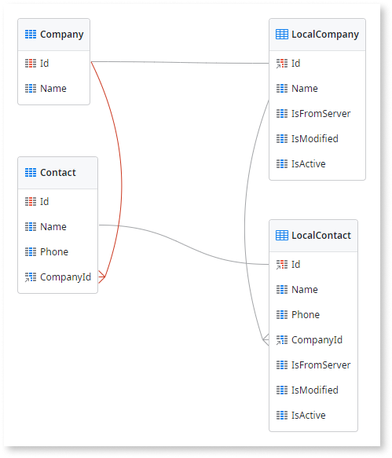
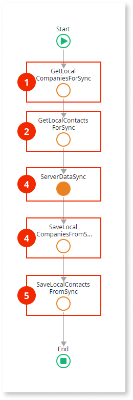
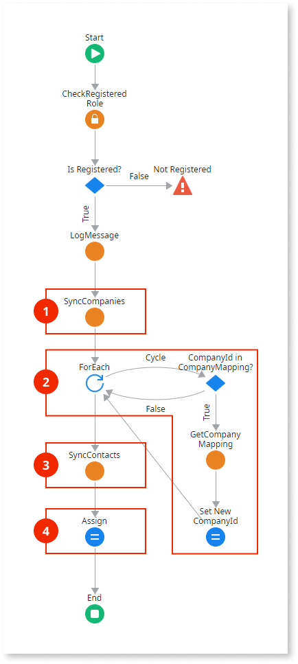
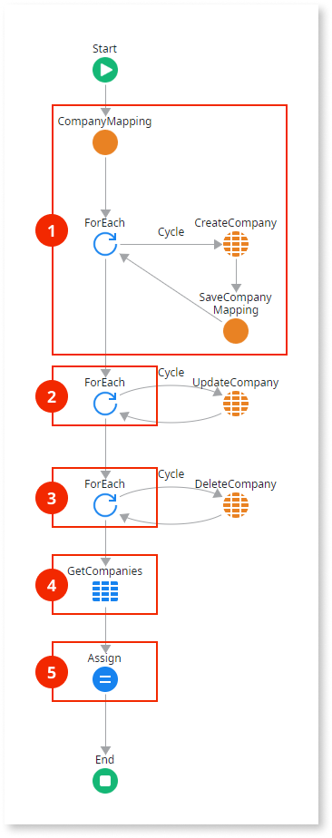

# Read/Write Data One-to-Many

Applies only to Mobile Apps.

This data synchronization pattern is recommended for mobile apps with entities that follow a one-to-many relationship and where it is not likely for multiple end users to change the same data while the apps are offline, as follows:

* The server database holds the master data that can change over time.
* The local storage database holds a subset of the master data and can be modified.
* Synchronization sends the modified data from the local storage to the server database and vice-versa.
* In the server, data is updated in a “last write wins” strategy while ensuring the relationship between the records of the master and detail entities. With this strategy, the latest data update overrides earlier updates.

The following is an overview of the Read/Write Data One-to-Many pattern:

1.  Sends local storage data modified by the app back to the server.

1.  Updates database data with the one sent from local storage, taking the necessary steps to maintain the relationship between the records of the master and detail entities. For example, a dictionary can be used to track the IDs of the local records and the IDs of the corresponding records on the server.

1.  Sends updated database data. 

1.  Deletes and recreates data in the local storage with the data received from the server.

**About the mapping**

In this sample pattern, we use a dictionary to maintain the relationship between the records of the parent and child entities. When syncing new parent entity records with the server, the dictionary keeps track of the correspondence between the original ID on the local storage and the new ID on the server database as shown below. This is needed because the parent and the child records are not created in the server database at the same time, so the dictionary mapping is used to update the unsynced child records with the foreign keys generated on the main server database.

Key: local record ID | Value: server record ID
---------------------|------------------------
5                    | 135
6                    | 136
7                    | 150

You can download the [sample module for the Read/Write Data One-to-Many pattern](http://www.outsystems.com/forge/component/1638/Offline+Data+Sync+Patterns/) explained here and examine the logic in your own environment.

## Data Model

This sample defines two related database entities `Company` and `Contact` and their local storage counterparts `LocalCompany` and `LocalContact`. Additionally, the `LocalCompany` and `LocalContact` entities define three metadata attributes to keep track of the synchronization status of the records.

The application logic must update the metadata attributes `IsFromServer`, `IsModified` and `IsActive` of the local entities according to the following:

* `IsFromServer`: If True, the record exists on the server.
* `IsModified`: If True, the record has been modified locally.
* `IsActive`: If False, the record was deleted locally but may not yet have been removed from the server. 

## OfflineDataSync Logic

The following is a description of the logic of the `OfflineDataSync` client action:

1. Obtains the list of locally added, updated, and deleted Company records.
1. Obtains the list of locally added, updated, and deleted Contact records.
1. Calls the `ServerDataSync` server action with the lists of locally added, updated, and deleted Company and Contact records as inputs. The server updates the data in the database and returns the list of updated Company and Contact records.
1. Deletes all Company records in the local storage and recreates the Company records in the local storage using the list of records returned by the server.
1. Deletes all Contact records in the local storage and recreates the Contact records in the local storage using the list of records returned by the server.

## ServerDataSync Logic

The following is a description of the logic of the `ServerDataSync` server action:

1. Calls the `SyncCompanies` server action with the lists of locally added, updated, and deleted Company records as inputs. The action updates the data in the database and returns the list of updated Company records, as well as a dictionary containing the mappings between the local and database IDs of the new Company records.

1. Iterates the list of locally added Contact records and uses the mappings in the dictionary to update the attribute `LocalContact.CompanyId` to the ID of the corresponding Company record created in the database. This is to ensure that the one-to-many relationship of the records is maintained on the server database.

1. Calls the `SyncContacts` server action with the lists of locally added, updated, and deleted Contact records as inputs. The action updates the data in the database and returns the list of updated Contact records.

1. Assigns the lists of updated Company and Contact records to the output parameters of the action.

## SyncCompanies Logic

The following is a description of the logic of the `SyncCompanies` server action:

1. Iterates over the list of locally added Company records. Creates new database records on the server. Also creates the dictionary mappings between the ID of the local record and the ID of the newly created database record.

1. Iterates over the list of locally modified Company records and updates the records in the database on the server.

1. Iterates the list of locally deleted (inactive) Company records and deletes the records in the database on the server.

1. Retrieves all the Company records from the server database.

1. Assigns the dictionary containing the mappings between the local and database IDs of the Company records and the list of Company records to output parameters of the action. Also, sets the values for the synchronization metadata attributes:

    IsFromServer = True  
    IsModified = False  
    IsActive = True

## SyncContacts Logic

The following is a description of the logic of the `SyncContacts` server action:

1. Iterates the list of locally added Contact records and creates the new records in the database.

1. Iterates the list of locally modified Contact records and updates the records in the database.

1. Iterates the list of locally deleted (inactive) Contact records and deletes the records in the database.

1. Retrieves all the Contact records from the database.

1. Assigns the list of Contact records to the output parameter of the action, while setting appropriate values for the synchronization metadata attributes:

    IsFromServer = True  
    IsModified = False  
    IsActive = True
