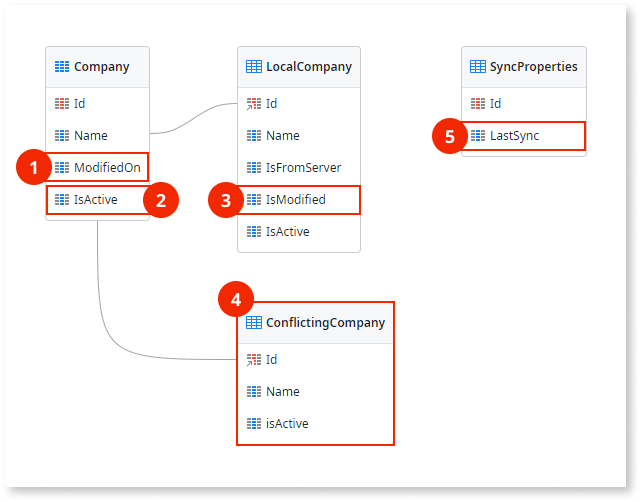
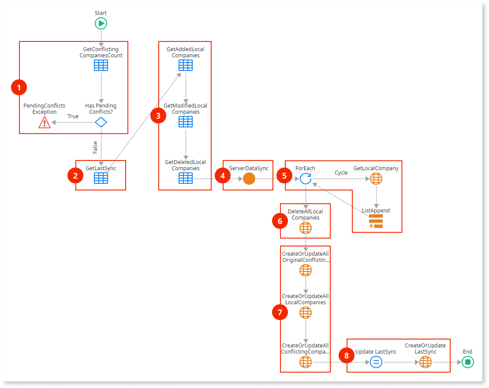
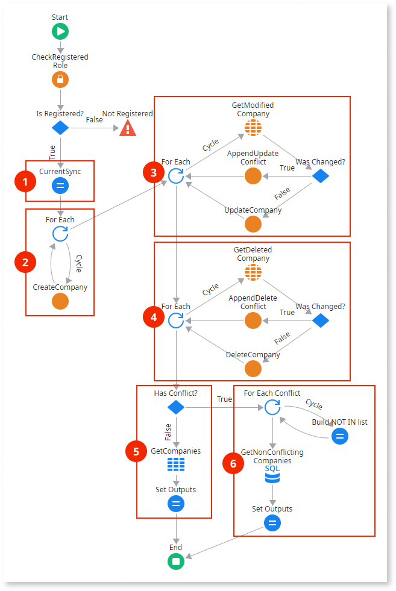

# Read/Write Data with Conflict Detection

This data synchronization pattern is recommended for advanced scenarios where multiple end users will change the same data while the apps are offline, as follows:

* The server database holds the master data that can change over time.
* The local storage database holds a subset of the master data and can be modified.
* Synchronization sends the modified data from the local storage to the server database and vice-versa.
* In the server, data is updated and any conflicting changes are registered for later resolution.

The following is an overview of the Read/Write Data With Conflict Detection pattern:

1.  Checks if there are unsolved conflicts. If conflicts exist, the client aborts the synchronization and reports the conflicts pending resolution.

1.  Sends local storage data modified by the app back to the server.

1.  Checks for conflicting changes performed in the database.

1.  Adds the records to the list of conflicts if it conflicts with client data.

1.  Updates database records in the absence of conflicts.

1.  Sends updated database data and the list of conflicting changes.

1.  Checks for conflicts. If conflicts exist, registers conflicts and updates local storage with the non-conflicting records. If no conflicts exist, deletes and recreates data in the local storage with the data received from the server.

1.  Updates last sync timestamp in local storage.

1.  Reports pending conflicts to the end user if applicable.

You need to implement a mechanism, either automatic or manual, to resolve the detected conflicts. For example, you can present the client and server versions of the records side by side and allow the end user to select which version to maintain.

Download the [sample module for the Read/Write Data with Conflict Detection pattern](http://www.outsystems.com/forge/component/1638/Offline+Data+Sync+Patterns/), that uses companies as an example of data to synchronize. The following sections provide detailed descriptions of the data model and logic used in the sample module.

## Data Model

This sample defines a database entity `Company` and its local storage counterpart `LocalCompany` . Additionally, the `LocalCompany` entity defines three metadata attributes to keep track of the synchronization status of the records, the `SyncProperties` local storage entity keeps the date and time of the last synchronization, and the `ConflictingCompany` local storage entity holds the conflicting records.

1. Tracks changed records by storing the timestamp when the record was last updated or created. 
1. Tracks deleted records. 
1. Metadata attributes that track the synchronization status of the records. 
1. Holds conflicting records. 
1. Timestamp of the last synchronization. Note that this timestamp is established by the server to avoid problems due to clock differences between client and server. 

The application logic must update the metadata attributes `IsFromServer`, `IsModified` and `IsActive` of the local entity according to the following:

* `IsFromServer`: If True, the record exists on the server.
* `IsModified`: If True, the record has been modified locally.
* `IsActive`: If False, the record was deleted locally but may not yet have been removed from the server.

## OfflineDataSync Logic

The following is a description of the logic of the `OfflineDataSync` client action:

1. Obtains the number of `ConflictingCompany` records and triggers an exception if there are any unresolved conflicts from a previous synchronization.

1. Obtains the timestamp of the last synchronization.

1. Obtains the lists of locally added, modified, and deleted Company records.  
    The aggregate that obtains the added records uses the following filter:

        LocalCompany.IsFromServer = False and
        LocalCompany.IsActive = True

    The aggregate that obtains the modified records uses the following filter:

        LocalCompany.IsModified = True and
        LocalCompany.IsFromServer = True and
        LocalCompany.IsActive = True

    The aggregate that obtains the deleted records uses the following filter:

        LocalCompany.IsActive = False and
        LocalCompany.IsFromServer = True

1. Calls the `ServerDataSync` server action with the lists of locally added, updated, and deleted Company records as inputs. The server updates the data in the database and returns the list of updated Company records, the list of Company records that have conflicts, and the list of IDs of the Company records that have conflicts.

1. Obtains the list of original Company records that correspond to the Company records with conflicts returned from the server.

1. Deletes all Company records in the local storage.

1. Recreates the Company records in the local storage and adds the records with conflicts returned by the server to the entity `ConflictingCompany`.

1. Updates the entity attribute `SyncProperties.LastSync` with the timestamp of this synchronization returned by the server.

## ServerDataSync Logic

The following is a description of the logic of the `ServerDataSync` server action:

1. Assigns the timestamp of this synchronization to an output parameter.

1. Iterates the list of locally added Company records and creates the records in the database with the attribute ModifiedOn set to the current timestamp.

1. Iterates the list of locally modified Company records. For each record in the list, obtains the corresponding Company record in the database and checks if it was modified since the last synchronization.

    * If it was not changed, updates the Company record in the database.
    * If it was changed, adds the Company record to a list of conflicting companies.

1. Iterates the list of locally deleted Company records. For each record in the list, obtains the corresponding Company record in the database and checks if it was modified since the last synchronization.

    * If it was not changed, deletes the Company record in the database.
    * If it was changed, adds the Company record to a list of conflicting companies.

1. If there were no Company records with conflicts, retrieves all the Company records from the database and returns them to the client.

1. If there were Company records with conflicts, obtains the Company records that had no conflicts from the database and returns them to the client, together with the list of Company records with conflicts.
