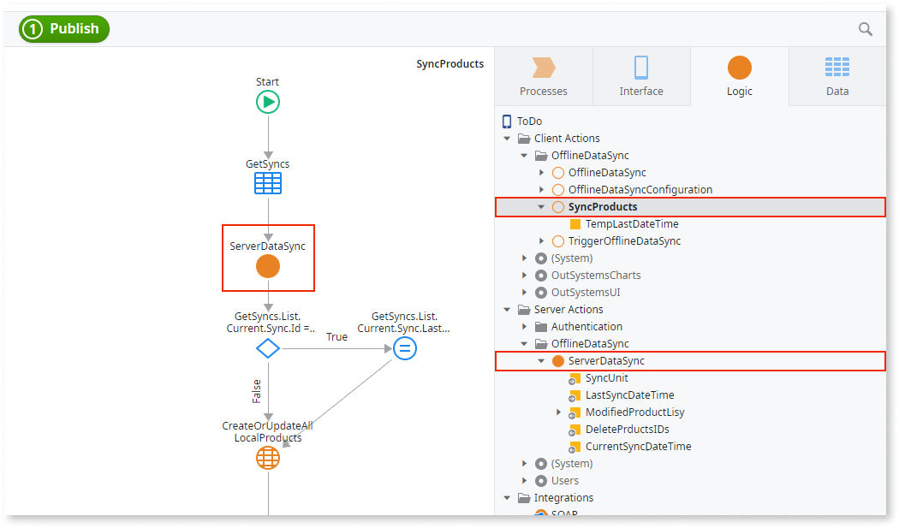
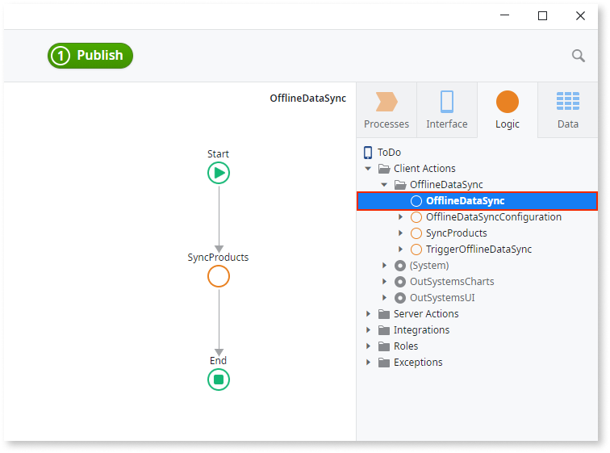

# Implementing Offline Sync

Applies only to Mobile Apps.

OutSystems provides a [framework for syncing data](<sync-reference.md>) between your mobile application and server. The framework consists of a set of actions and blocks available in the OutSystems Mobile UI Framework app templates and enables you to create the business logic, trigger the sync and react to sync outcomes and changes in network status. You can use the framework to create a mechanism to sync only the data you need, making the sync lightweight.

In this overview we use the read-only sync mechanism as an example, but the process is applicable to other sync patterns. In the example that follows, the catalogue of products is on the server and during the sync the app updates the local product list.

For the local entities that were created by **Add Entity from Database** command you can use accelerators. Some parts of the logic can be generated automatically by right-clicking such local entities and selecting one of the **Create Action to Sync Data** commands.

## 1. Create both client and server logic

The business logic for updating records for the individual entities is implemented in the client OfflineDataSync folder. The complexity of the client and server logic for data sync varies depending on the business needs and implementation. These are the common implementation parts:

* Create actions that update local entities during the sync, in **Logic** > **Client Actions** > **OfflineDataSync** folder.
* Create actions that get data from the server and perform updates on the server, in **Logic** > **Server Actions** > **OfflineDataSync** folder.
* Pass the sync data between the server and client actions.

In our case, the logic in the client SyncProducts action updates the local data through the local entities with the new data received from the server. Now it's time to place this logic into the framework and prepare it for running in the background.

## 2. Place the local entity action in OfflineDataSync action

The actions for updating local and remote storage need to be placed in the flow of the **OfflineDataSync** action, located in **Logic** > **Client Actions** > **OfflineDataSync** folder. This will enable you to run the sync in the background without affecting execution of the other app processes.

In the example there's only one action (**SyncProducts**) and we placed it, as required, in the **OfflineDataSync** flow. We are now ready to configure the manual start of the sync.

## 3. Configure manual start of the sync

The manual sync should be started by **TriggerOfflineDataSync** from **Logic** > **Client Actions** > **OfflineDataSync** folder. Place the TriggerOfflineDataSync into the flow at the point where the sync should start. Don't start the sync by placing OfflineDataSync directly in a flow, as this doesn't run the sync in the background and may cause the UI to freeze.

We created a button that calls the action we named SyncOnClick, and within the action's flow we dragged and dropped the TriggerOfflineDataSync. We ensured the updating logic is working as expected, so it's time to configure the automatic start of the sync.

## 4. Configure automatic start of the sync

Open the **OfflineDataSyncConfiguration** action from **Logic** > **Client Actions** > **OfflineDataSync** and set the variables in the flow to True, for all conditions when sync should run automatically.

In our example we decided not to start the sync automatically regardless of the conditions, so all our values are set to False.

# Sync Logic Flow

This is the flow of the sync execution stages. Note that they do not map to the steps in which we created the actual sync logic.

Stage 1
:   OfflineDataSync runs, in the background, the actions for updating the local storage. This action can be started manually by the TriggerOfflineDataSync action or automatically by an event configured in the OfflineDataSyncConfiguration action. 

Stage 2
:   The actions initiated by OfflineDataSync collect the records changed locally and send them to the server.

Stage 3
:   Server processes the requests and returns the updated data. 

Stage 4
:   The actions in OfflineDataSync update the local storage with the data received from the server.

Now that you know how to implement Offline Synchronization, it's recommend that you check the [Offline Synchronization Checklist](<sync-checklist.md>), to make sure that you avoid common issues, in your solution.

