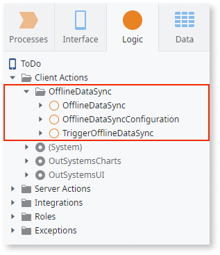
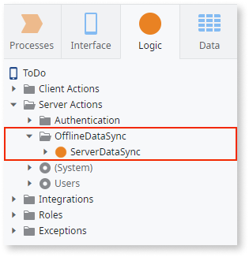
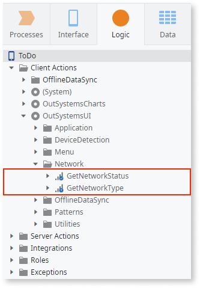
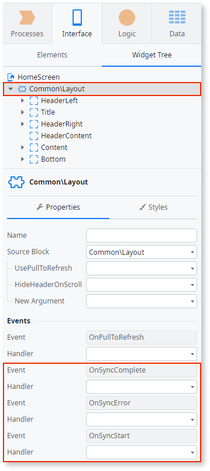

# Sync Framework Reference

These are the elements belonging to the framework for syncing data between the server and the application. For an implementation overview you can check [Implementing Offline Synchronization](<sync-implement.md>).

## Logic tab > Client Actions > OfflineDataSync folder

OfflineDataSync folder in **Client Actions** should contain all actions that run on the mobile device to update local entities and exchange data with the corresponding actions in the server side of the logic.

### OfflineDataSyncConfiguration

Contains multiple assignments to configure automatic start and retry of the sync:

* **SyncOnOnline**: Set to True to trigger the sync when the device comes online
* **SyncOnLogin**: Set to True to trigger the sync after login
* **SyncOnResume**: Set to True to trigger the sync once the application resumes from the background
* **RetryOnError**: Set to True to attempt a new sync in case of an error
* **RetryIntervalInSeconds**: Set the interval for the sync retry in seconds

### TriggerOfflineDataSync

Use TriggerOfflineDataSync to start the sync. TriggerOfflineDataSync is optimized for asynchronous sync that runs in the background and for triggering the sync events. Do not call OfflineDataSync to start the sync unless you want to block the flow execution and you do not need to trigger the sync events.

SyncUnit
:   String input parameter that can be passed from business logic to the sync actions. Useful for deciding which entity to sync.

DiscardPendingSyncUnits
:   If set to True clears the sync queue. Useful when you want to abort the pending syncs and start a new one immediately.

### OfflineDataSync

OfflineDataSync is the default action that can be used for creating logic executed on the client.

SyncUnit
:   String input parameter that can be passed from business logic to the sync actions. Useful for deciding which entity to sync.

## Logic tab > Server Actions > OfflineDataSync folder

OfflineDataSync folder in **Server Actions** should contain all actions that run on the server to update server entities and exchange data with the corresponding actions in the client side of the logic.

### ServerDataSync

ServerDataSync is the default action that can be used for creating logic executed on the server.

SyncUnit
:   String input parameter that can be passed from business logic to the sync actions. Useful for deciding which entity to sync.

## Logic tab > Client Actions > MobilePatterns 

Mobile apps come with two actions to detect network status and type. These are also accessible as functions in expressions.

### GetNetworkStatus

Returns a Boolean value. True for online, False for offline.

### GetNetworkType

Returns a text value. Describes the type of network, for example, `wifi`, `4g`, `undefined` (if in the browser preview).

## Interface tab > UI Flows > Common > Layout and LayoutBlank

The following event listeners in the Source Block of individual screens can be used to create actions that control how the UI elements respond to the sync outcomes.

To create actions as event listeners of these events, open the widget tree of a screen, select the **Layout** or **LayoutBlank** block instance in the screen and enter the **Handler** properties that correspond to the events.

### OnSyncComplete

Event triggered once the sync is successfully executed.

SyncUnit
:   String input parameter that can be passed from business logic to the sync actions. Useful for deciding which entity to sync.

### OnSyncError

Event triggered if the sync fails.

SyncUnit
:   String input parameter that can be passed from business logic to the sync actions. Useful for deciding which entity to sync.

ErrorMessage
:   A string identifying the error.

### OnSyncStart

Event triggered when the sync starts.

SyncUnit
:   String input parameter that can be passed from business logic to the sync actions. Useful for deciding which entity to sync.

## Interface tab > UI Flows > MobilePatterns > Private

Contains a block that you can use to listen if the application is online or offline.

### NetworkStatusChanged block

Drag the block to a Screen and then create a new action handler for NetworkStatusChanged event. In the flow of the event handler place the logic that reacts to IsOnline input.
