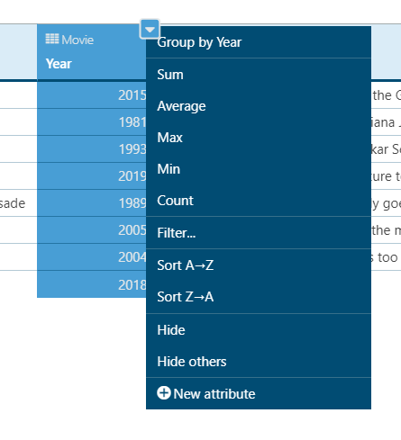

# Aggregate a Column into a Single Value

Sometimes displaying a single aggregated value can be more meaningful than displaying the full list of records available in the database.

To aggregate a column into a single value, hover on the column, right-click, and select one of the aggregate functions:

* Sum: sums all the values in the column
* Average: calculates the average of the values in the column
* Max: finds the maximum value in the column
* Min: finds the minimum value in the column
* Count: counts how many rows there are in the column

The list of available aggregate functions depends on the data type of the column. Sum and Average are only available for numeric data types whereas textual data types (text, email, and phone number) only have the Count function available.
