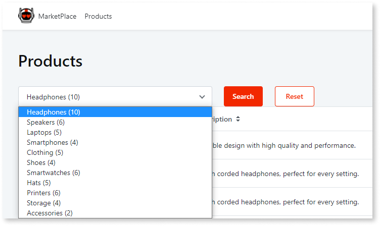
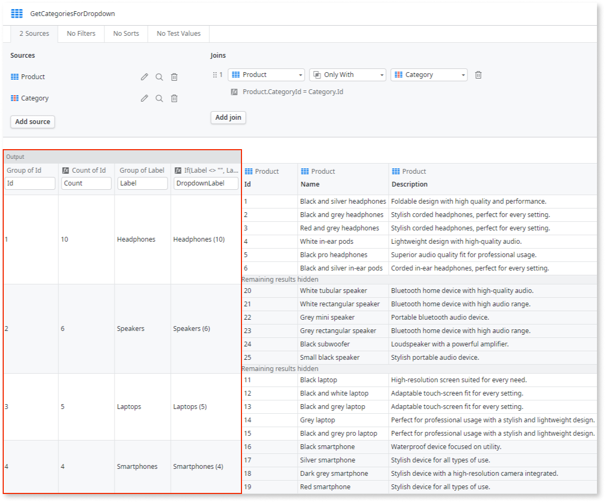

# Create a Calculated Attribute in an Aggregate

There are situations when the data fetched from the database isn't enough and you need to add more information to each record, namely based on the values returned. OutSystems allows you to do it. You can add new attributes to the records returned by the Aggregate based on the value of the other attributes:

1. In the Aggregate, click **New Attribute** to add a new attribute to the Aggregate and name it.
1. Open the attribute menu and select **Edit formula...**
1. Define the expression to calculate the value.

## Example

StoreApp, a Reactive Web App to check the products in a store, has a screen to list products.

In this screen, you want to address the following requirement: the end user can filter the listed products by category, by selecting an available category from a Dropdown. In each entry of the Dropdown, the app displays the number of products that have that specific category along with the category name.

To calculate this data and add it to each entry of the Dropdown, do the following:

1. As this is a Reactive Web App, right-click the screen and select the option **Fetch Data from Database** to add an Aggregate to the screen.

1. Add the `Product` entity to the Aggregate.

1. In the Aggregate, do the following:

    1. Click **Add source** and add the `Category` entity to the Aggregate, choosing products `Only With` category for the join rule.

    1. Group by `Category.Id`.

    1. Count by `Product.Id` to have the number of products per category.

    1. Group by `Category.Label` to get the label of each category.

    1. Open the last grouped column menu and add a new attribute. Name it `DropdownLabel`.

    1. Assign the following expression to the created column:

        `If ( Label <> "", Label + " (" + Count + ")" , "Not categorized" + " (" + Count + ")" )`

        `Label` and `Count` variables are two of the previously grouped columns.

    

1. Go to the screen and add a Dropdown. Set the Dropdown values to be the returning list of the Aggregate using the `DropdownLabel` attribute as the options text.
