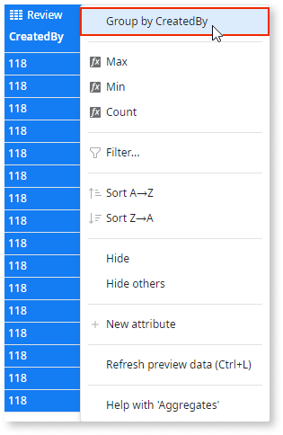

# Get Distinct Values from the Database

Database tables may have columns containing repeated values. There are situations when you only want to get the distinct values, instead of all the data including the repetitions. To obtain distinct values of entity attributes, you can use an aggregate with grouped columns.

To get distinct values of an entity attribute:

1. In an aggregate in the action flow, add the entity.

1. Right-click on the attribute for which you want to obtain distinct values, and choose to group by the attribute.

The aggregate only outputs the attribute values that are grouped.

To get distinct values using multiple entity attributes, select all the required attributes and choose to `Group by selected attributes`.

