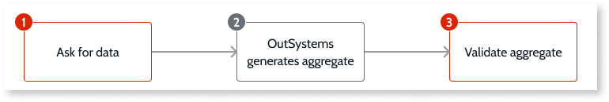
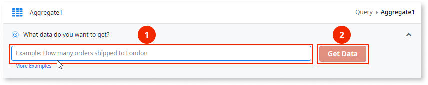
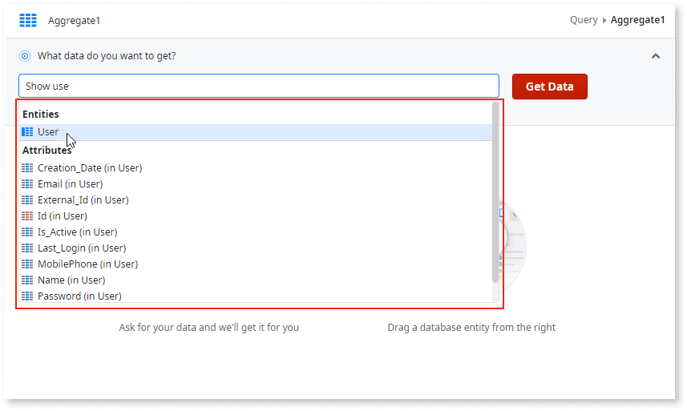

# Early Access Program - Fetch data using human language

This capability is only available for participants in the private Early Access Program (EAP). Request access to the private EAP [here](https://docs.google.com/forms/d/e/1FAIpQLScqvL2IIBTvJ8sklUS8pz7FeayuR8YYPr-YDwtidA8YEou5kw/viewform).

Fetch data in your apps by using everyday language to create queries.
Ask for data in similar way that you would ask another person, and Service Studio creates an Aggregate to get you that data.

Fetching data using human language includes the following steps:

1. In an aggregate, you ask for data using human language.

1. OutSystems handles your data request, and adds the needed sources, joins, filters, and sorting to the aggregate.

1. You validate the aggregate's result to ensure it's getting the correct data.

## Prerequisites

To use this capability ensure the following:

* You're enrolled in the private Early Access Program.

* You're using cross-platform Service Studio version 11.51.9 or later.

* Your Service Studio can reach `https://api.outsystems.com`.

## Ask for data

In an aggregate, add your data request in the text input, and click **Get Data**.

While you write your request, Service Studio provides suggestions based on context for the name of entities, attributes, and variables.

Use these suggestions to become more productive and to ensure you get the most reliable results. For example, if you have multiple attributes with the same name, use the right sugestion to quickly and accurately define the correct attribute.

### Examples

Since this capability is still under development, the way you ask for data is important.
Check the following examples on the best way to ask for data, depending on your use case.

#### Get all data

You want | You ask
---|---
**All employees** | `Find employees`
**All orders** | `Show orders`
**All orders and their descriptions**. Here, orders and their descriptions are kept in two different entities, Order and Order Details. | `Get Order and Order Details for orders that ship to ShippingLocation`

#### Get filtered data

You want | You ask
---|---
**Employees who live in London** | `Find employees who live in London`
**Sales managers in London** | `Employees who live in London and whose title is sales manager`  
**Orders and their descriptions that ship to London** | `Show Details for orders that ship to London`
**Orders that cost more than $10** | `Show orders with a minimum price of $10`
**Open orders** | `Get open orders`
**Orders over a variable minimum price.** Here, the minimum price is kept in a MinOrderPrice variable. | `Show orders over MinOrderPrice`
**Orders and their descriptions that ship to a variable shipping location.** Here, the shipping location is kept in a ShippingLocation variable. | `Show Order and Order Details for orders that ship to ShippingLocation`

#### Get sorted data

You want | You ask
---|---
**Employees ordered by the city they live in** | `Get employees ordered by city`
**Orders sorted by price from highest to lowest** | `Show orders sorted by price from high to low`

#### Get grouped data

You want | You ask
---|---
**All employees grouped by the city they live in** | `Get employees grouped by city`

#### Get count or average

You want | You ask
---|---
**How many employees exist** | `Count employees`
**How many users exist** | `Total number of users`
**How many orders have shipped to London** | `How many orders shipped to London`
**The average unit price of orders** | `What is the average order price`

## Validate data

Since this capability is still under development you need to always validate both the query results as well as the generated aggregate.
Start by checking the aggregate results, ensuring you got the data you expected.
Then check the sources, filters, and sorts tabs of the generated aggregate to ensure the aggregate is valid and makes sense for your data request.

To improve your aggregate, tweak your sentence and ask for data again. Alternatively, tweak your aggregate manually by adding sources, filters, sorts, and functions.

## Limitations

This capability is under development, check the current limitations in the following sections.

### Data model

* The feature may not work when you have a big number of entities and attributes. Please submit feedback if you get stuck in this situation.

### Asking for data { #limitation-ask }

* You can only ask for data using English.

* Typos in the name of entities, attributes, and variables may cause errors in the generated aggregate.

* You can't ask for data filtered with **Functions**. For example, **GetUserId()** or data type conversion functions like **TextToIdentifier()**.

* You can't ask for data filtered using variables with **List** or **Record** complex data types.

* You can't ask for data that include **calculated attributes**. For example, a new attribute joining attributes, like `User.FirstName + " " + User.LastName`

* You can't ask for data ordered using **dynamic sorts**.

### Generated aggregates { #limitation-aggregate }

* The generated aggregate always have **Max Records** set to **50**.

* The generated aggregate isn't renamed automatically.

* Generated aggregates with several source only use left joins and inner joins.
