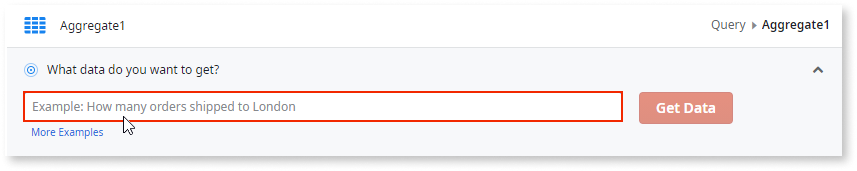

# Fetch data using human language

Fetch data in your apps by using everyday language to create queries. Ask for data similarly to how you would ask another person, and Service Studio creates an aggregate to retrieve that data.

Fetching data using human language includes the following steps:

1. In an aggregate, you ask for data using human language.

1. OutSystems handles your data request, and adds the needed sources, joins, filters, and sorting to the aggregate.

1. You validate the aggregate's result to ensure it's getting the correct data.

<iframe src="https://player.vimeo.com/video/803095782" width="650" height="250" frameborder="0" allow="autoplay; fullscreen" allowfullscreen="">Video demonstrating using human language to fetch data</iframe>

The video shows a developer asking for data using everyday language and then checking the aggregate source and filter to ensure relevance. Download the video [here](resources/NL2Agg_MainDemo.mp4).

## Prerequisites

To use this capability check the following:

* You're using cross-platform Service Studio version ≥ 11.53.13 or ODC version ≥ 1.0.31.

## Ask for data

In an aggregate, add your data request in the text input, and click **Get Data**.

While you write your request, Service Studio provides suggestions based on context for the name of entities, attributes, variables, and functions.

Use these suggestions to become more productive and to ensure you get the most reliable results. For example, if you have multiple attributes with the same name, use the right suggestion to quickly and accurately define the correct attribute.

### Use cases

The clarity with which you ask for data is important to make the most of the feature.
Check the following examples on the best way to ask for data, depending on your use case.

#### Get all data

You want | You ask
---|---
**All employees** | `Find employees`
**All orders and their descriptions**. Here, orders and their descriptions are in two different entities, Order and Order Details. | `Show Order and Order Details`

#### Get filtered data

You want | You ask
---|---
**Employees who live in London** | `Find employees who live in London`
**Sales managers in London** | `Employees who live in London and whose title is sales manager`
**Orders that cost more than $10** | `Show orders with a minimum price of $10`
**Open orders** | `Get open orders`
**Orders over a variable minimum price.** The minimum price is in the OrderPriceVar variable. | `Show Order with a TotalAmount (in Order) bigger than OrderPriceVar`
**Total number of Orders shipped until the current day.** | `How many Orders were delivered until today?`
**Show the Employee name that is currently logged in the application.** | `Show Employee with GetUserId()`

#### Get sorted data

You want | You ask
---|---
**Employees ordered by the city they live in** | `Get employees ordered by City (in Employee)`
**Orders sorted by price from highest to lowest** | `Show orders sorted by Price (in Order) from high to low`

#### Get grouped data

You want | You ask
---|---
**All employees grouped by the city they live in** | `Get Employee grouped by CityName (in City)`

#### Get the count or average

You want | You ask
---|---
**How many employees exist** | `Count employees`
**How many users exist** | `Total number of users`
**How many orders have shipped to London** | `How many orders shipped to London`
**The average unit price of orders** | `What is the average order price`

## Validate data

Start by checking the aggregate results, ensuring you got the data you expected.
Then check the sources, filters, and sorts tabs of the generated aggregate to ensure the aggregate is valid and makes sense for your data request.

To improve your aggregate, tweak your sentence and ask for data again. Alternatively, tweak your aggregate manually by adding sources, filters, sorts, and functions.

## Limitations

Check the current limitations in the following sections.

### Data model

* The feature may not work when you have a big number of entities and attributes. Please submit feedback if you get stuck in this situation.

### Asking for data { #limitation-ask }

* You can only ask for data using English.

* Typos in the name of entities, attributes, and variables may cause errors in the generated aggregate.

* You can't ask for data filtered with advanced **Functions**. For example, **AddDays()** or data type conversion functions like **TextToIdentifier()**.

* You can't ask for data that includes **calculated attributes**. For example, a new attribute that joins attributes, like `User.FirstName + " " + User.LastName`

* You can't ask for data ordered using **dynamic sorts**.
