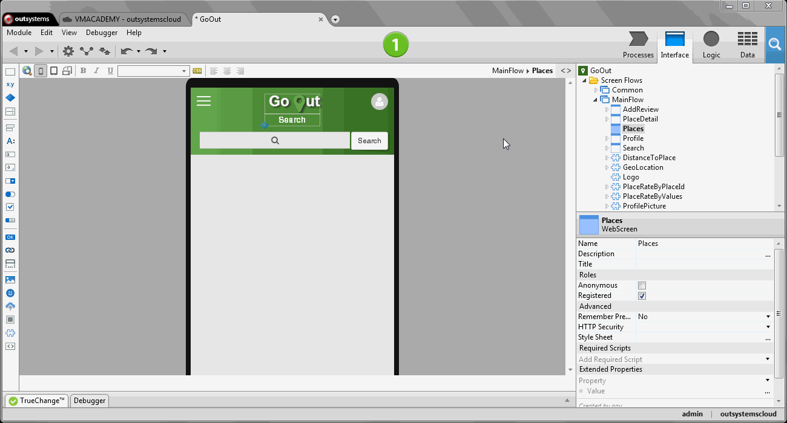
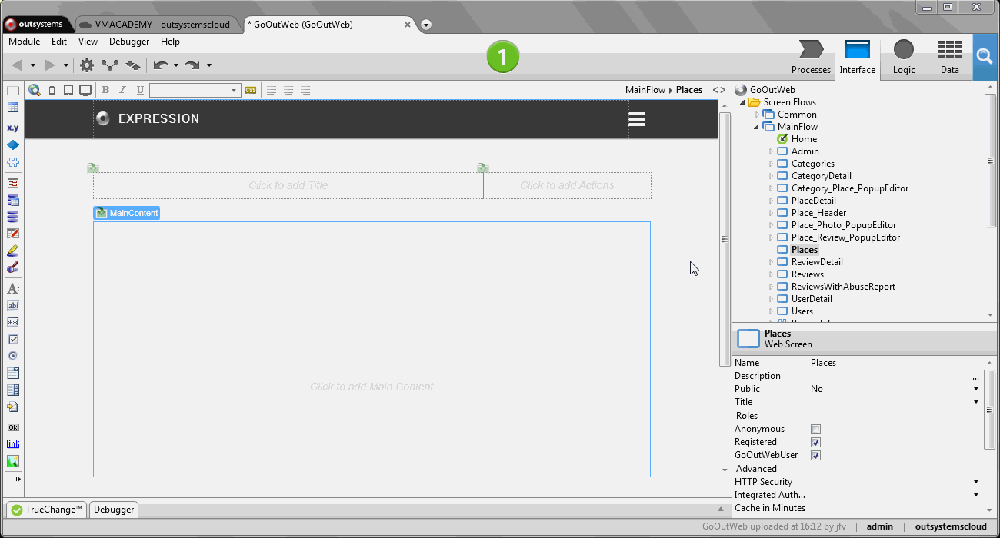

# Fetch and Display Data from the Database

One of the most common operations in a data-driven application is fetching data from the database, for example, to display it on the screen. In OutSystems, Aggregates provide this functionality.

To fetch data from the database in Reactive Web or Mobile:

1. On the Interface tab, right-click a screen and select if you want to retrieve data from the database or from the local storage to add an aggregate.
1. Open the aggregate, and drag the entities from where you want to fetch data from the Data tab to the aggregate.
1. Access the data using the output list of the aggregate.

To fetch data from the database in Traditional Web:

1. Drag the aggregate tool from the toolbox to any action flow. Aggregates are typically used in Preparation actions of screens.
1. Open the aggregate, and drag the entities from where you want to fetch data from the Data tab to the aggregate.
1. Access the data using the output list of the aggregate.

## In Reactive Web and Mobile

In the following steps, we will fetch Places from the database of a mobile app called GoOut. Then we will use the List widget to display them on the screen.

1. On the Interface tab, right-click on the screen where you will display the data and select  Fetch Data from Database to add an aggregate to the screen.
1. Open the aggregate and drag the Place entity from the Data tab to the aggregate.
1. Drag the List widget from the toolbar onto the screen.
1. Set the Source property of the widget to `GetPlaces.List` to bind the data of the aggregate to the widget.
1. To define what to display, drag the Name and Address attributes of the aggregate from the Interface tab into the List widget.
1. Publish the application.

## In Traditional Web

In the following steps we will fetch Places from the database of a web app called GoOutWeb. Then we will use a Table Records widget to display them on the screen.

1. Add the Preparation action to the Places screen, and open it.
1. Drag the aggregate from the toolbar to the Preparation action. Then double-click on the aggregate to open it.
1. Drag the Place entity from the Data tab to the aggregate.
1. On the screen, add a Table Records widget from the toolbar.
1. Set the widget's  Source Record List property to `GetPlaces.List`. This binds the data to the widget.
1. Drag the Place entity from the Data tab to the Table Records widget on the screen.
1. Publish the application.

