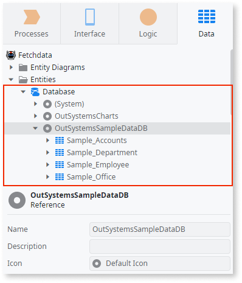
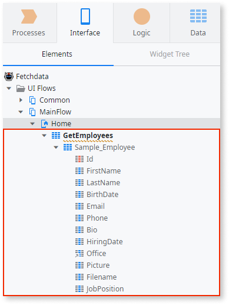
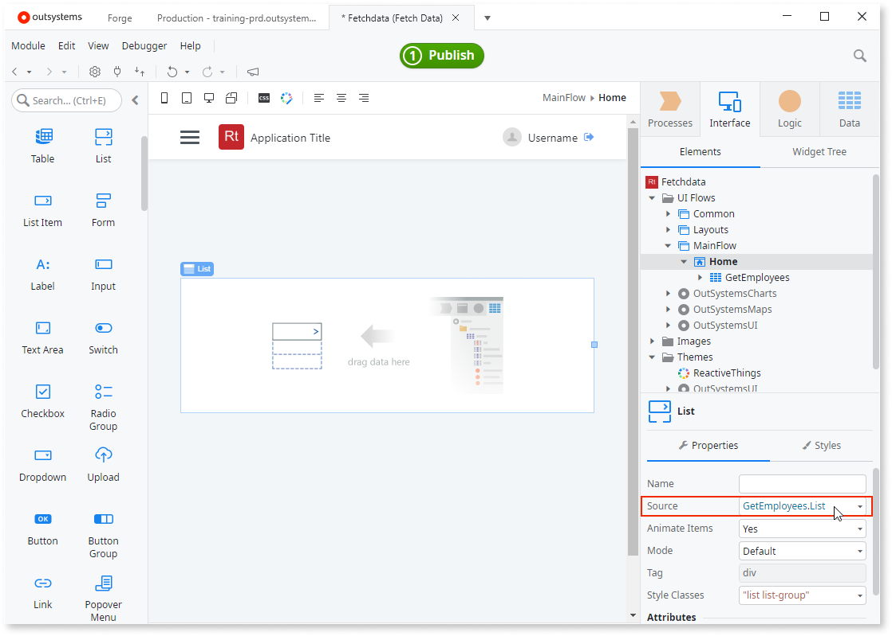
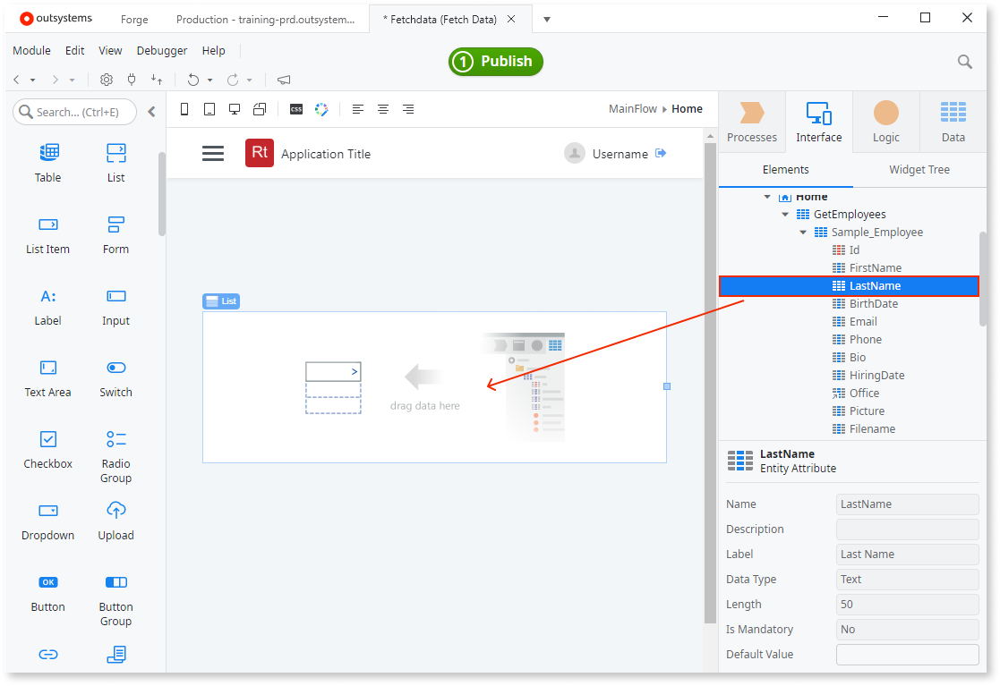
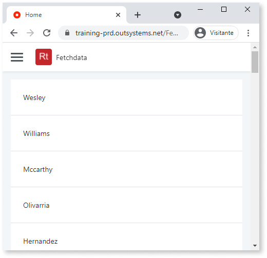

# Fetch and display data from the database in OutSystems

You often need to fetch data from a database to, for example, show it on the screen. An efficient way to fetch data from databases in OutSystems is to use an Aggregate.

This document guides you through two steps:

1. Getting data. You first need to load some data from your database. The example uses Entities from OutSystems sample data, but you can use your Entities as well. 
1. Showing data. Once your app has data, you can show all records or just some. The example uses the List widget, but you can add a Table or some other widget.

## Fetch data from a database

Here is how you can fetch data in your app by using an Aggregate. Aggregates are a handy way to get data, and they don't require knowledge of databases. As this is a simple app, you can reference the data directly from the main module.

This is an example of getting data with an Aggregate to a Screen. Both Aggregate and Screen run in the **client**. For more information about creating Aggregates in the **server** logic, see [Server-side Aggregates](../../../ref/lang/auto/Class.Aggregate.final.md#server-side-aggregates).

1. Start by [creating a new app](../../../getting-started/create-reactive-web.md#new-app).

1. Add a Screen to your app. Go to **Interface** > **UI Flows**, right-click **MainFlow** and select **Add Screen**. In the **New Screen** window select **Empty** (1), enter **Home** as the Screen name (2), then click **CREATE SCREEN** (3). Service Studio adds an empty Screen to your app.

    
   
1. Add data sources to your app by referencing some Entities in the **Manage Dependencies** window (**Ctrl+Q**). This example app [references OutSystems sample data](../../../develop/ui/screen-templates-create/sample-data.md#referencing-sample-data-in-apps). Once you reference Entities, they're available in Service Studio under **Data** > **Entities** > **Database**.

    

    

    Instead of referencing existing Entities, you can [import data from Excel](../excel-bootstrap.md) and create new Entities.

    

1. Publish the app by clicking the **1-Click Publish button**. This step is optional, but it lets the app show the data preview later.  

1. It's time to load some data to the Screen. Go to **Interface** > **UI Flows** > **Main Flow**, and then right-click your **Home** Screen. Select **Fetch Data from Database**. A new Aggregate edit screen opens, and there's a notice that you need some data.

    

1. With the Aggregate still open, navigate to **Data** > **Entities** > **Database** > **OutSystemsSampleDataDB**. Drag the **Sample_Employee** Entity to the Aggregate window. If you're using your data instead of OutSystems sample data, then drag some other Entity. Service Studio shows the data preview in columns, and uses the Entity name to name the Aggregate.
   
    

    

    If you don't see a preview, but warnings instead, go ahead and publish your app to update the references and refresh the preview.

    

1. Go back to **Interface** > **UI Flows** > **Main Flow** > **Home** and notice the **GetEmployees** Aggregate in the Screen. Expand the Aggregate to see the Entities, and then expand the Entities to list the Attributes. There's also a warning that you're not using the data anywhere. Follow the instructions on [how to show the data in an app](#showing-data) to prevent the warning. 

    

## Show data in a widget

Once you fetch data from the database, use one of many OutSystems widgets to show the data to the users. Continuing from the previous section, in this example you create a list with the employee last names.

1. Open your **Home** Screen for editing. To do that, double-click **Home** in  **Interface** > **UI Flows** > **Main Flow**.

1. In the search bar, search for the **List** widget and drag the widget to the Screen. Service Studio now shows an empty List widget.

    

1. Click the List widget to select it, and go to the properties. In the **Source** field select **GetEmployees.List**. With this you're telling the app which data source to use with this widget.

    

    

    The **Sample_Employees** Entity comes from the OutSystems sample data. See the [fetching data](#fetch-data-from-a-database) section for more information.

    

1. With your List widget connected to a data source, add some Attributes to show data in the List. Expand the Entity to see the Attributes, under **Interface** > **UI Flows** > **Main Flow** > **Home** > **GetEmployees** > **Sample_Employee**. Drag an Attribute, for example, **LastName** to the List widget. This tells the widget to list all last names that are in the database.

    

1. Publish your app and load it in the browser. There's a list widget listing the last names of the employees.

    

## Traditional Web App

For more information on how to add an Aggregate in Traditional Web App, see [Aggregates in Traditional Web Apps](../../../ref/lang/auto/Class.Aggregate.final.md#traditional-web-apps).
