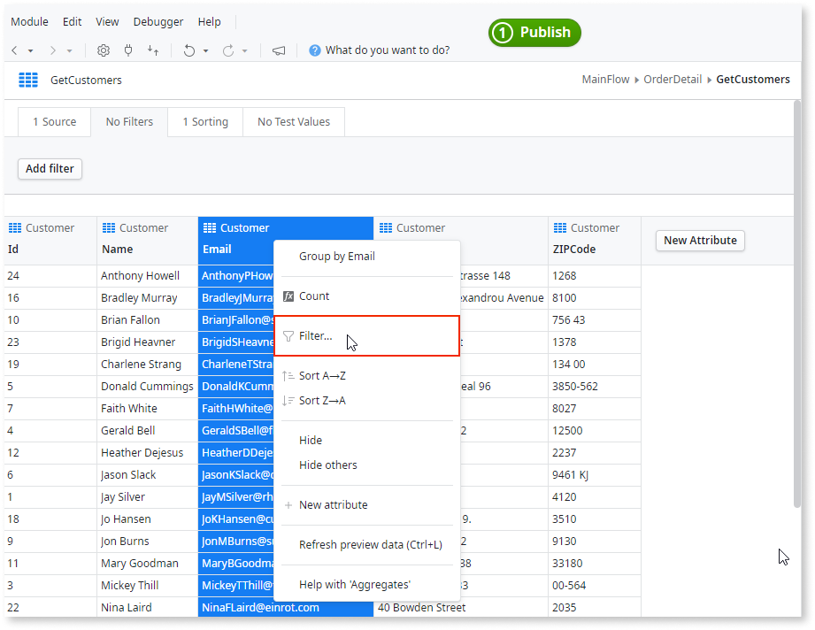

# Filter Query Results

When designing queries, it's common to add conditions to filter results and get exactly what you want from the database. You can do this in OutSystems by adding Filters to Aggregates, as follows:

1. Double-click to open the Aggregate.
1. Right-click the attribute you want to filter by and select **Filter...**.

    

1. Enter the condition. 

To edit the conditions, go to the Filters option and change the ones you want to alter.
