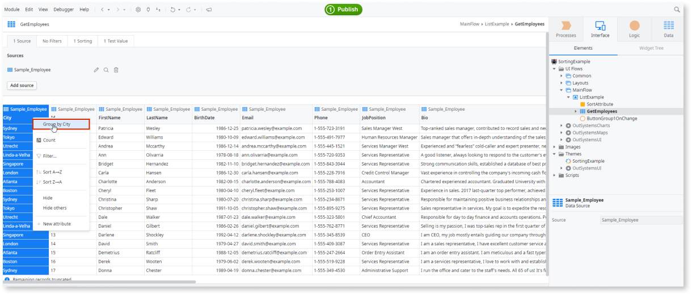
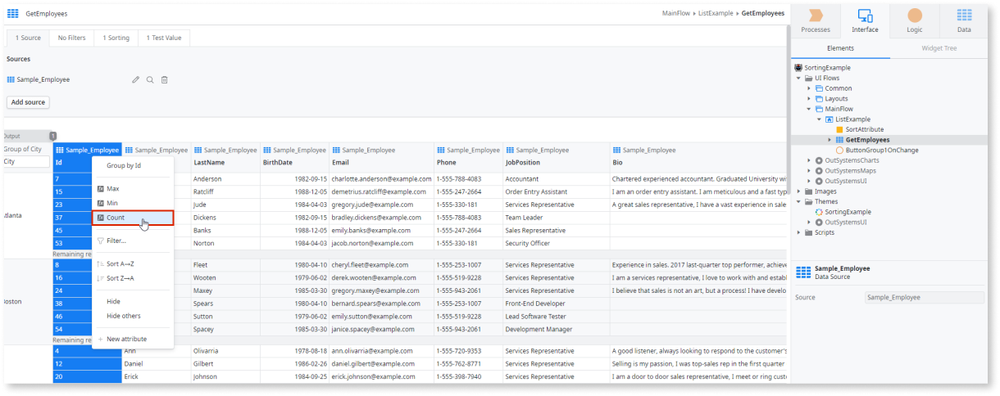
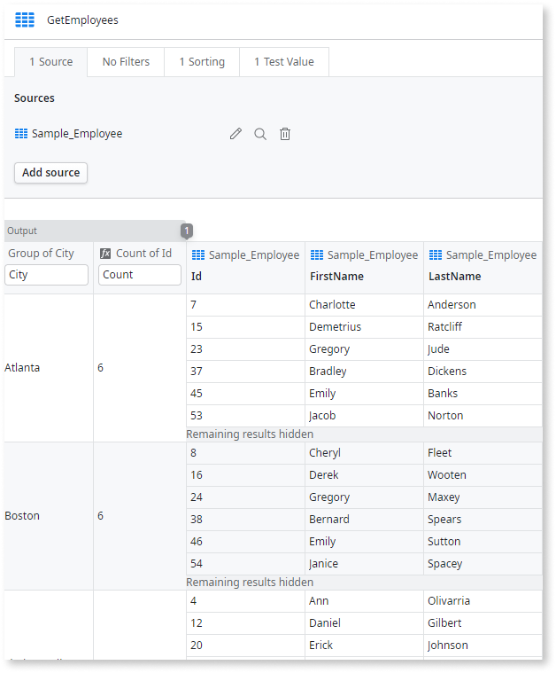

# Calculate Values from Grouped Data

Putting data into groups to calculate aggregated values allows you to extract more information from your data sets. In OutSystems, you can use aggregate functions to calculate values based on groups of identical data.

[Fetch the data](<fetch-display.md>) in an aggregate and do the following:

1. In the attribute with identical data, right-click, and select **Group by &lt;attribute name&gt;**.
1. In the attribute to calculate, right-click, and select an aggregate function such as **Count**.

Once you group or use aggregate functions on attributes, those attributes become the only output of the aggregate.

## Example

Consider that you already have an aggregate fetching all the data from the database. Open the aggregate and do the following:

In the Sorting Example application, we want to define how many employees are in each city. First, create a **Group by** city. Next, calculate the **count** of those employees by city. Assume that you already have an aggregate fetching all the employees from a sample database. 

Open the aggregate and do the following:

1. On the `City` attribute, right-click, and choose **Group By City**.
  
    

1. On the `Employee Id` attribute, right-click, and choose **count**.

    

1. Now you see how many employees are in each city.

    
