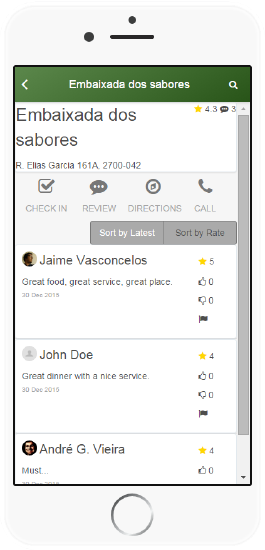

# Sort Results in an Aggregate

Most of the times, records are listed on screens following some order to facilitate the reading or to help find information faster.

In OutSystems, aggregates allow sorting the records they return. The sorting can be fixed or dynamic, meaning that it can change during runtime.

To sort results in an aggregate with fixed sorting:

1. In the aggregate, click on  to  open the menu of the attribute to sort.
1. Select A-Z for ascending order or Z-A for descending order.

To sort results in an aggregate with dynamic sorting:

1. In the aggregate, go to the Sorting panel and click on Add Dynamic Sort.
1. The expected input is an expression of type Text. This value can be the result of a condition or other logic implemented in the expression itself. To refer to columns, you can select a variable of type Text previously defined from the Scope tree.

While defining expressions as values for your variable, you can specify:

* Calculated or grouped attributes, using the pattern `AttributeName` for ascending order or `AttributeName DESC` for descending order;
* Entity attributes, using the pattern `Entity.Attribute` or `Entity.Attribute DESC` for ascending or descending order.

## Example

In GoOut, a mobile application to search review and rate places, we have a screen that lists details for a place and all its reviews. We want to allow the user to sort the reviews for a place by most recent date and by highest rating as follows:

1. Open the screen PlaceDetail.

1. Add a local variable of type `Text` called `SortAttribute`.

1. Open the aggregate GetPlaceReviews.

1. On the panel Sorting, click **Add Dynamic Sort** and define the sorting expression as the variable SortAttribute.

1. Drag a Button Group widget from the toolbox to the top of the reviews list and bind the variable SortAttribute with the Button Group.

1. Remove one of the Button Group Items and rename the remaining Button Group Items to `Sort by Latest` and `Sort by Rate`.

1. Select the Sort by Latest Button Group Item and set the **Value** property to the expression `Review.Date DESC`. This sorts the results of the aggregate by descending order of the attribute Date.

    

1. Select the Sort by Rate Button Group Item and set the **Value** property to the expression `Review.Rate DESC`. This sorts the results of the aggregate by descending order of the attribute Rate.

1. Select the Button Group widget and set the **On Change** event handler to a new action called `SortCriteriaOnChange`.

1. Open the action SortCriteriaOnChange and add a Refresh Data that refreshes the aggregate GetPlaceReviews. This ensures that the aggregate refreshes the data using the sorting criteria defined in the variable SortAttribute.

1. Publish and test.

