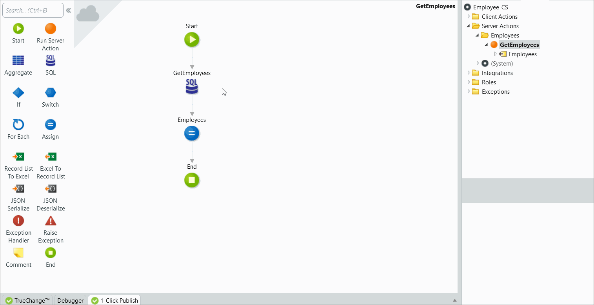

# SQL Queries

We’ve been working on this article. Please let us know how useful this new version is by voting.

The  SQL element allows you to execute, test, and review custom SQL queries in your applications. The element provides flexibility in data manipulation, but we recommend using Aggregates when applicable. Aggregates are highly optimized and easier to maintain.

SQL queries can access data that is sent through the input parameters only, and other logic can access only what the SQL query returns through its Outputs.

Input parameters
:   Providing input parameters allows you to use dynamic data in the SQL query. Input parameters are optional. To reference an input parameter in your SQL statement use a `@` prefix, e.g. `@CustomInputParameter`.

Output parameters
:   SQL in OutSystems queries always have two output parameters, even when the query executed does not return a result:

    * **List**: The list with the result returned by the query. The list is empty if there are no results.
    
    * **Count**: The number of records returned by the query without considering the SQL Max Records property.

Output Structure
:   Output Structure is mandatory. You need to define the structure (data types of the columns) that your query returns. You can use any combination of Entities, Structures or both, but the attribute order/data type must match your Select. Output Structure is needed even if your SQL statement does not return any results. 

    * Example 1: When selecting all attributes of the Employee Entity (with `Id`, `Name`, `Email`, and `PhoneNumber` attributes), 
    specify the Employee Entity as the Output Structure. This enforces that List output parameter of the SQL 
    query returns Employee List data type.
    
    * Example 2: When selecting only the `Name` and `Email` of the same Employee Entity, create a Structure 
    (named EmployeeInfo) to hold the attributes you need and use it as the Output Structure. The data type and order of the attributes in the SELECT statement must match the data type and order of the atributes of the EmployeeInfo Structure. This 
    enforces that List output parameter of the SQL query returns EmployeeInfo List data type. 

To reference an entity in your SQL query write it between curly brackets (e.g. `{User}`) and to reference an entity attribute write it between square brackets (e.g. `[PhoneNumber]`).

## Write Your Own SQL Query

Do the following:

1. Add a SQL element to an action flow.
1. If necessary, define the query parameters.
1. Write the SQL query.
1. Define the output structure used for the output of the SQL node.
1. Use the output list of the SQL node to access the result of the SQL query.

## Test Your SQL Query
You can test your work by clicking the `TEST` button located at the bottom of the SQL editor. In order to test it successfully make sure that:
1. If you have `Query Parameters` you should first assign a test value in the Test Inputs tab.

    _If no values are assigned, the query will be tested with empty values._
    
1. There is one or more output entities/structures that will match the attributes on the `SELECT` statement.
1. Click **TEST**.

## Notes and guidelines

Consider the following when using the SQL element:

Avoid Data Definition Language
:   The SQL tool should only be used to execute the following: `SELECT`, `INSERT`, `UPDATE`, and `DELETE` statements. Using Data Definition Language (DDL) statements like `CREATE TABLE`, `ALTER TABLE`, `DROP TABLE`, etc. might make the OutSystems metamodel inconsistent, leading to misbehavior.

No physical layer query
:   To ensure the OutSystems metamodel is always consistent, you cannot perform queries directly to the physical tables of the metamodel. The platform shows an error message if your query uses tables prefixed with `OSLOG`, `OSSYS`, or `OSUSR`.

Exception triggers a rollback
:   OutSystems starts a transaction when the web request arrives to the server, and commits the transaction before sending the reply to the user. If an exception is left uncaught, the transaction is rolled back to ensure your data is always consistent. This means that your queries run inside a transaction and that changes are rolled back if something goes wrong.

Check runtime user permissions
:   Your queries are tested and run in the database using the runtime user specified in the [Configuration Tool](<../../../ref/configuration-tool/tabs/platform.md>). You need to make sure this user has permissions to run the SQL statements specified in your query, otherwise an error will occur when you execute the query at runtime or when you test it.

Database support check
:   If the Database Module Property is set to **All**, OutSystems checks the queries to ensure they are compliant with all supported databases. If not, a warning message is displayed.

Avoid enabling the Expand Inline property of query parameters
:   Proper use of parameters being expanded inline is **hard**, since you need to make sure that any user input has been properly escaped in the right way before using it in an SQL statement. If possible, avoid enabling this property altogether.  
OutSystems provides ways of implementing common use cases without enabling this property. Check [Building dynamic SQL statements the right way](<https://success.outsystems.com/Documentation/Best_Practices/Building_dynamic_SQL_statements_the_right_way>).

## Convert an Aggregate to SQL

As your application grows, you may need to change an existing Aggregate to fetch data in a different way. If your use case requires more advanced data fetching, such as subqueries or IN clauses, you will need to use a SQL element instead of an Aggregate. For these situations, you can **convert an existing Aggregate to a SQL element**, which enables you to keep evolving the SQL generated from your original Aggregate.

Although a SQL element enables you to refine your query, **Aggregates have the following advantages**:

* The runtime SQL statement of an Aggregate is optimized to fetch the necessary number of rows and columns.

* The effort to maintain an Aggregate is lower.

Therefore, you should always start fetching data using an Aggregate and convert to a SQL element only when necessary.

### Limitations

The option to convert an Aggregate to a SQL element will only be available if your Aggregate doesn't include:

* Structures in Sources
* Calculated Attributes
* Group By attributes
* Dynamic Sorts

In Reactive Web and Mobile apps, this feature is not available for Aggregates in Client Actions or Screens.

### How to Convert an Aggregate to a SQL Element

To convert an existing Aggregate to a SQL element follow these steps:	

1. In your action flow, double-click the Aggregate you want to convert.	
1. In the Aggregate window, double-click the `Executed SQL` property to open the Executed SQL window.  	
1. Click **CONVERT AGGREGATE TO SQL**. 

The **CONVERT AGGREGATE TO SQL** button is only enabled if your Aggregate doesn't include any of the [limitations listed above](#limitations).

	
1. Click **PROCEED**.

Your action flow now includes a SQL element based on the original Aggregate. 
The original Aggregate is kept in the action flow but it is disabled. After validating the query results of the new SQL element you can delete the disabled Aggregate.

