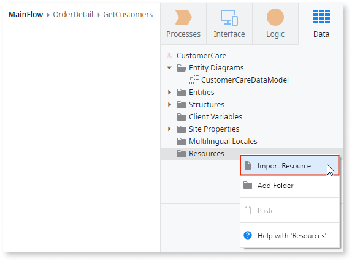

# Use Resources

When designing your application you are allowed to add all sort of files to your module. These files are called Resources and can be used for example to embed a video file in a Web Screen, to include a PDF document to be downloaded from your application, or simply to add to your module a file containing all the icons of your application in their source format.

You can import Resources to your module in the Resources folder of the Data tab:

Any Resource you add to your module is saved in the module's OML file. When you publish the module, the Resources are deployed depending on the value set in their Deploy Action property:

* **Do Nothing**: The resource is not deployed.

* **Deploy to Target Directory**: The resource is deployed to the sub-directory set in the Target Directory property, which is created under the deploy directory of the module.  
    **Note:** Deploying to Target Directory is not applicable if you are using Library Modules.

Adding big resource files to your module may slow down the publish operation.

In the table below there are some example of how you can use the Resources path and filename in the design of your module:

| Resource Filename | Target Directory | Relative Path |
|-------------------|------------------|---------------|
|'Presentation.wmv' |'Videos'          |'Videos\Presentation.wmv'|
|'Tutorial1.wmv'    |'Videos\Tutorials'|'Videos\Tutorials\Tutorial1.wmv'|
|'Tutorial2.wmv'    |'Videos\Tutorials'|'Videos\Tutorials\Tutorial2.wmv'|
|'Conditions.pdf'   |'Documents'       |'Documents\Conditions.pdf'|
|'Statement.pdf'    |'' (application root directory)|'Statement.pdf'|

## Use Resources to Display a PDF Document

Imagine you want to display a 'Conditions.pdf'  document after clicking on a 'See Conditions' link in your web screen. Proceed as follows:

1. Add the 'Conditions.pdf' document as Resource of your module.
1. Set the `Deploy Action` property to 'Deploy to Target Directory' and the `Target Directory` property to 'Documents'.
1. Create an External Site element in the web flow of the web screen and name it 'Conditions'.
1. Set the External Site `URL` property with the Resource path,  'Documents\Conditions.pdf'.
1. Set the 'Conditions' External Site as destination of the 'See Conditions' link.
1. Publish the module.

## Use Resources to Play a Video

Imagine you want to play a 'Tutorial1.wmv' video in your web screen. Proceed as follows:

1. Add the 'Tutorial1.wmv' file as Resource of your module.

1. Set the `Deploy Action` property to 'Deploy to Target Directory' and the `Target Directory` property to 'Videos'.

1. Add an Expression element to the web screen where the video is to be played.

1. Set the `Expression` property to:

    `<embed src='Videos\Tutorial1.wmv' bgcolor='#FFFFFF' width='600' height='450' type='video/x-ms-wmv'>`

1. Set expression's `Escape Content` property to 'No'.

1. Publish the module.

Depending on the file type, you may have to configure the application server (IIS or Apache) to serve static files with a specific MIME type. Learn [here](https://en.wikipedia.org/wiki/Media_type) more about MIME types for situations like the one above where the resource file is embedded with its MIME type.

## Use Resources to Allow Downloading a File

Imagine you want to add a button to allow downloading the file 'Rules.pdf' that is a deployed resource of your module:

1. Add the 'Rules.pdf' file as Resource of your module.
1. Set the `Deploy Action` property to 'Deploy to Target Directory' and the `Target Directory` property to 'Documents'.
1. Add a Button element to your web screen, name it 'Download', and set the `Destination` property of the button to (New Screen Action).
1. A 'Download' Screen Action is automatically created: edit its action flow and drag a Download element into the existing End element.
1. Select the Download element, open the Expression Editor for the `File Content` property, and choose the 'Rules.pdf' file from the Resources in the Scope Tree.
1. Set the `File Name` property of the Download element to 'Rules'.
1. Publish the module.
