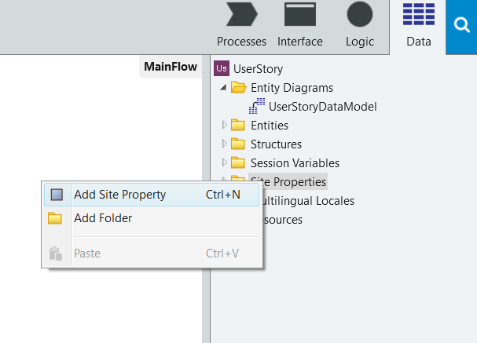

# Use Site Properties to Configure Behaviors at Runtime

Site Properties are global variables that have constant values. They are typically used to implement configuration values for the application - such as a maximum value for an application parameter - since they can be set at runtime for each environment with no need to republish the application.

You can set a Site Property to a default value on its creation. At runtime, someone with privileges can change the Site Property value for a specific environment through the environment management console (Service Center).

## Create and use a Site Property

Site Properties exist in the server-side of the application. To create and use a Site Property:

1. In the Data tab, right-click on the Site Properties folder and add a site property.

    

1. Define the name, data type and default value of the newly created Site Property.

1. Use the Site Property in your server-side code by referring to it as `Site.<SitePropertyName>`.

If you want to use the value of a Site Property in the client-side logic of a mobile application, you must add a Server Action to get the Site Property value and use that Server Action in your client-side logic. 

Site Properties are stored in cache of your application until invalidated.

## Change the value of a Site Property in Service Center

1. Open the Service Center in your environment (`http://<environment>/ServiceCenter`) and login with your credentials.
1. In the Factory tab, select **Applications** and filter by the name of your application.
1. Select the module in which the Site Properties are stored.
1. Click on the **Site Properties** tab and select the Site Property whose value you want to change.
1. Change the Effective Value of the Site Property and click Apply.

## Usage

This section explains how to use a Site Property, using an example of an aggregate called **GetMovies** to retrieve records about movies from a **Movie** Entity, with the default maximum records of 50.

Follow the steps below.

1. On the **Data** tab, right-click **Site Property**.
1. Select **Add Site Property**.
1. On the **Name** property, enter `MaxRecords`.
1. On the **DataType** property, enter `Integer`.
1. On the **Default Value** property, enter `10`.
1. Select the **GetMovies** Aggregate and set the **Max. Records** property value to `Site.MaxRecords`.
1. Click the **1-Publish** button to publish your app, and open it on your web browser.
1. Open a screen that uses the **GetMovies** Aggregate.
1. Click on the **Module Management** icon at the top-left side to open Service Center.
1. Click on **Factory** and then **Modules**, and select the module on which you applied the Site Property.
1. Go to **Site Properties** and check that it lists the **MaxRecords** Site Property.
1. Change the **MaxRecords** value and refresh the page.
1. The MaxRecords displayed must adopt the new value.
