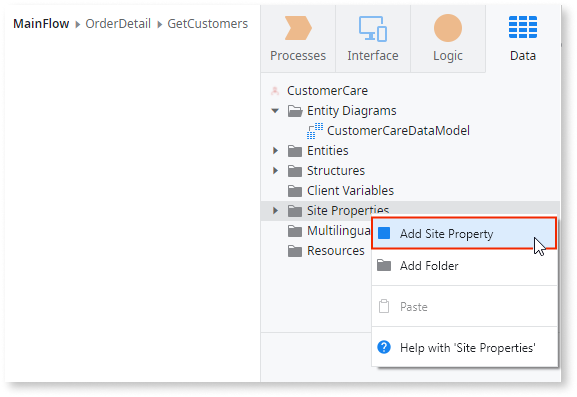

# Use Site Properties to Configure Behaviors at Runtime

Site Properties are global variables that have constant values. They are typically used to implement configuration values for the application - such as a maximum value for an application parameter - since they can be set at runtime for each environment with no need to republish the application.

You can set a Site Property to a default value on its creation. At runtime, someone with privileges can change the Site Property value for a specific environment through the environment management console (Service Center).

## Create and use a Site Property

Site Properties exist in the server-side of the application. To create and use a Site Property:

1. In the Data tab, right-click on the Site Properties folder and add a site property.

    

1. Define the name, data type and default value of the newly created Site Property.

1. Use the Site Property in your server-side code by referring to it as `Site.<SitePropertyName>`.

If you want to use the value of a Site Property in the client-side logic of a mobile application, you must add a Server Action to get the Site Property value and use that Server Action in your client-side logic.

## Change the value of a Site Property in Service Center

1. Open the Service Center in your environment (`http://<environment>/ServiceCenter`) and login with your credentials.
1. In the Factory tab, select **Applications** and filter by the name of your application.
1. Select the module in which the Site Properties are stored.
1. Click on the **Site Properties** tab and select the Site Property whose value you want to change.
1. Change the Effective Value of the Site Property and click Apply.

## Usage
Ex. In an aggregate called GetMovies that retrieves records about movies from an Entity called Movie, the Default Max. records is 50
Go to Data tab
Right Click Site Property
Select Add Site Property
Give Name MaxRecords, DataType Integer and Default Value 10
Go to Aggregate GetMovies and replace Max. records | 50 by Max.Records | Site.MaxRecords
Publish and Open in Browser
Open a page on which the GetMovies aggregate is used
Go to your Service Center (Click the clog top left in Service Studio)
Goto https://<Hostname>.outsystemscloud.com/ServiceCenter/eSpace_SiteProperty_Edit.aspx
Go to Factory/Modules and select the module on which the Site Property was applied
Go to Site Properties
Check MaxRecords is listed
Change the MaxRecords value and refresh the page
The MaxRecords displayed must adopt the new Value
