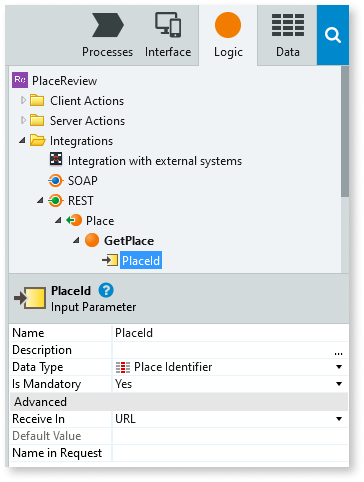
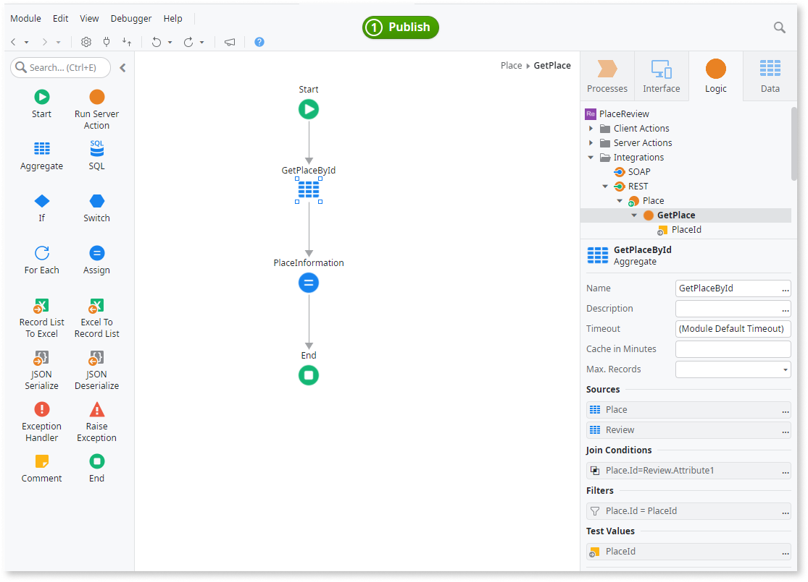
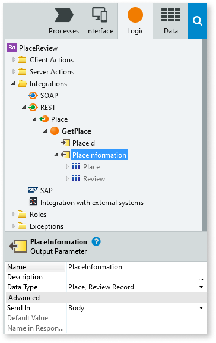
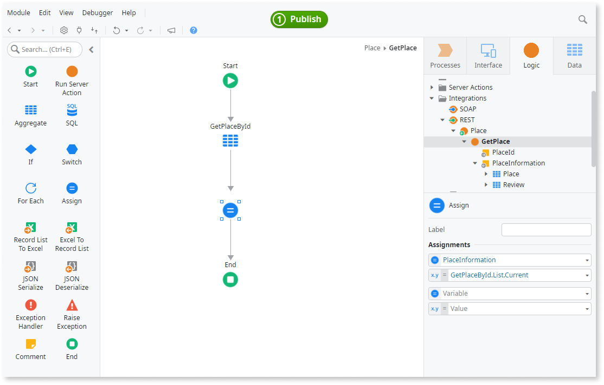
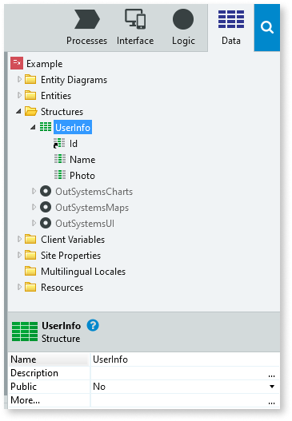
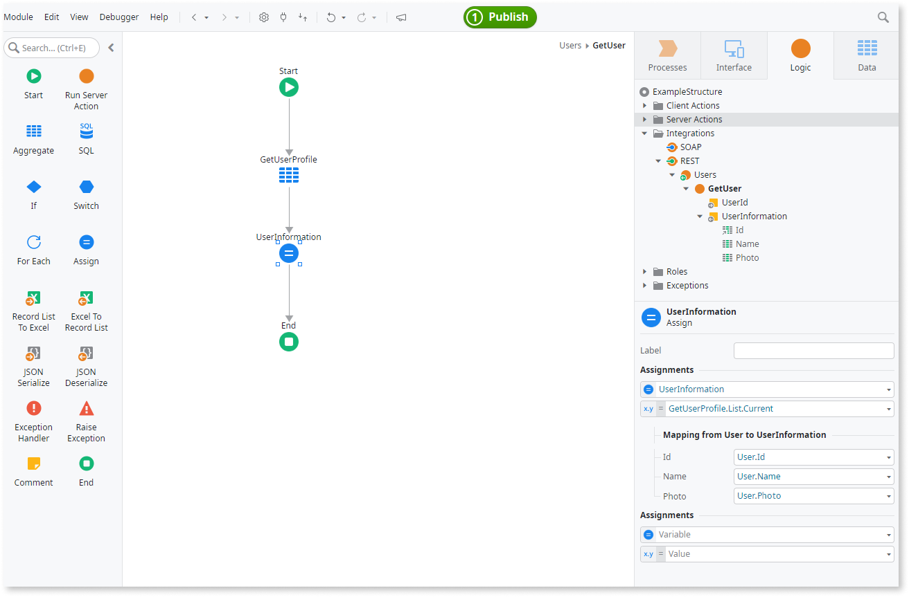

# Use Structures and Records to Create Compound Data Types

While developing your application, you may find it interesting to have a variable holding a collection of variables with different data types grouped together and use it in the logic or UI. For example, to assign the values returned by an action where you don't have to create one output for each value.

In OutSystems, you can create structured values by using a Structure or a Record. A Structure is a custom data type that you can use in your module. A Record is a custom data type defined for a single variable and cannot be reused in another variable.

To declare and use a Structure:

1. On the Data layer, right-click the folder Structures and select **Add Structure** to add a new Structure.
1. To add an attribute, right-click the new Structure, select **Add Structure Attribute**, and change the properties of the attribute such as the name and the data type.
1. Create a new variable.
1. Set the variable's data type to the Structure you've created.

To define a Record:

1. Create a new variable.
1. Change the data type of the variable to Record.
1. On the pop-up window, add attributes to the record and define the data types of the attributes.

## Example using a Record

In an application where we want to find and review places of interest, we want to return basic information about a Place using a REST API method. The information to return about each place is the Id, the name, and the average rating. The data is stored in the Place and Review entities.

Since the data type that we will need to assign to the output parameter will only be used here, we will use a Record:

1. Expose a REST API, name it Place and create the method GetPlace.
1. Add an input parameter to the GetPlace method named  `PlaceId`. Ensure the **Data Type** is **Place Identifier**.

    

1. To define the logic of the GetPlace method, in the element tree, double-click **GetPlace**.
1. Drag an aggregate from the toolbox into the action flow.
1. Add the Place and Review entities to the aggregate.
1. Filter the aggregate ensuring the Place.Id attribute matches the PlaceId parameter. Add a filter condition with `Place.Id = PlaceId`.

    

1. In the GetPlace method, add an output parameter called `PlaceInformation`.
1. Set the PlaceInformation **Data Type** to **Record...**. A Text attribute is added to the variable.
1. Change the **Data Type** of the Text attribute to the **Place** entity and its **Name** to `Place`.
1. Add a new attribute from the PlaceInformation context menu.
1. Change the **Data Type** of the attribute to the **Review** entity and its **Name** to `Review`.

    

    

    You can also use the suggested Data Type **GetPlaceById Record Type** to set the PlaceInformation data type as a compound data as covered by steps 6 to 9.

    

1. In the GetPlace method flow, assign the result of the aggregate to the output parameter. 
    1. From the toolbox, drag an Assign after the aggregate.
    1. Add an assignment by setting the **Variable** to `PlaceInformation` and the **Value** to `GetPlaceById.List.Current`.

    

## Example using a Structure

In the application GoOutWeb, a Web application to find and review places of interest, we are developing a REST API method to expose basic information about a registered end user of the application. The  information we are returning is the Id, the name, and the profile picture of an end user.

Since we are going to reuse the user information in another action of the application, we will create a Structure to hold this information thus allowing us to reuse the data type:

1. On the Data layer, right-click the folder Structures and add a new structure named `UserInfo`.

1. Add the following attributes to the new structure:

    * `Id` of type User Identifier
    * `Name` of type Text
    * `Photo` of type Binary Data

    

1. Expose a REST API named User and create the method GetUser.

1. Add an input parameter with the User Id for which to return information. 

1. In the action flow, add an aggregate with the User and Profile entities and filter using the User Id input parameter.

1. Add an output parameter called UserInformation and assign the UserInfo structure as its the data type.

1. To assign the values to the output variable, add an Assign element to the action and assign the first element returned from the aggregate.

1. Since the data type returned by the aggregate is different from the output variable, below the assignment in the properties of the Assign node, map the attributes from the aggregate output to the output parameter attributes.

