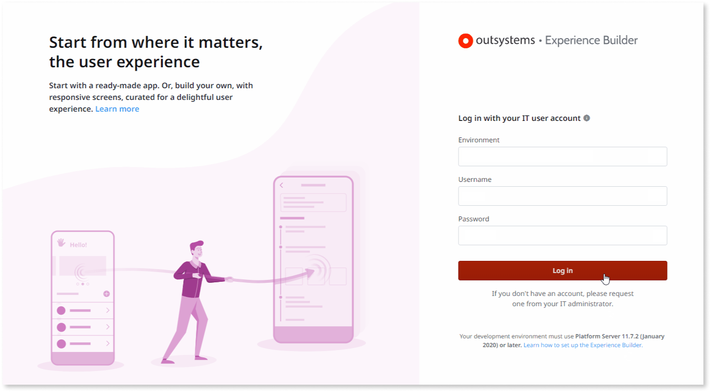
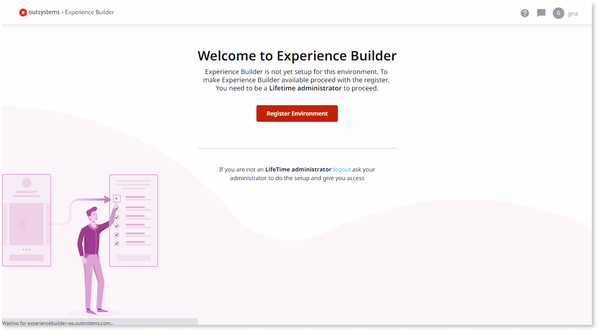
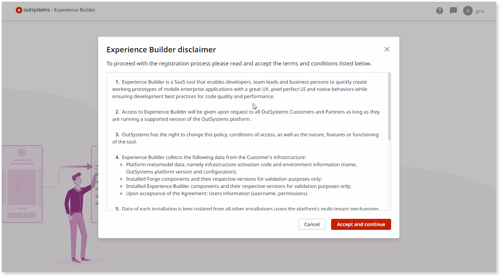
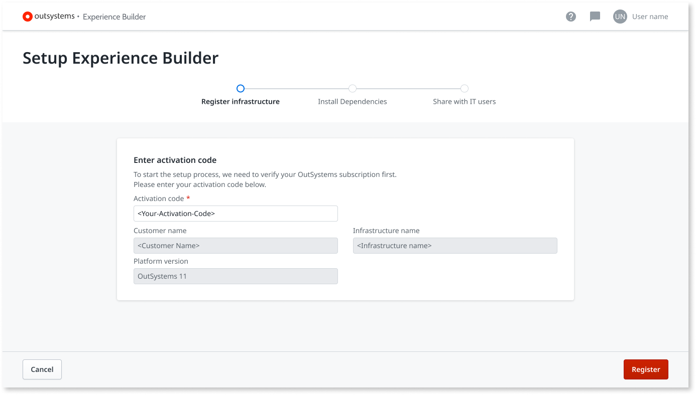
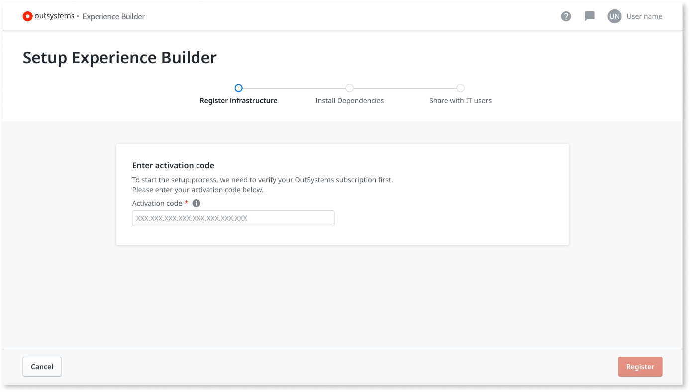
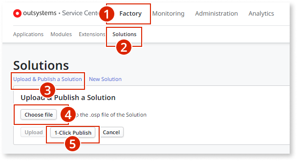
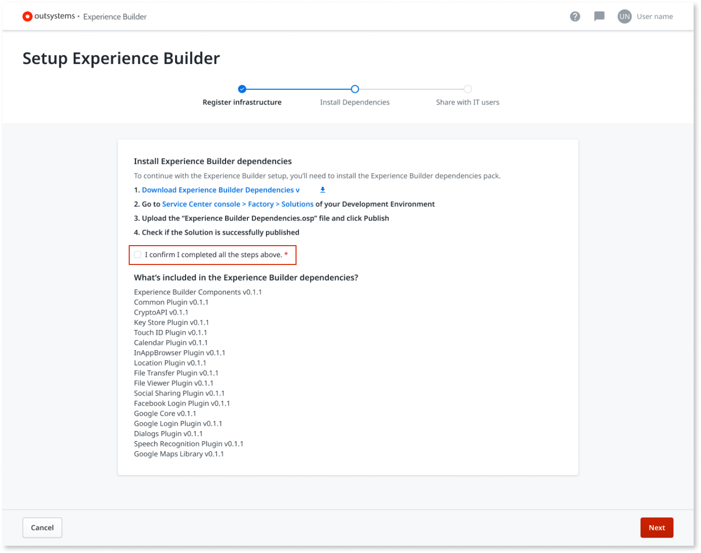
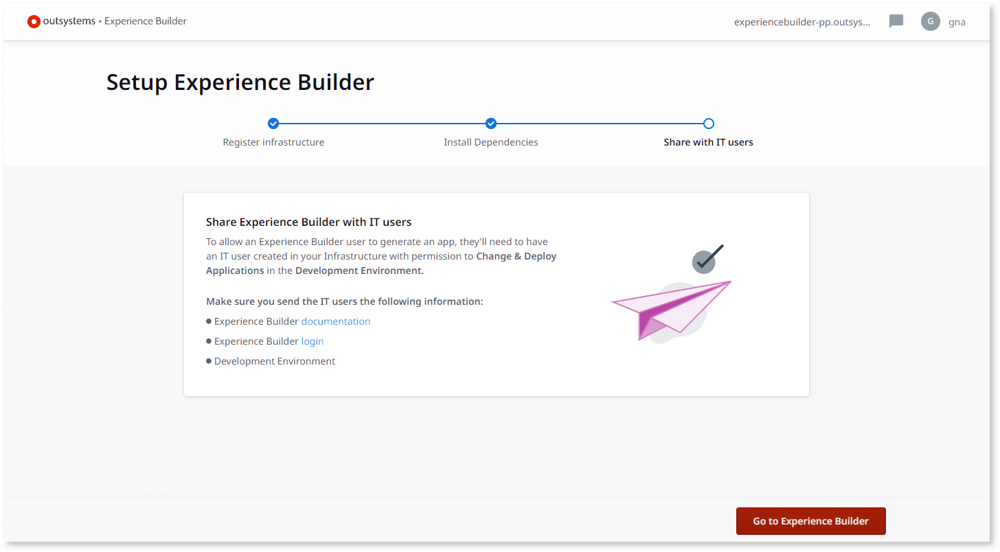
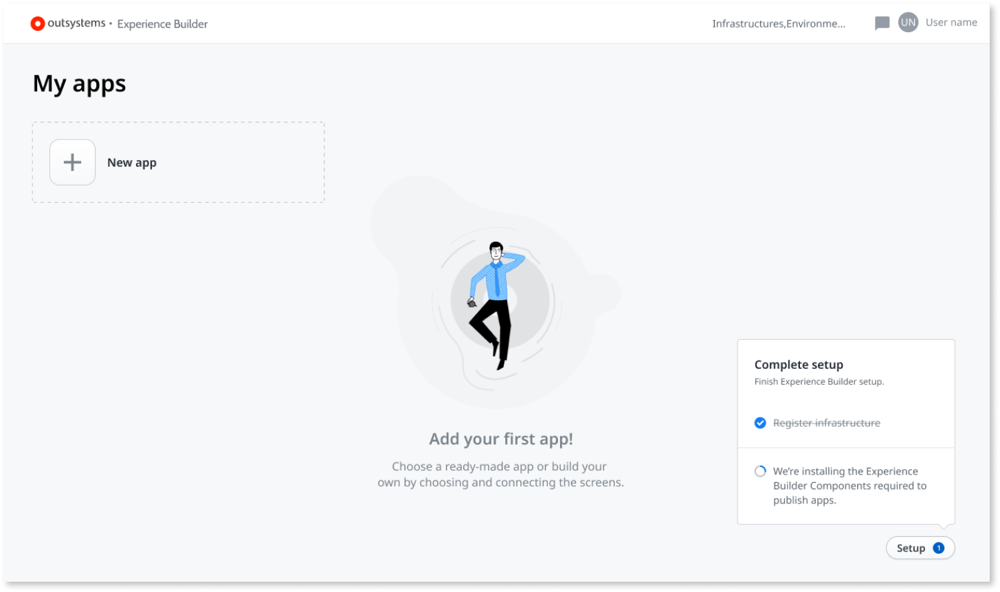
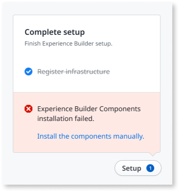

---
tags:
summary: Learn how to set up Experience Builder.
locale: en-us
guid: 0d73e561-eeae-4755-af4c-eb4a6a92f6df
---
# How to set up Experience Builder

Learn how to set up Experience Builder.

## Prerequisites

To use Experience Builder, make sure the following prerequisites are met.

### Your environment

To set up and use Experience Builder your environment must comply with the following prerequisites:

* Your environment is associated with an [OutSystems Edition](https://www.outsystems.com/pricing-and-editions/) that isn't the Free Edition. **You can't use a Personal Environment with Experience Builder**.

* Your development environment uses [Platform Server release 11.7.2](https://www.outsystems.com/Downloads/ScreenDetails.aspx?MajorVersion=11&ReleaseId=19414&ComponentName=Platform+Server) or later.

* Your development environment allows communication with Experience Builder by allowing inbound traffic from `https://experiencebuilder.outsystems.com` in **port 443**. The Experience Builder will use the environment's public DNS hostname to communicate. Check [Experience Builder network requirements](../../setup-maintain/setup/network-requirements.md#experience-builder) for detailed information.

    

    If your infrastructure is on OutSystems Cloud and you didn't [configure an internal network for the environment](../../managing-the-applications-lifecycle/secure-the-applications/configure-internal-network.md), you already fulfill this prerequisite.

    

* Your development environment has [Outsystems UI](https://www.outsystems.com/forge/component-overview/1385/outsystems-ui) 2.5.2 or later.

### Your user

You must have an IT user with **Change and Deploy Application** and **Create Applications** permissions for the environment.

### Your device

You can access Experience Builder with the **latest versions** of the following **desktop browsers**:

* Edge.
* Firefox.
* Google Chrome.
* Safari.

## Log in for the first time

When you log in to [Experience Builder](https://experiencebuilder.outsystems.com/) for the first time you enter the following welcome screen:

To log in to Experience Builder, perform the following steps.

1. Enter the address of your OutSystems **development environment** in the **Environment** field.

    

    Use a **non-production environment** with Experience Builder, preferably your **development environment**.  
    When you publish an app in Experience Builder, the app is published in the environment you entered in the log in.

    

1. Enter your IT user credentials.

1. Click on the **Login** button.

## Registering your infrastructure

As a first user from your organization logging in, you first need to register your environment. The registration procedures vary, depending on the Platform Version installed in the environment.

To begin registering your infrastructure in Experience Builder, perform the following steps:

1. Click on the **Register Environment** button.

    

1. Read the Experience Builder disclaimer and GDPR information carefully. To proceed, click on the **Accept and continue** button.

    

1. Depending on your Platform Server release and your user role in Lifetime, there are two scenarios:

    * Experience Builder collects all data from your infrastructure automatically. Check the information displayed, and click on the **Register** button.

        

    * Enter your infrastructure activation code, and click on the **Register** button.
    Then, Proceed to **Step 4**.
    To learn how to get your activation code, refer to [Find the Activation Code of your infrastructure](https://success.outsystems.com/Support/Enterprise_Customers/Licensing/02_Manage_and_Upgrade/Find_the_Activation_Code_and_the_Serial_Number).

        

1. Download the **Experience Builder Components** package using the link provided on the screen.

1. In the Service Center console of the Development Environment (`https://<development_environment>/ServiceCenter`), install the downloaded **.osp** file in your Development environment by following these steps:
    
    

    1. Click on **Factory**.
    1. Click on **Solutions**.
    1. Select **Upload & Publish a Solution**.
    1. Select **Choose File** and select the **.osp** file.
    1. Click the **1-Click Publish** button.
    
1. Validate if the Solution is successfully published by checking for a **Done: The solution was successfully published** message, and go back to the Experience Builder setup page.

1. Click on the checkbox to confirm you completed all the steps, and then click on the **Next** button.

    

1. Share Experience Builder with your IT users. To allow an Experience Builder user to generate an app, they’ll need to have an IT user created in your Infrastructure with permission to Change & Deploy Applications in the Development Environment.

1. The Experience Builder registration is complete. Click on the **Go to Experience Builder** button to enter the tool.

    

    When you enter the tool, a background process installs the Experience Builder components required to publish the apps.

    

    

    If the Experience Builder components installation fails, you need to install the components manually. Read [How to install or update dependencies](how-update-dependency.md) to learn about it.
    
    

    

1. The Experience Builder registration is complete.
    
## Granting access to IT users

To publish apps with Experience Builder, IT users must have  permission to **Change & Deploy Applications** in the **development environment**.

Ensure you send your users the following information:

* [Experience Builder documentation](intro.md)
* The Experience Builder URL: https://experiencebuilder.outsystems.com
