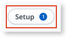
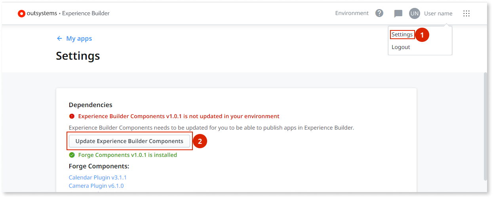
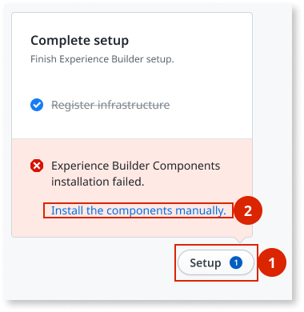
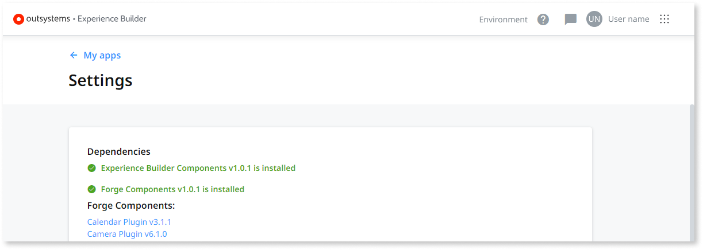

---
tags:
summary: Learn how to install or update Experience Builder dependencies.
locale: en-us
guid: 846ff90b-1883-40ce-adcf-ca9eb6004f90
---
# How to install or update dependencies

Check the status of the dependencies by selecting **Setup** on the bottom right of Experience Builder.

If Experience Builder doesn't manage to automatically install or update dependencies, you need to do this process manually.

To install or update Experience Builder dependencies manually, follow these steps:

1. Start the manual installation of the dependencies by doing one of the following:

    * Select your user name, select **Settings**, and then select **Update &lt;outdated-dependency&gt;** or **Install &lt;outdated-dependency&gt;**, where &lt;outdated-dependency&gt; is the missing or outdated dependency. For example, if the Experience Builder Components dependency is outdated, select **Update Experience Builder Components**.

        

    * Select **Setup**, and then select **Install the components manually**.

        

1. In the **Install &lt;outdated-dependency&gt;** dialog, select **Download &lt;outdated-dependency&gt;** and save the **.osp** file in your computer.

1. Select **Service Center console > Factory > Solutions**.

1. In Service Center, select **Upload & Publish a Solution**.

1. Select **Choose File** and select the **.osp** file that you downloaded in step 3.

1. Select **1-Click Publish**.

1. Validate if the Solution is successfully published by checking for a **Done: The solution was successfully published** message.

1. In Experience Builder, select the checkbox to confirm you completed all the steps, and then click on the **Installation complete**.

After completing these steps, Experience Builder re-checks and updates the status of your dependencies.

Repeat the previous steps for each missing or outdated dependency.

Experience Builder apps have dependencies for various apps and components. For more information see, [Extend your Experience Builder app in Service Studio](extend-app-in-ss.md).

Apps created with Experience Builder use custom UI patterns and actions included the Experience Builder Components package. For more information, see [Experience Builder Components package reference](ref/intro.md).
