# Use Experience Builder

Follow this tutorial to learn how to use Experience Builder to create your first mobile app prototype.  
After completing this tutorial you will have created a mobile app prototype that you can test and share, and that includes the following flows:

* Sign up, including using a phone number and phone number confirmation.
* Login using a phone number and a one-time passcode sent to the phone number.
* Contact support using several methods, including chat and email.
* Check general information about their bank account and bank cards in a dashboard.
* Mockup of a recover password screen.

## Prerequisites

Before proceeding make sure the following prerequisites are met.

### Your device

You can access Experience Builder with the **latest versions** of the following **desktop browsers**:

* Edge.
* Firefox.
* Google Chrome.
* Safari.

### Your user

You must have an IT user with **Change and Deploy Application** and **Create Applications** permissions for the environment.

### Your environment

Your environment is already [set up to use Experience Builder](how-setup.md).

## Step 1. Log in

To log in to Experience Builder, access <https://experiencebuilder.outsystems.com/>, enter your development environment address and your IT user credentials, and select **Login**.

Use a **non-production environment** with Experience Builder, preferably your **development environment**.  
When you publish an app in Experience Builder, the app is published in the environment you entered in the log in.

After logging in, if Experience Builder lets you know that the environment isn't registered, do one of the following depending on your LifeTime role:

* If you **are an administrator** check the [environment prerequisites and set up Experience Builder](how-setup.md).

* If you **aren't an administrator** contact your OutSystems IT administrator and ask them about [setting up Experience Builder](how-setup.md).

## Step 2. Check the onboarding

After logging in for the first time, check out the onboarding to get an overview of Experience Builder.

Select **Next** to see the next dialog, and once you reach the last step, select **Start now** to close the onboarding.

To check the onboarding again, select **?** in the header of Experience Builder, and then select **Open onboarding**.

## Step 3. Start creating your first app

After closing the onboarding, you can see the **My apps** screen.

This screen shows you the list of all the apps created with Experience Builder in your environment. If you are the first one using Experience Builder in your environment you won't see any apps.

Let's start by creating a new app by selecting **Create app**.

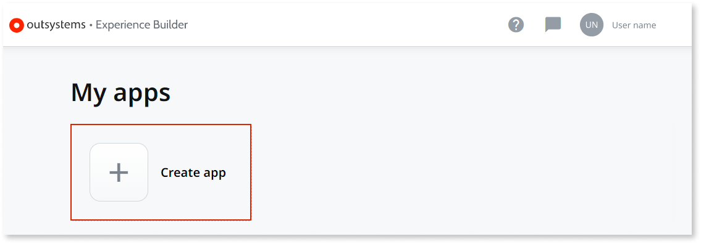

## Step 4. Choose a starting point for your app

Experience Builder lets you start from pre built app templates or from a blank app.

Fell free to explore the pre built app templates.%% After selecting one of the templates, you can see a short description of the app, and an overview of all the flows and screens included.

In this tutorial you are starting from an empty app. Select **Blank App**, and then select **Start building**.

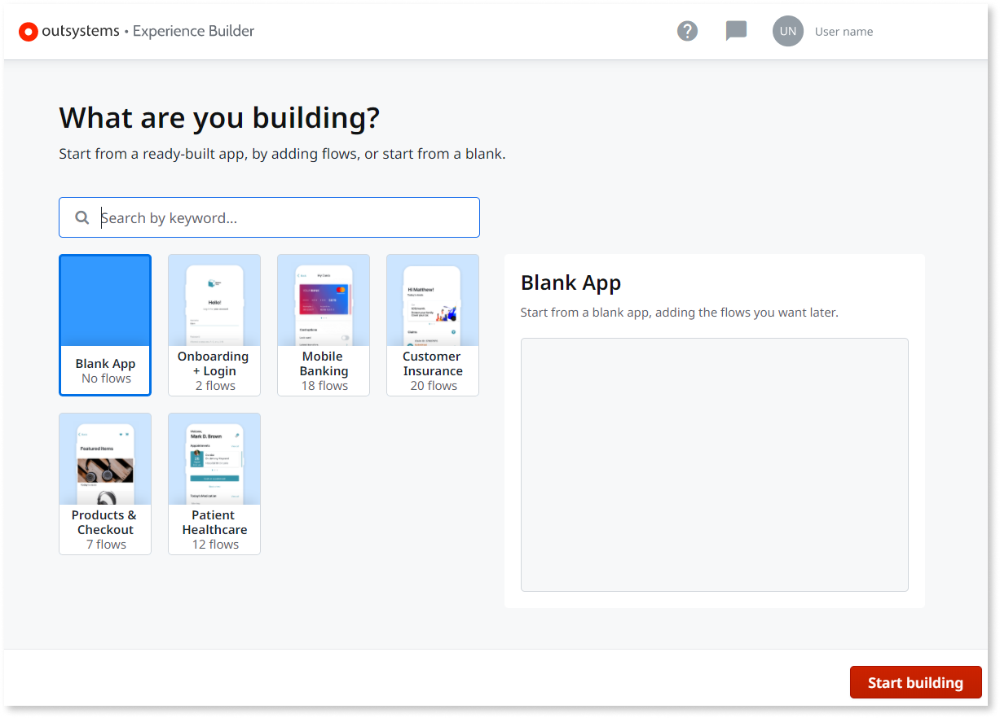

## Step 5. Customize your app

The **Customize your app** screen lets you do some basic customization and branding of your app.  
Follow these steps:

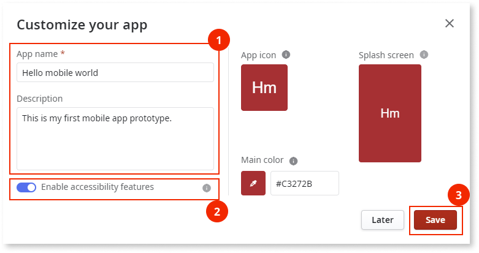

1. Enter a name for your app in **App name**, for example `Hello mobile world`, and enter a **Description**, for example `This is my first mobile app prototype.`.

    

    Feel free to customize other details of your app.

    The **App icon** and **Splash screen** are especially important if you want to publish your app to an app store.

    If you upload an **App icon**, Experience Builder also changes the **Main color** based on the main color of your icon. The icon should be a 1024x1024 pixels JPEG or PNG image with RGB colors.

    If you upload a **Splash screen**, Experience Builder creates a set of images tailored to different screen sizes. The splash screen should be a 2048x2048 pixels JPEG or PNG image, with the main logo or text centered. Ensure the main logo or text of the splash screen is centered and has a maximum size of 300x300 pixels.

    

1. Enable/Disable accessibility features for your app.

    **Note**: By default this feature is enabled.  Any time this value is changed, you must republish your app so that the change becomes effective.

    By enabling accessibility features for your app, by default, all of the screens comply with the AA accessibility level. For more information about accessibility features for your app, see [Accessibility](../ui/accessibility/intro.md). 

1. Once you are done customizing your app, select **Save**.

    

    To open the **Customize your app** screen again, select the name or icon of your app in the header of Experience Builder.

    

## Step 6. Add the first flow

The flow canvas lets you design the screen flows of your app.

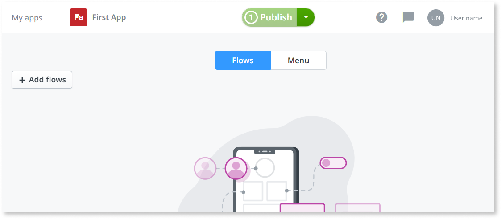

Flows are basic building blocks that contain one or more screens and aim to solve a specific use case.

The flows in Experience Builder are indivisible, self-contained, and the transition between their screens is already created.  
You can link flows together but you can't remove or add screens to a flow.

Each Experience Builder app can only have one instance of each flow, with the exception of the **Empty Screen** and of the **Onboarding** flows, namely **Animated Onboarding Option 1**, **Animated Onboarding Option 2**, and **Animated Onboarding Option 3**.

Let's add the first flow to your app, **Banking Sign Up**, a sign up flow that includes account details, a passcode and even the possibility of using biometrics.  
Follow these steps:

1. Select **Add flows**, and search for `Sign up`.

1. Select **Banking Sign Up**.

1. Select **Add flow**.

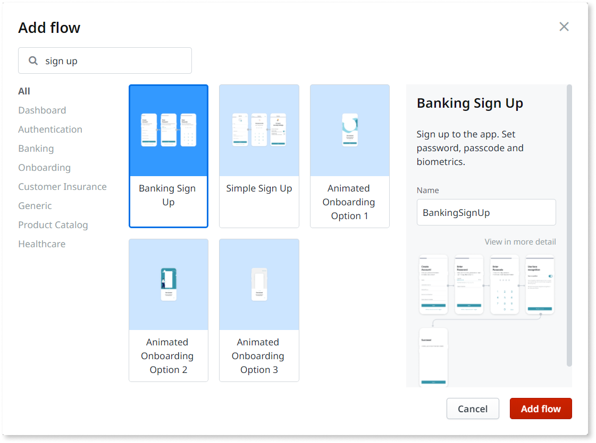

After these steps you add a flow to the flow canvas.

There are a number of options you can perform on a flow:

* You can drag the flow around the canvas.
* You can change the flow name, by clicking the name of the flow.
* You can change the name of a screen in the flow, by clicking the name of the screen.
* You can delete the flow from the contextual menu.
* You can replace login and signup flows from the contextual menu.

The **Banking Sign Up** includes five screens that are linked together. For example, if a user of your mobile app selects **Next** in the **PersonalDetails** screen they move on to the **Password** screen.

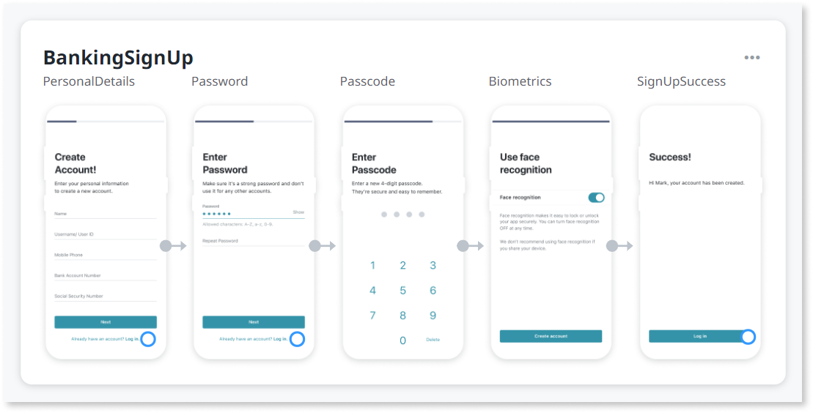

## Step 7. Connect an exit point to a new flow

The **Banking Sign Up** also has three **exit points**, represented by blue circles.

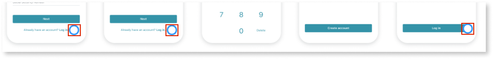

A flow can have multiple exit points.  
Exit points exist in places where an end user of your app can touch to perform an action (for example, button or link) and you use exit point to connect different flows.

For now, all the exit points are unlinked, and all the exit points are related to the login.

Empty blue circles represent unlinked exit points.  
When an end user of your app selects an unlinked exit point they see a feedback message stating that the button or link is "Not connected to a screen".

Let's add a new login flow and connect it to the exit points of your app.  
Follow these steps:

1. Select the exit point of the last screen, originally named **SignUpSuccess**, and then select **Connect to a new flow**.

    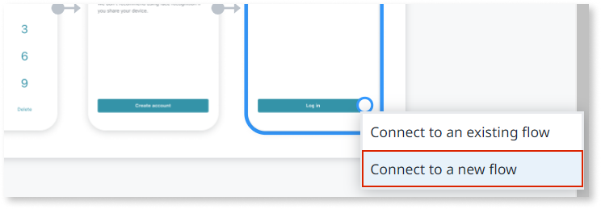

1. In the **Add flow** dialog, select the **Authentication** filter, and then add the **Login Passcode** flow.

    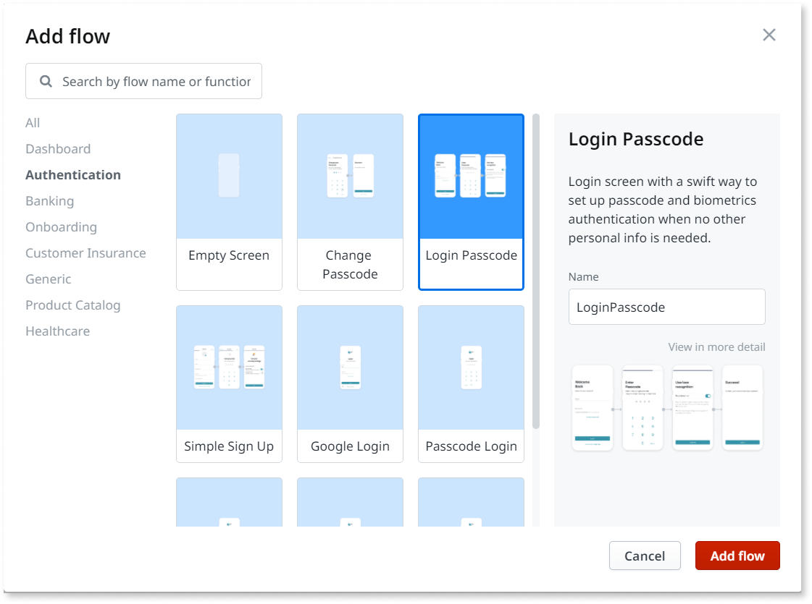

After these steps, you added the **Login And Passcode** flow to your canvas and linked the exit point to it.

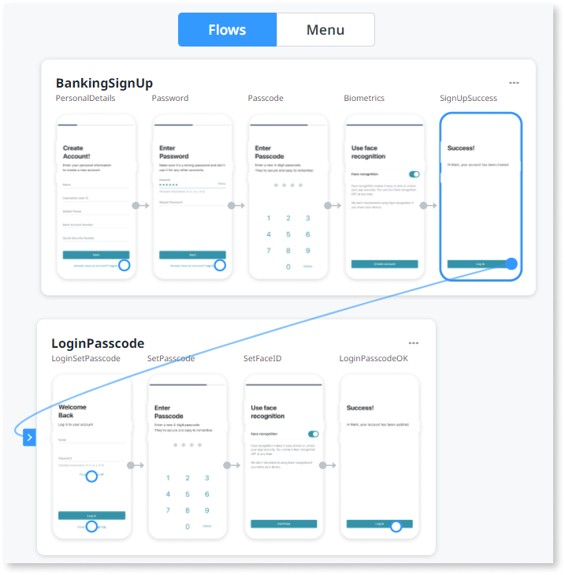

## Step 8. Connect exit points to existing flows

Your flows still have several unlinked exit points.  
Connect the remaining unlinked exit points of the **SignUpSuccess** flow to the **LoginPasscode** flow, by clicking on each **SignUpSuccess** unlinked exit point and dragging it to the **LoginAndPasscode** flow.

Select **show connections** to see the existing connections between exit points and flows.

In the first screen of the **LoginPasscode** flow, connect the last exit point, of the **No account, sign up** button, to the **SignUpSuccess** flow.

## Step 9. Use an empty screen to add a mockup

At this point, the **LoginPasscode** flow has two unlinked exit points. Let's add a mockup of a screen or flow that doesn't exist in Experience Builder, and connect it to **Forgot password?** in the first screen.  

Follow these steps:

1. Select the **Forgot password?** exit point, and then select **Connect to a new flow**.

    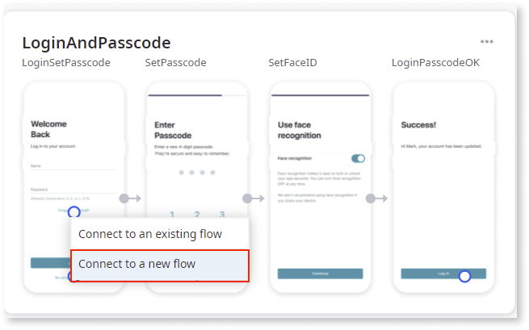

1. Select **Empty Screen**, set the **Name** as `lost_password_mockup`, and set the **Comment** as `This screen should let users recover their password. Check mockup.`.

    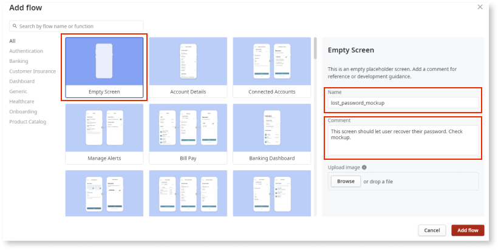

1. To upload an image, click **Browse**, and select the relevant image.

    If you add an image, the image is displayed under the comment.
    
    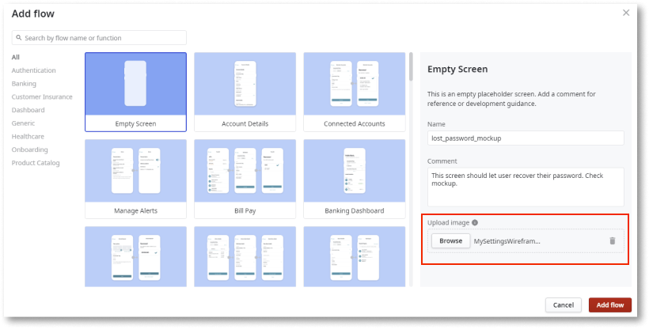

1. Click **Add flow**.

1. In the canvas, select the context menu for the empty screen, and select **Edit flow**.

    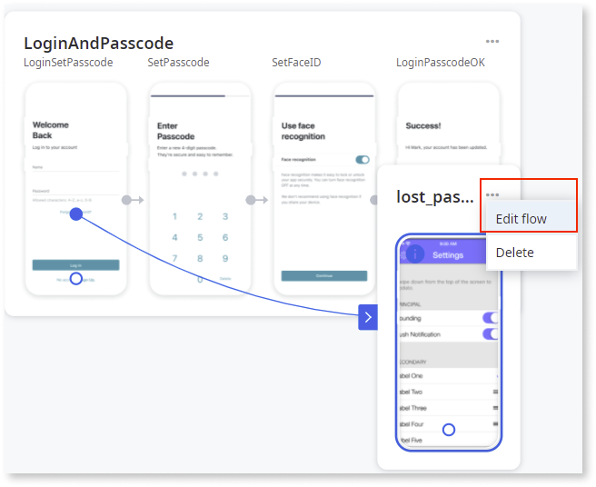

1. In the **Preview**, drag exit point **1** to where you want it to appear on your mockup image.

    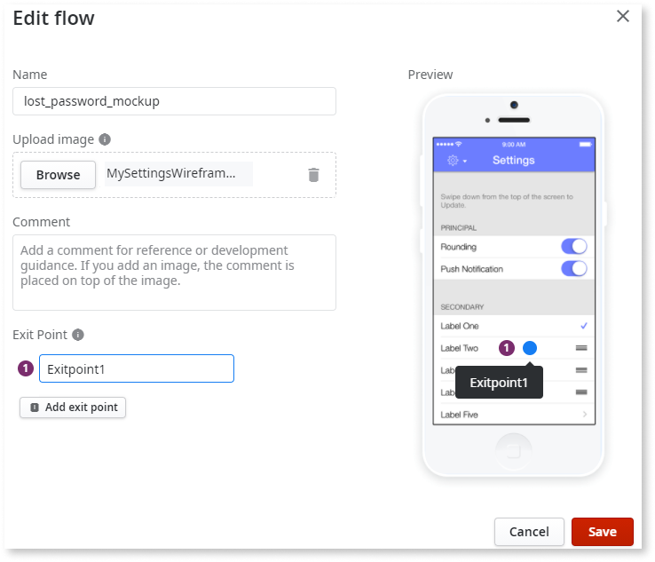

    

    **Empty Screens** can have more than one exit point.
    Add more exit points by selecting **Add exit point** if, for example, the empty screen includes more than one button or link.

    

You've now added a new empty screen with a description and a mockup image. This can be used later to guide the development of the new screen in Service Studio.

You can add more than one **Empty Screen** to your app.

## Step 10. Add more flows and connect them to exit points

Let's add a couple more flows to your app.  
Follow these steps:

1. Add a **Contact Support** flow, connected to the exit point of the **lost_password_mockup** flow.

1. Add a **Banking Dashboard** flow, connected to the **Login** exit point of the last screen, **LoginPasscodeOK**, of the **LoginPasscode** flow.

After these steps your app has a total of five flows that allow a user to sign up, login, contact support to recover their password, and check general information about their bank account and bank cards in a dashboard.

## Step 11. Set up a side menu

Let's add a side menu, and add menu entries to access the dashboard and the contact support screen.  
Follow these steps:

1. Select **Menu**.

1. Select **Side menu**.

1. Select **Menu 1**, and add a **home** icon.

1. Click the unlinked exit point of **home**, and select **Connect to an existing flow**.

1. Select the label of the menu entry, **home**, and set it to `Home`.

1. Select the **BankingDashboard** flow, and then **Add destination**.

1. Add a second menu entry with a **life ring** icon, rename it to **Support**, and connect it to the **ContactSupport** flow.

After these steps your app has a side menu with two entries, one entry linking to the account dashboard screen and the other linking to the support flow.

## Step 12. Publish your app

Let's publish your app for the first time so you can test it and share it.  
Select **Publish**.

When you select **Publish**, Experience Builder validates your app.

If everything is valid, the publishing process starts.  
If the validation finds issues with the app, Experience Builder lets you know by listing [blockers and warnings](ref/error-ref.md).

Blockers are issues that you need to solve in order to publish the app.  
Warnings are issues that may affect the experience of your app, but you don't need to solve them to publish the app.

After Experience Builder validates your app, it starts the publishing process. Experience Builder starts by grabbing all the assets (like images and metadata), then generates the application package, and finally publishes the app to your environment.

The publishing process continues even if you close Experience Builder. You can always check the status of the app in the **My apps** screen.

You can also continue to work on your app while publishing, but these changes are only published after you select **Publish** again.

## Step 13. Test your app

Once the app is published, you can test your app by opening it in a browser or in a mobile device.

Select **Open in browser** and test your app.

## Step 14. Iterate your app by replacing flows

After testing your app and showing it to stakeholders, you may have new requirements or requests for changes in your app.

Let's replace the sign up and login flows so users start using their phone numbers and a one-time passcode to login to your app.

Follow these steps:

1. Go back to the flows canvas of your app in Experience Builder.

1. For the **Banking Sign Up** flow, open the contextual menu and select **Replace flow**.

You can replace flows by other flows of the **same type**. For example, you can replace a login flow by another login flow but not by a signup flow.

Currently, you can replace flows of the **Authentication** category, which include **Onboarding**, **Signup** and **Login** flow types.

1. In the **Choose target flow** screen, select the **Phone Number Sign Up** flow, and then select **Replace flow**.

Replacing a flow in this way, keeps endpoints connected to their destinations.

1. Replace the **Login and Passcode** flow by the **Login OTP** flow.

After these steps you replaced the sign up and login flows of your apps, enabling the use of single-use passcodes to login.
