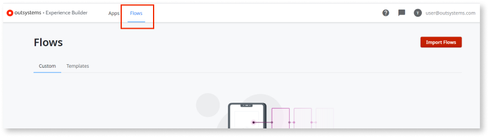
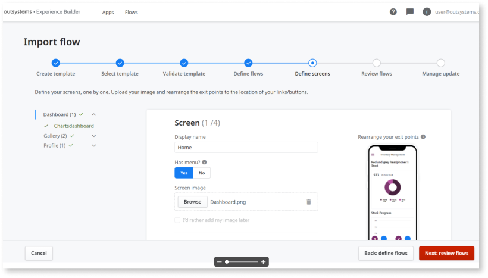
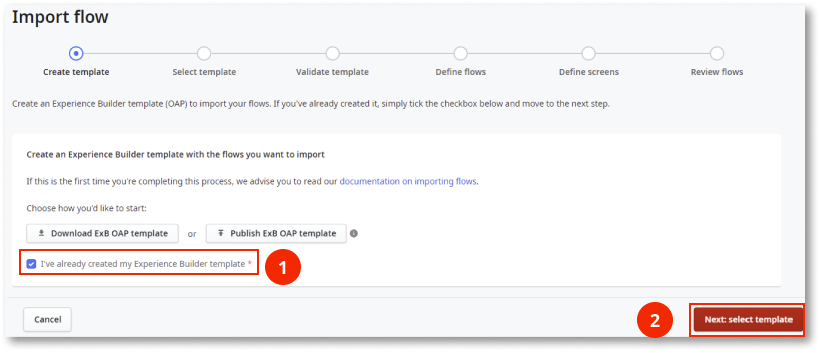
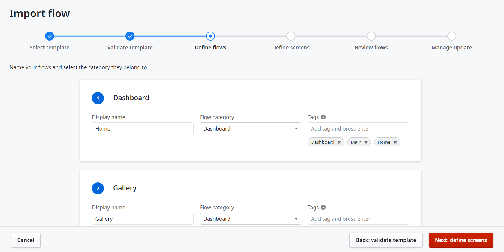

# Editing Flow Templates

After importing flows into Experience Builder, you can edit them. The way you edit the flows depends on the type of data you want to edit:

* To modify metadata you defined in Experience Builder during the importing process (for example, screens display name, screen preview image) use the [Flow edition process](#edit-the-flow-metadata).

* To apply changes made in Service Studio to the flows template module, use the [Flow reimport process](#reimporting-a-flow).

## Edit the flow metadata

1. Log into Experience Builder and click the **Flows** tab.

    

1. Locate the imported flow you want to edit and from the contextual menu, select **Edit flow**.

    

1. Edit the flow display name,  flow category, and tags and then click the **Next: edit screens** button.

    

1. Edit the screen's display name, **Has menu?** property, screen image, and reposition the exit points and then, click the **Next: review flows** button.

    

1. Check your changes and click the **Next: manage update** button.

    

1. Review which apps will be affected by this change and then click the **Save** button. 

    All apps that use any re-imported flows are moved to Draft. This allows you to review them again before re-publishing them.

    

## Reimporting a flow

To reimport a flow, you must reimport the entire template module that contains it. Keep in mind that all flows contained in that template module will also be updated by this process.

1. Log into Experience Builder and click the **Flows** tab.

    

1. Click the **Import Flow** button.

    

1. Select the **I have already created my Experience Builder template** checkbox and then click the **Next: select template** button.

      

1. From the list of modules, select the one that contains the flow template you want to update and click the **Next: validate template** button.

    

1. Analyze the validation process feedback messages. Your module needs to be re-validated to check if it still complies with Experience Builder guidelines.

    If there are no blocking errors, click the **Next: define flows** button to continue the importing process.

    

1. Edit flow data according to the [metadata reference](metadata-if.md) document. Then, click the **Next: define screens** button.

    

1. Edit the screen data according to the [metadata reference](metadata-if.md) document and then click the **Next: review flow** button..

    

 1. Review all of the flows and screens. Ensure that all of the names and images are in place and that the screens inside each flow are in the correct order. Then click the **Next: Manage update** button.

    

1. Review which apps will be affected by this change and then click the **Save** button. All apps that use any re-imported flows are moved to Draft. This allows you to review them again before re-publishing them.

    
