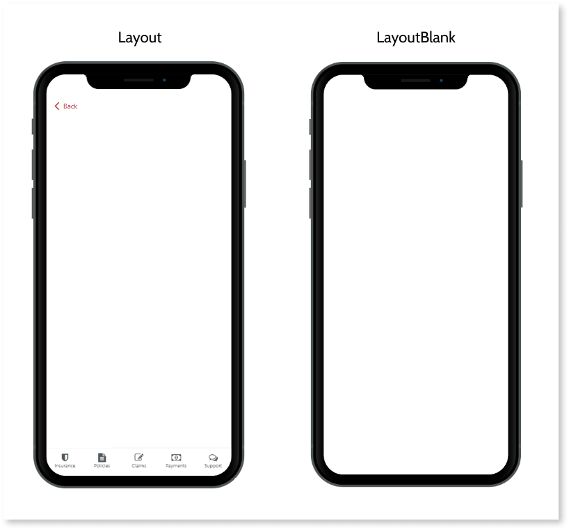
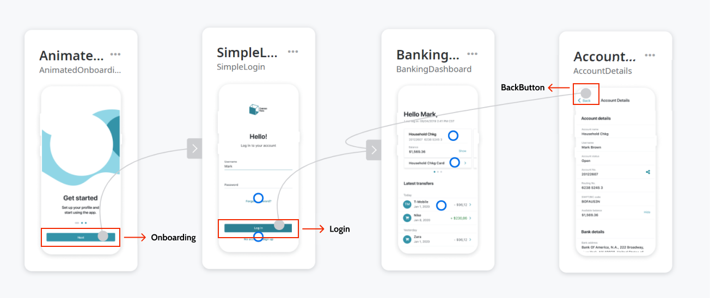
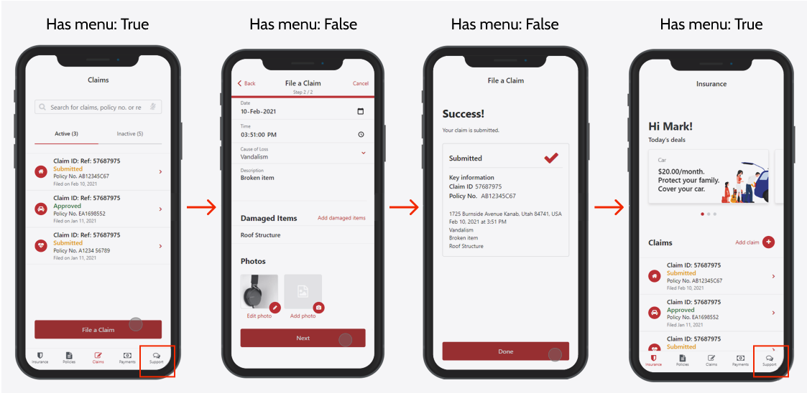

# Import Flows FAQ

## Can I use my own custom layout block on the imported flows?

**No**. Your flows must use the same layout block as the default screens from Experience Builder. This guarantees the correct integration of all features.

## Which layout block should I use on my imported flows?

The **Experience Builder Templates Mobile** app provides two layout options:

* Layout: Block that displays a header, footer, back button, and menu. Should be used on most screens.
* LayoutBlank: Layout block that displays nothing but the screen content. Usually used when a more simple structure is needed, for example, Login and Sign Up pages. Screens that are built with this layout block are not affected by the user's customizations on Experience Builder's menu canvas.

## Can I import flows with external dependencies?

**Yes**, but you must ensure that all dependencies are always available on the environment. Otherwise, users may experience runtime errors on generated mobile apps that use imported flows.

## What is the purpose of the Flow type property? Which one should I choose?

The **Flow type** property defines the role of the flow that's being imported. Experience Builder uses this information both for [validation](../ref/error-ref.md) purposes and for generating quality apps.

To find the value that best describes the flow's main objective, see the following table. If none of these categories fit, leave the property blank.

Value | Description |
---|---
ChangePasscode | Identifies flows that allow users to set their authentication passcode
Dashboard | Characterizes flows with dashboards or that are commonly used as app home screen
Login | Labels the flow as capable of handling users login
Onboarding | Distinguishes flows used to onboard users to the app
Signup | Labels the flow as capable of handling users registration

## What is the purpose of the Link type property? Which one should I choose?

The **link type** property identifies the purpose of the exit points in a flow that's being imported. Experience Builder uses this information during the generation of the mobile app (for example, automatically setting the application entry point for logged in users).

To find the value that best describes the exit point's role, see the following table. If none of these categories fit, leave the property blank.

Value | Description |
---|---
BackButton | Identifies exit points used by the user to navigate to the previous screen
Login | Identifies exit points used by the user to enter the application after a successful Login
Onboarding | Identifies exit points that directs the user after being onboarded

## What is the effect of the "Has menu?" property on imported screens

This property defines which screens should have a menu that is automatically added by Experience Builder.

Usually, most screens should have a menu to allow users to easily navigate through the app. The exceptions are screens where the user should not leave a process (for example, the intermediary screens on a step-by-step process).
