# Creating and Importing Flow Templates

Experience Builder allows you to import entire mobile flows and make them available for all users in your factory.

## Before you start importing flows

You can import new or existing flows into Experience Builder. By importing flows, you can import every screen, action, structure, entity, reference and almost everything else needed for your flow to correctly function on generated mobile apps.

However, the following are some limitations that you must keep in mind during the importing process:

* To start importing your flows, you must transfer them to the **Experience Builder Templates Mobile** application provided by Experience Builder. This way, you begin the importing process with all of the necessary tools.

* Your screens can only use the layout blocks provided by OutSystems in the  **Experience Builder Templates Mobile** application. This is necessary to ensure the correct integration between flows from different sources, thus providing the end-users with a seamless experience.

* The provided layout blocks must be used as-is. This means you cannot edit its content.

* The module themes must be well structured, that is, they can't have a monolithic theme. You must break it down into smaller bits (the flow specific themes) to inherit the base structure from an external module.

* Remember to set a default entry for your module. This is helpful whenever you need to preview it in the browser.

### Process overview

The following outlines the steps involved in the process of importing flows into Experience Builder using Service Studio. Depending on your setup, not all steps are mandatory. 

1. [Access the Import Flow wizard.](#step-1)

1. [Install the Experience Builder Templates Mobile application](#step-2). 

1. [Create new flow templates from scratch](#step-3). 
 
1. [Integrate preexisting flow templates](#step-4).
 
1. [Import and validate flow templates](#step-5).

#### Accessing the Import Flow wizard { #step-1 }

1. Log into Experience Builder and click the **Flows** tab.

    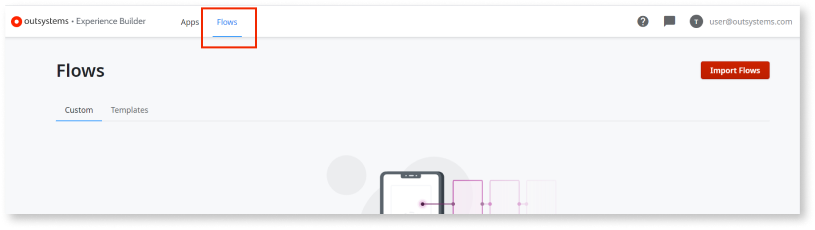

1. Click the **Import flows** button.

    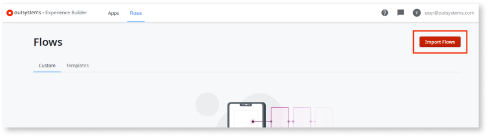

    You are redirected to the first step of the **Import Flows** wizard. 

    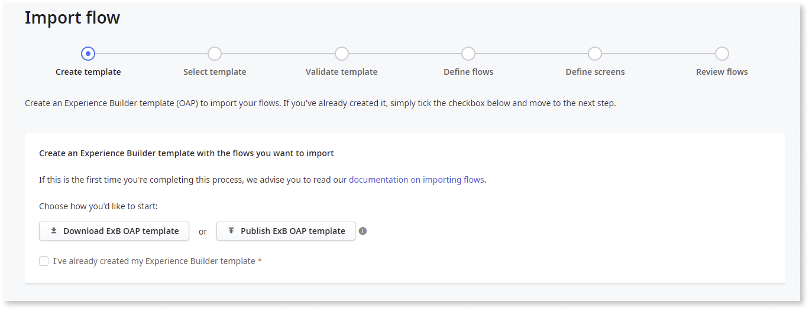

#### Downloading and installing the Experience Builder Templates Mobile application { #step-2 }

Before you begin to import flows, you must download and install the **Experience Builder Templates Mobile** application. 

1. To automatically download and install the application, click **Publish OAP template** and wait for the installation process to complete.

1. To manually download the application, click **Download OAP template**, then proceed to Service Center and install the downloaded application file.

#### Creating new flow templates { #step-3 }

**Note**: Only complete the following steps if you have no preexisting flow templates. Otherwise, see [integrating preexisting template flows](#step-4).

To create flows templates from scratch, follow these steps:

1. In Service Studio, open the module contained in the **Experience Builder Templates Mobile** application. 

    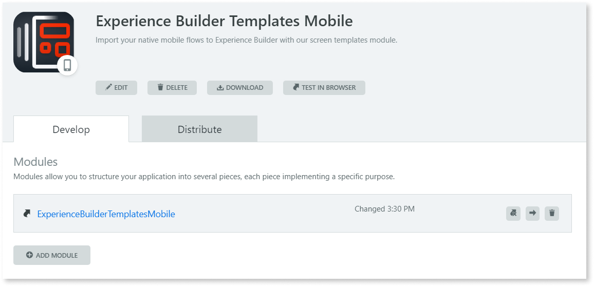

1. On the **Interface** tab, right-click the **UI Flows** folder, and select **Add UI Flow**. 

    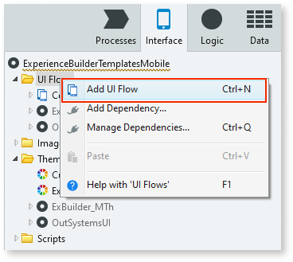

1. Enter a name for the new UI flow. In this example, we enter ``GenericDashboard``.

    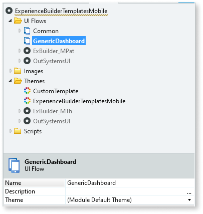

1. (Optional) To create a new theme, right-click the **Themes** folder, select **Add Theme**, and enter a name for the new theme (in this example, we enter ``CustomTemplate_GenericDashboard_Flow``). Then, select the new UI flow, and from the **Theme** property dropdown, select the new theme. For more information, see the [proposed theme structure](theme-structure-if.md) for flow templates.

    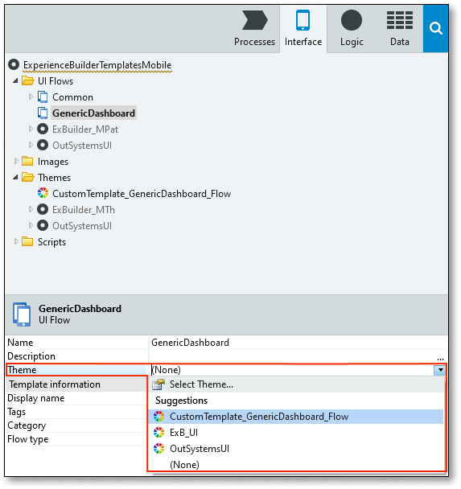

    **Note**: While this step is optional, we strongly recommend you create a new theme. Having a good theme structure in the imported flows enhances Experience Builder's capacity to generate mobile apps that follow the architecture's best practices.
  
1. Right-click the new UI flow and select **Add Screen**.

    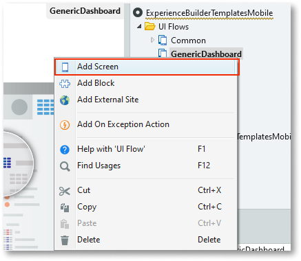

1. In the **New Screen** window, choose **Empty** and click **Create Screen**.

    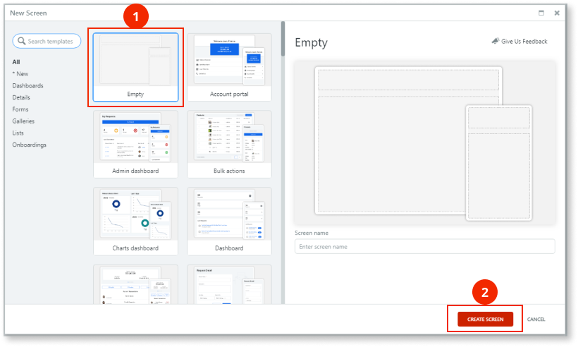

1. Enter a name for the screen. In this example, we enter ``Gallery``.

    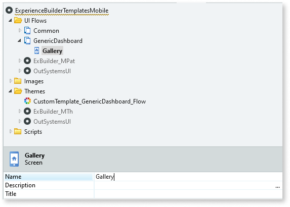

1. Add the relevant elements to your screen.

    Experience Builder interprets an element as an **Exit Point** (the blue circles used by developers to connect flows) when it fulfills the following criteria:
 
    * The element is a [button](../../../ref/lang/auto/ServiceStudio.Plugin.NRWidgets.Button.final.md), a [link](../../../ref/lang/auto/ServiceStudio.Plugin.NRWidgets.Link.final.md), or an [action destination](../../../ref/lang/auto/Class.Destination.final.md) 
    * The element's **Destination** property is set to an [external site](../../../ref/lang/auto/Class.External Site.final.md) or to a [screen](../../../ref/lang/auto/Class.Screen.final.md) from another flow.

        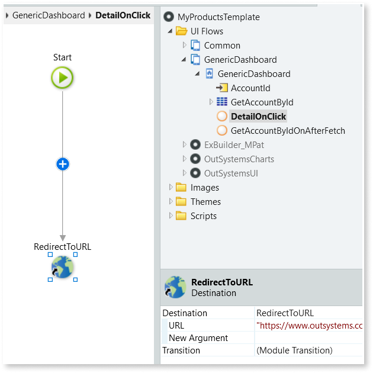

1. Add as many flows, screens, and blocks as necessary and then publish the module.

#### Integrating preexisting flow templates { #step-4 }

**Note**: Only complete the following steps if you have preexisting flows. Otherwise, see [Creating new flow templates](#Creating-new-flow-templates).

To use mobile flows from an existing module, follow these steps:

1. In Service Studio, open an existing module and on the **Interface** tab, select all of the flows you want to copy to the **Experience Builder Templates Mobile** application, right-click and select **Copy**.

    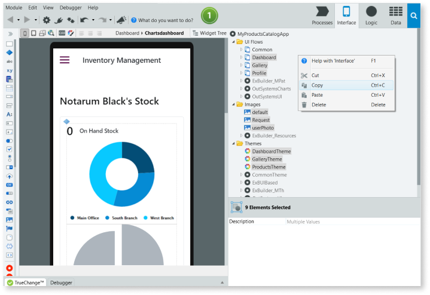

1. Open the module contained in the **Experience Builder Templates Mobile** application, right-click the **UI Flows** folder and paste the copied flows.

    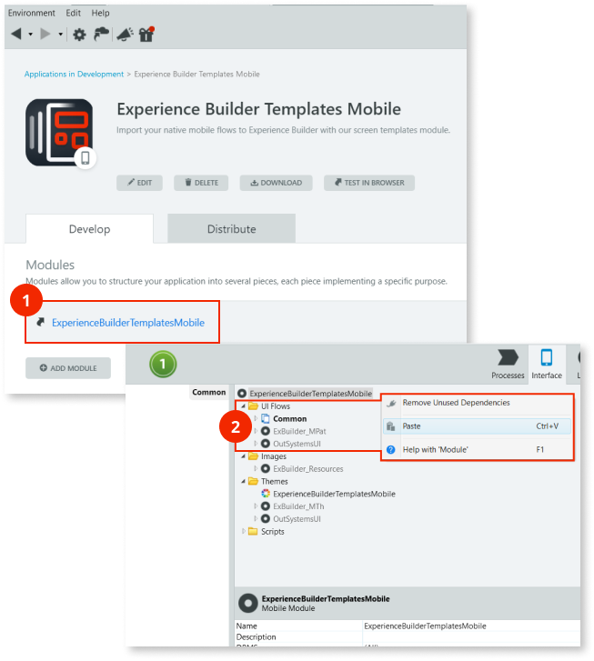

1. (Optional) To create a new theme, right-click the **Themes** folder, select **Add Theme**, and enter a name for the new theme. Then, select the new UI flow, and from the **Theme** property dropdown, select the new theme. For more information, see the [proposed theme structure](theme-structure-if.md) for flow templates.

    **Note**: While this step is optional, we strongly recommend you create a new theme. Having a good theme structure in the imported flows enhances Experience Builder's capacity to generate mobile apps that follow the architecture's best practices.

1. To modify the base layout on the screens, click the newly created theme, and from the **Layout** dropdown, select either **Common/Layout** or **Common/LayoutBlank**.

    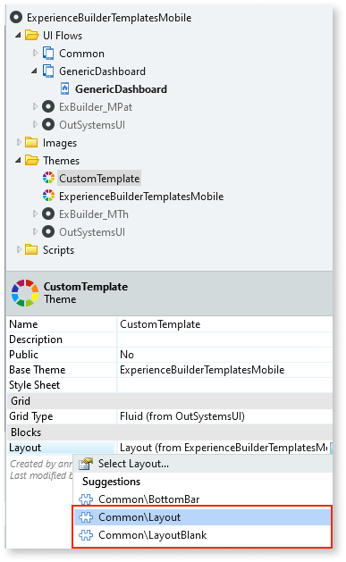

    **Note**: Every screen must use either the **Common/Layout** or the **Common/LayoutBlank** layout blocks. This ensures that your imported flows can be fully integrated with the existing Experience Builder flows, resulting in mobile apps with a consistent look and feel, despite the origin of the flow.

1. Add the relevant elements to your screen.

    Experience Builder interprets an element as an **Exit Point** (the blue circles used by developers to connect flows) when it fulfills the following criteria:
 
    * The element is a [button](../../../ref/lang/auto/ServiceStudio.Plugin.NRWidgets.Button.final.md), a [link](../../../ref/lang/auto/ServiceStudio.Plugin.NRWidgets.Link.final.md), or an [action destination](../../../ref/lang/auto/Class.Destination.final.md) 
    * The element's **Destination** property is set to an [external site](../../../ref/lang/auto/Class.External Site.final.md) or to a [screen](../../../ref/lang/auto/Class.Screen.final.md) from another flow.

        

1. Publish the module.

#### Importing flow templates { #step-5 }

1. Log into Experience Builder and click the **Import flows** button.

1. Select the **I have created my module template** checkbox and click the **Next: select template** button.

    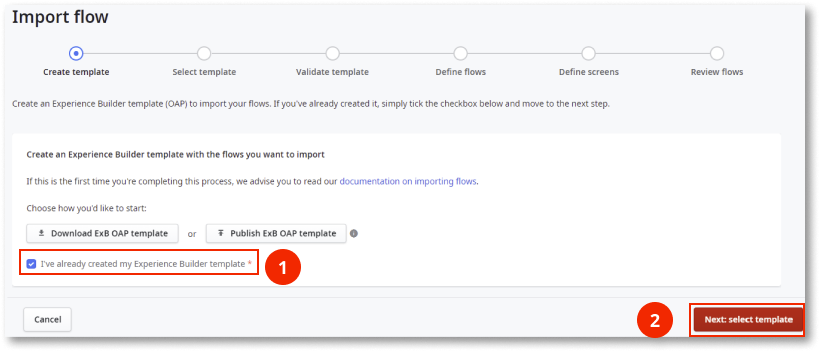

    A list containing all modules from your environment with *template* in the name is displayed. 

    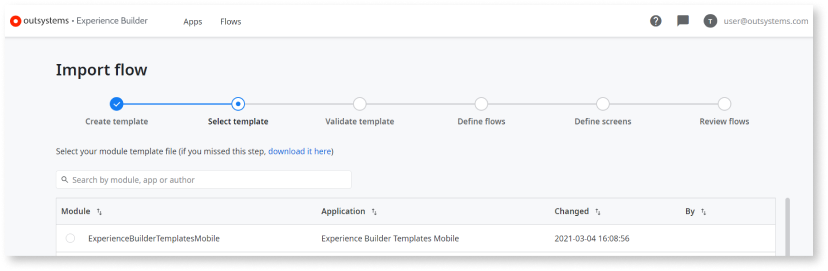

1. Select a template and click the **Next: validate template** button.

    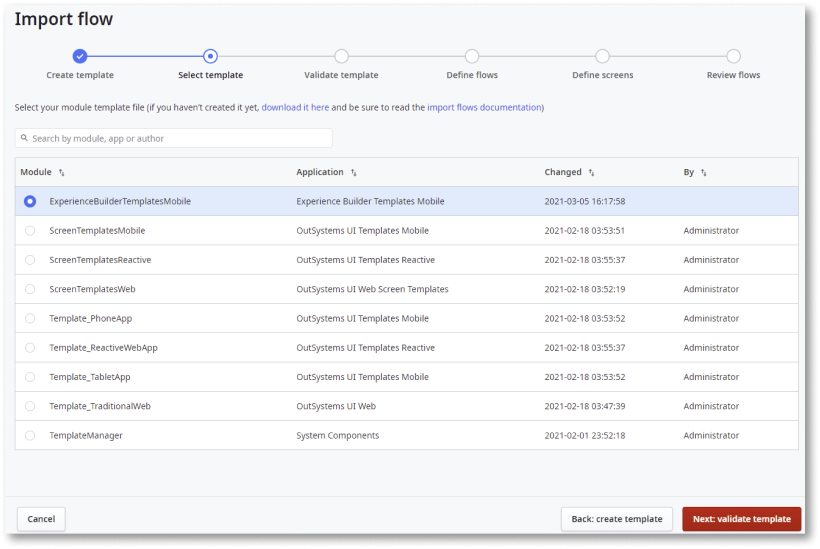

    Validation messages are displayed (if any).

1. Analyze the validation messages.

    * **Errors** must be fixed before proceeding with the import process.
    * **Warnings** should be analyzed and, if possible, fixed.

    If there are no blocking errors, to continue the import process, click the **Next: define flows** button. 
    
    Otherwise, you must analyze the messages, return to Service Studio to publish a fix to the template module, and execute the validations again. For in-depth information about all types of validation messages, see [validations reference page](error-ref-if.md).

    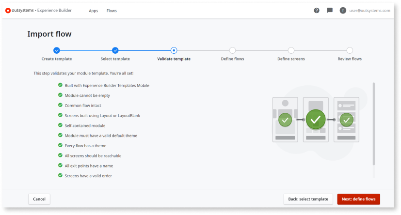

1. Edit the flow data (display name, flow category, and flow type) according to the [metadata reference](metadata-if.md) document, then click the **Next: define screens** button.

    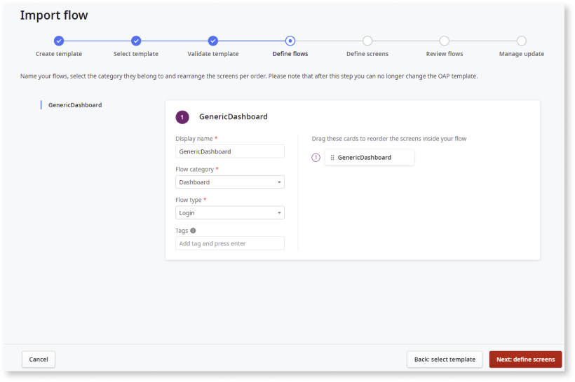

1. Edit the screen data according to the [metadata reference](metadata-if.md) document.

    1. Add an image to the screen. This image is  displayed to users on the Experience Builder canvas.
        * To upload an existing image, click the **Browse** button, select the image you want to upload, then click the **Done** button. 
        * You can skip this step by selecting the **I'd rather do it later** option.
    1. Drag and drop the blue circle icons to the exit points positions, then click the **Next: review flow** button.
    
        A good positioning of exit points, coupled with the screen image, allows users to have a clear view of the flow structure and correctly connect them to other flows.

       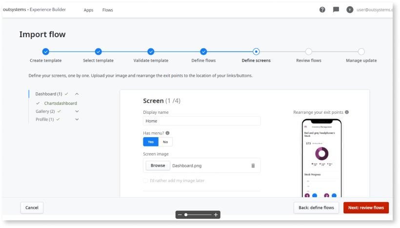

1. Review all the flows and screens before proceeding. Check if all names and images are in place and if the screens inside each flow are in the correct order.

    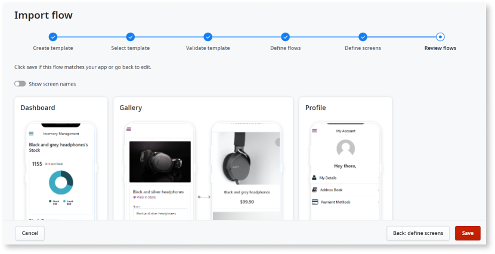

1. Click **Save**.
