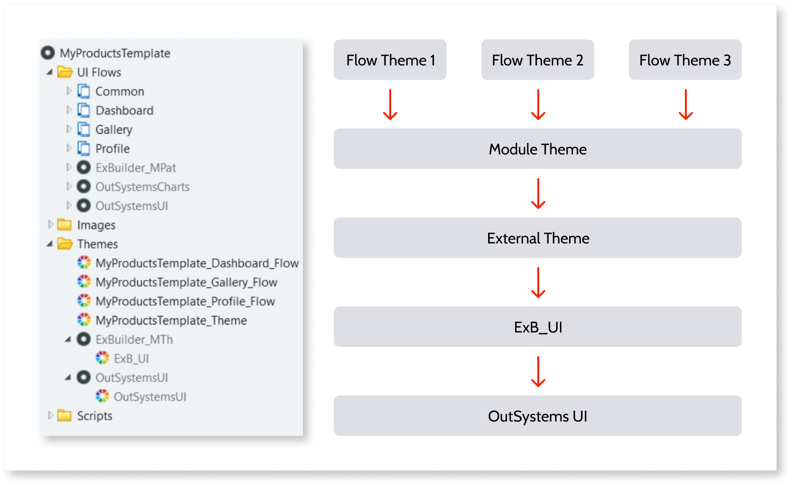
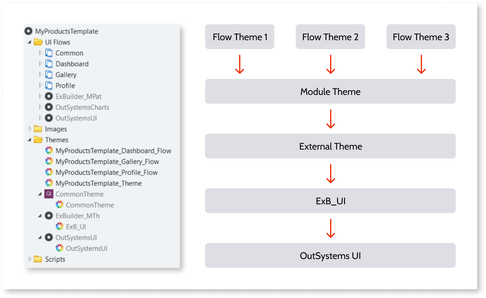
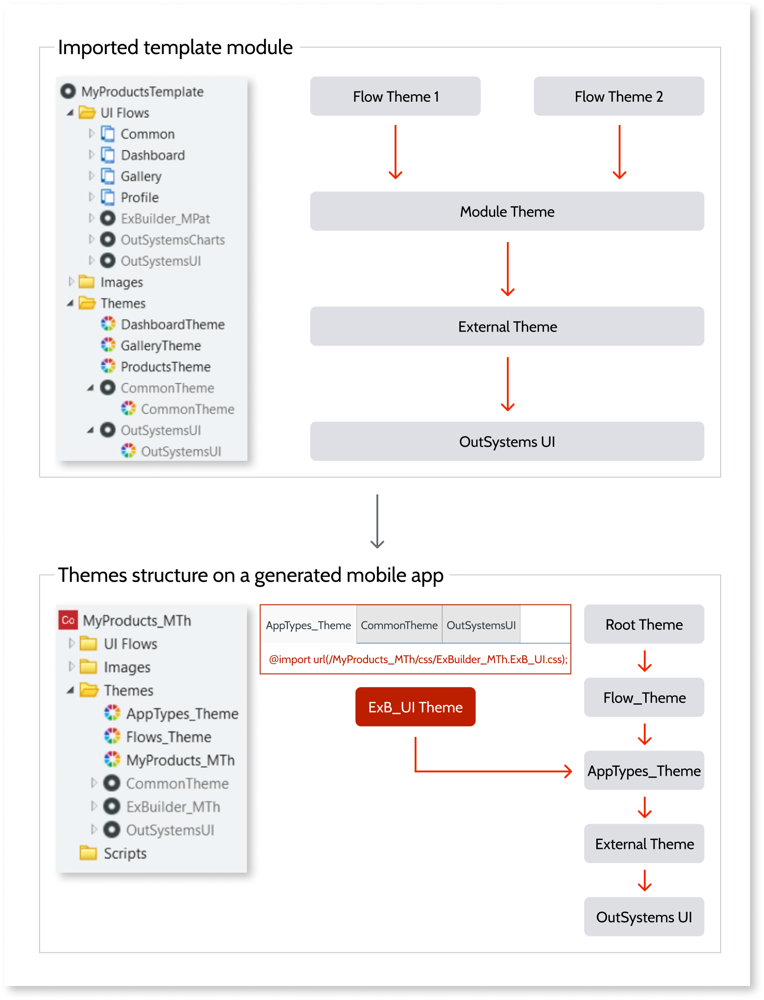

# Theme structure guidelines

Experience Builder relies heavily on flow templates that follow development best-practices to deliver high-quality code. A good CSS structure allows better code reusability and organization.

## ExB_UI base theme

All mobile apps generated by Experience Builder have their themes based on the ExB_UI theme. Your imported flows should use this same base theme to ensure their look and feel is preserved on the final app.

## Flow-specific theme

All CSS rules used by a single flow only should be placed on a flow-specific theme. This way, Experience Builder only includes these highly specific CSS rules on the generated mobile app if needed.

## Module theme

In the module theme, you should include all the remaining rules that are shared by most/all flows on the templates module that will be imported.

## General-purpose theme structure

The following theme structure ensures that your template module will have an easy-to-maintain CSS organization. It also enables Experience Builder to generate mobile apps with a solid theme architecture.

1. Add a module default theme that contains all CSS rules that are widely used across all the flows.

1. This default theme should have the ExB_UI theme as the default theme, provided as a reference on **Experience Builder Templates Mobile**.

1. For each flow, create and assign a new theme. In this theme, include all CSS rules that are used exclusively in that flow.

1. Flow themes should inherit the module default theme.

    

## Using an external theme

Sometimes, your flow templates can depend on an external theme that is shared across several apps in your factory. In this case, the optimal approach would be to modify this base template to use the ExB_UI theme. This way, your mobile apps generated by Experience Builder still have a reference for both your shared theme and for the ExB_UI theme.

If this change is impractical, you **can** skip the ExB_UI inheritance requirement. But, because Experience Builder provides flows and blocks that need this to work correctly, the ExB_UI theme will be [imported](../../ui/look-feel/css.md#importing-css) to the generated mobile apps. After importing your flows, to guarantee that they can be harmoniously integrated with all existing flows, test them in Experience Builder.

