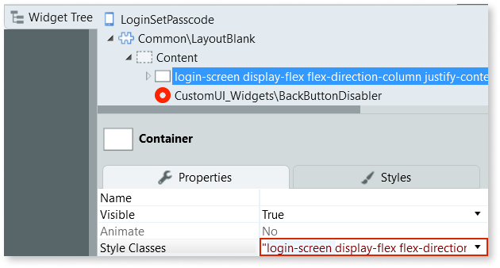

# Troubleshooting Experience Builder

If you are facing issues while using Experience Builder, start by checking the following list of issues and possible solutions.

## Distorted splash screen in published app

Issue
:   The splash screen of an app published using Experience Builder is distorted and looks stretched.

Possible cause
:   The image you used for the splash screen isn't 2048x2048 pixels.

Solution
:   In Experience Builder, ensure the image you set as the splash screen of the app is 2048x2048 pixels and then republish the app.

## Publish fails after editing menu items

Issue
:   Changing menu items on a previously published app causes an error during publishing.

Possible cause
:   Menu items you create in Experience Builder are saved as static entity records when you publish the app.  
    Information about the original static entity record may still exist in the OutSystems metamodel, causing a conflict.

Solution
:   In Experience Builder, delete the menu item you previously changed, recreate it, and then republish the app.

## Missing module on published app

Issue
:   A successfully published app is missing a module, usually the front end module.

Possible cause
:   The name of the module may already exist in your environment. Module names must be unique across every app in an environment.

Solution
:   Rename the app in Experience Builder and republish it.

## Using Theme Editor to set an image for the "Login and splash background" of published app doesn't work

Issue
:   After using Service Studio's Theme Editor to set an image for the "Login and splash background" of an Experience Builder app, you publish the app but the login screen doesn't include the background image you selected.

Possible cause
:   By default, Experience Builder apps don't have a background image in login screens. As such, the login screens don't include the `login-screen` class, which is used when setting a new background image using Theme Editor.

Solution
:   In Service Studio, add the `login-screen` class to the login screens of the app by following these steps:

    1. In the &lt;app-name&gt; frontend module, open the login screen, and toggle the **Widget Tree**.

    1. In the Widget Tree, select the container in the **Content** placeholder, and add the `login-screen` class to the **Style Classes** property.

    

    After these steps publish your app.
