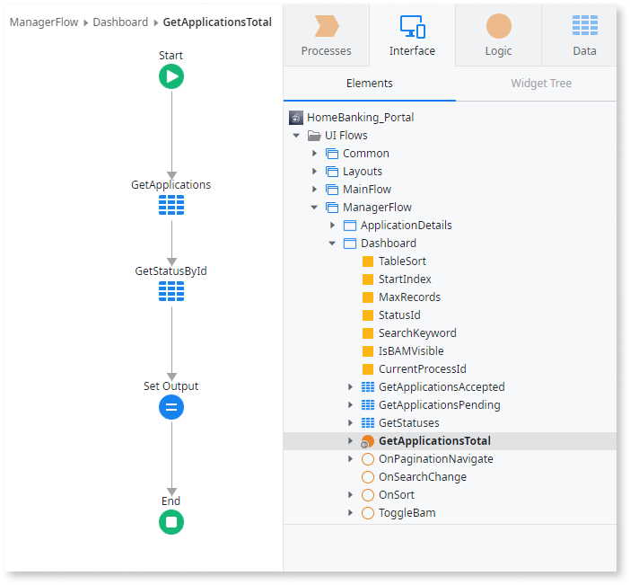
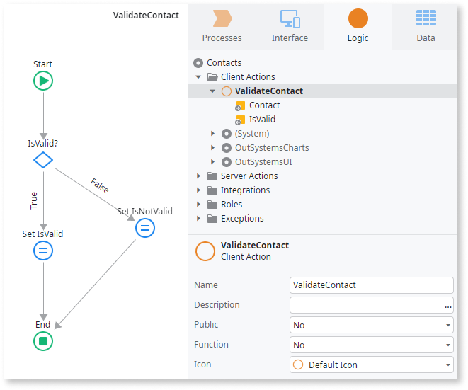

# Actions in Mobile Apps

When developing an OutSystems mobile app you have code that runs on the **server** and code that runs on the **client** device, as a smartphone or a tablet.

The action flows of server actions and client actions are presented differently in Service Studio. The top left-hand corner of the content canvas displays either a **cloud** or a **tablet and smartphone** indicator icon to remind you where the current action will be executed - on the server or on the mobile device, respectively.

The toolbox icons for the same tools are also slightly different for server and client, so that it’s easier to understand in which context the flow will execute:

In OutSystems mobile apps you can create the following Actions:

* Data Actions
* Client Actions
* Server Actions

## Data Actions

Some mobile screens may require fetching complex information from the database or other external systems, as for example a home banking dashboard. In OutSystems mobile apps you do this in a **Data Action**:

**Data Actions** run on the server. You can create **Data Actions** to fetch complex data from the database, which you are not able to achieve using a single server Aggregate, or to fetch data from an external system, for example through a consumed REST API.

**Data Actions** run simultaneously with the client and server Aggregates to fetch data after each screen loads.

You can also create **Data Actions** in your Blocks.

## Client Actions

**Client Actions** run logic in the user device. You can create **Client Actions** in two different scopes: in the scope of a **mobile screen** and in the **client logic**.

**In the scope of a mobile screen:** Allows you to run logic when the user interacts with the screen. For example, if you have a screen to update a Contact, you can create a **Client Action** that reacts to user clicking the “Save” button and executes the logic to update the Contact:

You can also create **Client Actions** in your Blocks.

**In the client logic:** Allows you to encapsulate logic to be reused in several screens. For example, if you have a validation rule that you must apply in several screens of your app, you can create a **Client Action** general to the client logic and use that action in the Client Actions of your screens:

The **Client Actions** defined in the client logic can be set as functions and used directly in expressions.

## Server Actions

Similarly to OutSystems web applications, you can create **Server Actions** in your mobile app to encapsulate the logic that implements the business rules of your application and use them in other actions, such as other Server Actions, Data Actions or Client Actions. **Server Actions** run logic on the server.

You can set a **Server Action** as a function and use it directly in expressions.
