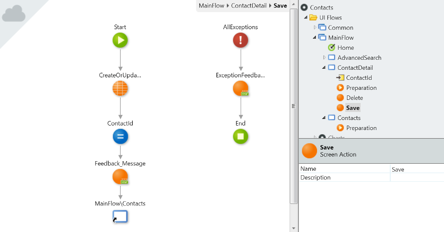
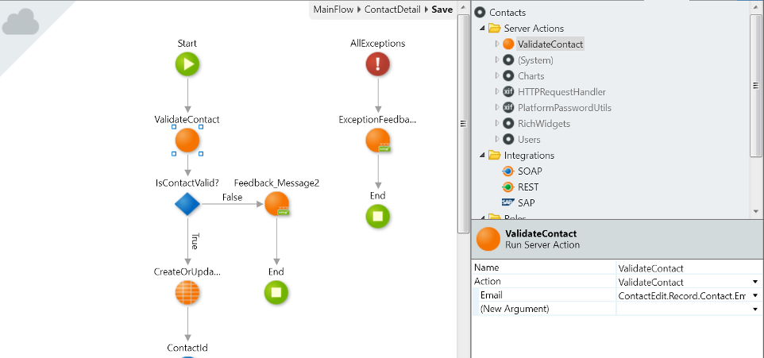

# Actions in Web Applications

Applies only to Traditional Web Apps.

In OutSystems web applications you can create the following Actions:

* Preparation
* Screen Actions
* Server Actions

## Preparation Actions

When you have for example a web screen that lists Contacts, you will need to execute some logic before the screen is displayed to fetch the list of Contacts from the database.

In OutSystems, you execute that logic in a **Preparation** action:

You don't have to explicitly invoke the **Preparation** action because it is automatically executed before a screen is rendered. It is right place to add all the logic you want to execute before the screen is displayed, such as setting values to variables and fetching data from the database.

You can also add a **Preparation** action to your Web Blocks.

## Screen Actions

In a web screen to update a Contact, for example, you will need to define an action that reacts to the user interaction of clicking the "Save" button and execute the logic to update the Contact. In OutSystems web applications you do this in a **Screen Action**:

**Screen Actions** allow you to run logic when the user interacts with the screen, such as clicking on a button or a link.

You can also add **Screen Actions** to your Web Blocks.

## Server Actions

An application typically has its own business rules. In OutSystems you can create **Server Actions** to encapsulate the logic that implements the business rules of your application and use them in other actions, such as Preparation actions, Screen Actions or other **Server Actions**:

You can set a **Server Action** as a function and use it directly in expressions. 
