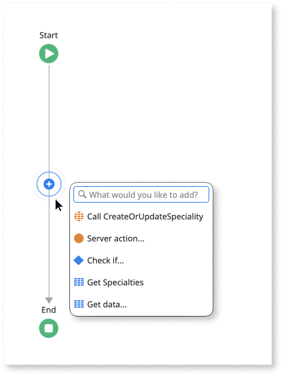
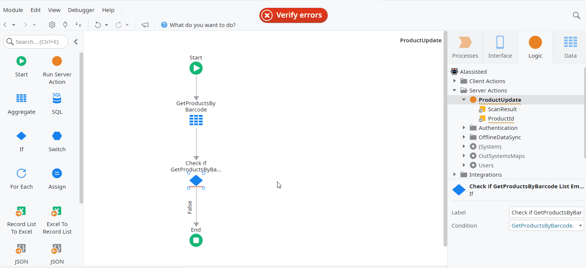
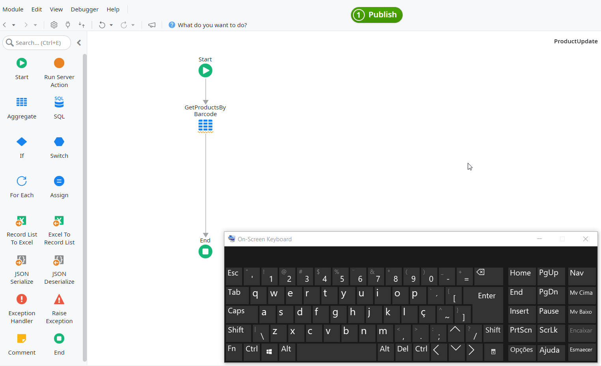
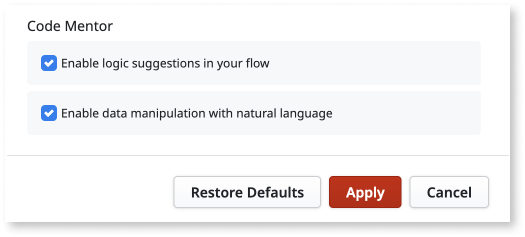
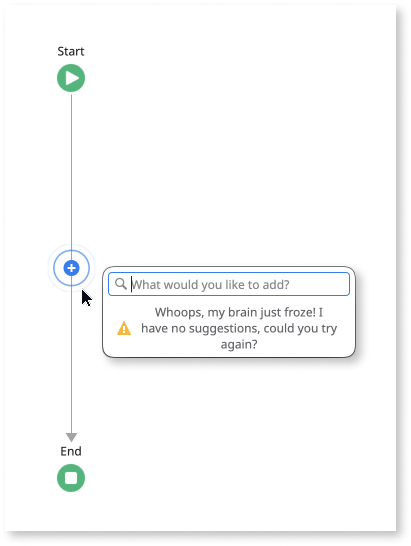

# Code Mentor - Logic suggestions

Speed up your app development with Code Mentor for logic. By analyzing millions
of anonymized code samples using artificial intelligence and machine learning
algorithms, Code Mentor predicts and suggests possible next steps for your
logic. Use its suggestions to develop logic faster, with less repetition, while
following best practices.

Code Mentor suggestions appear in flow connectors when you click the AI radar,
shown as a pulsing blue circle.

**Guided Example:** Check how you can [implement logic for a Client Action
using Code Mentor](ai-create-action.md) .

## Prerequisites { #prerequisites }

These are the requirements for using Code Mentor feature:

* The feature [is enabled](#enable-disable) in Service Studio.

* You're using:

    * Windows-only Service Studio version 11.6.9 or later.

    * Any version of cross-platform Service Studio.

* Service Studio can reach the URL `https://api.outsystems.com`.

* Your operating system supports the Transport Layer Security (TLS) 1.2
  protocol.

## Using Code Mentor - Logic suggestions

### Starting the flow

Depending on how you name your action flow, Code Mentor behaves differently:

* In a flow with a default name (for example, **Action1**), when you hover your
  mouse over the connector, the blue radar starts blinking where you can click
  to choose suggestions.

* In a flow with a custom meaningful name to it (for example, **DoLogin**), the
  blue radar automatically starts blinking with a plus sign where you can click
  to choose suggestions.

### Getting suggestions

Code Mentor provides up to six suggestions, depending on the confidence level
of the mentor. When the confidence level about the next element in the flow is
high, you get only one suggestion.

There are several ways to get suggestions:

* Click the AI radar (blue circle) on the flow connectors.

    

* Drag a connector from an existing element and drop it in the flow window.

    

* Accept a suggestion from Code Mentor whose required properties are already
  filled in for you. In most situations, this presents new suggestions for the
  next step of the flow.

### Accepting a suggestion

You can accept a suggestion presented by Code Mentor by clicking on it or by
selecting it with the arrow keys and pressing `Enter`.

Service Studio creates a new element in the flow according to the selected
suggestion.

Depending on the context, it may also auto-complete some properties of the new
element. When Service Studio auto-completes the properties of the selected
suggestion you can see the Service Studio stars popping.

When Service Studio auto-completes all the required properties of the new
element, you can immediately get new suggestions from the Code Mentor for
implementing the next step in your logic.

### Types of suggestions

Code Mentor tries to guess what you need next in your flow, based on all the
available context and all it has learned from millions of anonymized action
flow patterns.

When you click on the AI radar, you can get the following types of suggestions:

Specific suggestions

:   These suggestions add elements to the flow with a pre-completed business
context. For example, an **Action** with a pre-populated **Source** field.

Generic suggestions

:   These suggestions add elements that fit the current position in the flow,
but without any business context. For example, a **Message** element for you to
enter text.

The suggestions you get depend on the confidence of the mentor about what you
might need in your next step and the information it can extract from the
context. The more specific information you add to Actions, the more precise the
suggestions are.

The suggested nodes have different names from what you might be used to. As an
example, Aggregates show as Get Data. This gives a more natural and
conversational interface.

### Tips to get better suggestions

To ensure the best suggestions from Code Mentor, fill in the missing
information and context in your action flows to inform the mentor better. In
particular:

* Give a meaningful name to your Action flow. Try to enter it before you start
  creating the flow since this is relevant information for the suggestions.
  Using a descriptive name can help. When you give a custom name to an Action,
  the AI radar becomes more visible with a white **+** (plus sign) inside.

* Create the Local Variables, Input Parameters, and Output Parameters you
  believe you need. They give valuable context to the assistant and enable it
  to auto-complete the parameters.

### Intelligent Quick Search

When Code Mentor suggestions don’t fit your needs or you reach a dead-end, you
have the ability to search for other elements, that can be used in your flow.
To use the feature simply start typing what you want to add to the flow, and
the results show up immediately.

### Using the keyboard

Once you open the Code Mentor menu, instead of using the mouse, you can move
the suggestion selection with the keyboard arrow keys, or you can start typing
to retrieve other elements. Select and insert the highlighted suggestion by
pressing the Enter key.

## Enabling and disabling the feature { #enable-disable }

To enable or disable the feature, do the following:

1. In Service Studio, go to **Preferences**. Depending on your operating system
   do the following:

    * If you're using Windows, go to the **Edit** menu and select
      **Preferences**.

    * If you're using macOS, go to the **Service Studio** menu and select
      **Preferences**.

1. In the Preferences window, locate the **Code Mentor** section.

    

1. Check the status of the option **Enable logic suggestions in your flow**.

## Troubleshooting

Here are some troubleshooting tips to help you.

### What does it mean when there are no more suggestions?

When the mentor thinks there's nothing more to add, but you wish to continue
the flow, you can still take advantage of the Intelligent Quick Search. This
allows searching for other elements. You can also manually edit the flow.

### Why do I have to click again to get suggestions?

If this keeps happening, check your internet connection and try again. You can
still use the Intelligent Quick Search to search for other elements.

### Why isn't the AI radar showing up?

The Code Mentor node may not show because some prerequisites are missing. Check
[Prerequisites](#prerequisites) for more information.

### Why does the AI radar disappear?

If there's a recurring error or a poor Internet connection, the AI radar is
temporarily deactivated to ensure your Service Studio experience runs smoothly.
