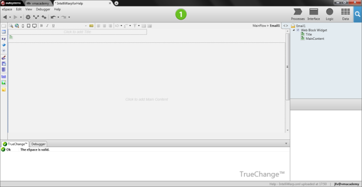
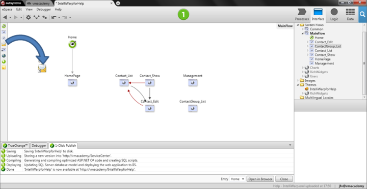

# Send an Email From a Web Application

OutSystems provides you with tools that allow you to use built-in emails in your web applications: create an email, compose the email content, send emails, send emails with attached files, use emails logging, and even extend email functionality or adapt emails to your needs through the [Emails API](<../../ref/apis/emails-api.md>).

Emails are very similar to Web Screens. They are created and designed using a Web Block from the Email layout of the [Theme](<../ui/look-feel/themes.md>).

## Compose the Email

The email content is rendered at runtime, before sending, which makes possible to compose dynamic content, such as a personalized introduction like `Dear <client name>` at the beginning of your email.

To compose an Email, do the following:

1. Drag the Email element from the Web Flow Toolbox and drop it in the Web Flow. Alternatively, right-click the Web Flow in the elements tree and select 'Add Email'.

    

1. Compose the Email content using widgets, in the same way you do for designing a Web Screen:    

    * Add **input parameters** to the Email to pass runtime values.
    * In the **Preparation** action of the  Email, use the input parameters to get the data you need.
    * Use widgets of dynamic content, such as **Expressions** or  **Ifs**, and use the data you obtained in the Preparation.
    * You can customize the email subject using the input parameters value.
    * To attach files to your Email, use the **Attach File** tool, which you can drag from the Action Flow Toolbox within the **Preparation** action.

For advanced usages, where you want further control over the email header, you can set specific Extended Properties for your email.

## Send the Email

To send an email within the logic of your action or process, do the following:

1. Drag the **Send Email** tool from the Flow Toolbox into the action flow or process flow, depending on the type of flow you're designing:

    

1. Set the runtime data for the message header fields using **Expressions** in the **Send Email** arguments:    
    * **From**: the email address of the sender
    * **To**: the email address(es) of the recipient(s)
    * **CC**: the email address(es) of the recipient(s) of the carbon copy
    * **BCC**: the email address(es) of the blind recipient(s) of the carbon copy

Use [email built-in functions](<../../ref/lang/auto/builtinfunction.Email.final.md>) to help you handle email addresses.

### How OutSystems Handles the Email Sending

At runtime, the **Send Email** tool renders the email content, adds it to a sending queue, and continues execution, thus not sending it right away. It is another OutSystems process, the OutSystems Scheduler Service, that picks queued emails and effectively sends them, i.e. emails are **asynchronously sent** by OutSystems.

As emails are sent asynchronously in a different session you cannot rely in session data to render emails.

OutSystems tries to send failed emails for a period of days (default period is 2 days). When an email continues to fail after this period, OutSystems quits trying to send it.

All emails you send through an OutSystems web application are logged and you are allowed to check up on them in **Service Center**.
