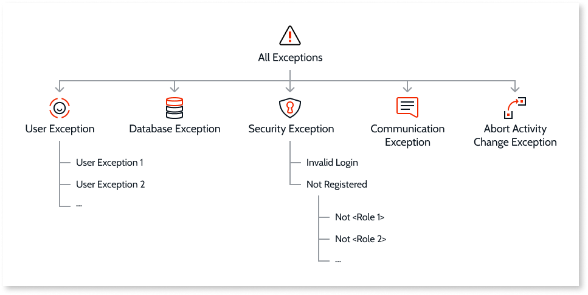

# Handle Exceptions

An exception is an exceptional circumstance that prevents your application flow from running normally. For example, when your application fetches data from an external system, and that system is experiencing a downtime.

You should raise exceptions only for exceptional circumstances and not to control the logic of your application.

When an exception is raised, the execution of the application flow is interrupted.

In OutSystems you can handle exceptions in your application using the Exception Handler action flow element. For raising exceptions in your logic, use the Raise Exception action flow element.

## Types of Exceptions { #types }

There are several types of exceptions, which differ in the way they are raised and how they can be handled in the application. Exceptions follow a hierarchy that determines how they are handled:

In this hierarchy, a "parent node" exception can handle any "children node" exception type. For example, a Security Exception Handler handles an Invalid Login exception if it appears in the flow before an Invalid Login Exception Handler.

In OutSystems you have the following types of exceptions:

### All Exceptions

All Exceptions is the most general exception, including all the remaining. This means that an Exception Handler for All Exceptions handles an exception of any type if there is not a more specific Exception Handler to handle it.

You can use All Exceptions if, within that specific scope, you want to handle all the exceptions in the same way.

### User Exception { #user-exception }

You can create your own User Exceptions and raise them in your logic in specific conditions. For example, you can create a User Exception named UnavailableExternalSystem and raise it in your logic when you detect that the external system you use to fetch data in your application is experiencing a downtime.

The User Exceptions created by you are "children nodes" of the general User Exception. This means that a general User Exception Handler will handle any of your own User Exceptions if it appears in the flow before an Exception Handler for your specific User Exception.

### Database Exception { #database-exception }

Database Exceptions are raised by OutSystems when there is an error related to the database management system, such as:

* Violation of a database constraint due to the creation of a record that already exists or duplication information in a unique index
* Creating or updating data in some entity with the incorrect data type
* Attempts to violate a Delete Rule relationship set as Protect

OutSystems can raise Database Exceptions whenever you are interacting with the database engine, such as, when using an aggregate, an SQL query or an entity action.

### Security Exception { #security-exception }

OutSystems can raise Security Exceptions whenever you have authentication or other security mechanisms in your application module. Security Exceptions include:

Invalid Login
:   The login provided by the end user isn't correct. This exception is raised by the [Login](../../../ref/apis/auto/system-actions.final.md#Login) and [LoginPassword](../../../ref/apis/auto/system-actions.final.md#LoginPassword) System Actions.

Not Registered
:   The end user is not registered and cannot access the current screen without registration. When you create new custom Roles in your module, OutSystems creates specific Role Exceptions under Not Registered Exception:

    * Not &lt;Role&gt; &#8211; the end user is accessing a screen without an authorized Role. 

OutSystems allows you to raise in your logic the Not Registered Exception or any of the existing Role Exceptions.

A Security Exception Handler handles any of the above exceptions if there isn't a more specific Exception Handler. You should handle Security Exceptions in **OnException** actions of your UI Flows.

### Communication Exception

Communication Exceptions apply only to Reactive Web and Mobile Apps, and are raised whenever there is a communication problem while the client device is trying to connect to the server, such as no internet connection. Weak connections may also lead to communication exceptions whenever the server fails to reply within the specified timeout value (you can set the default timeout in the **Server Request Timeout** property of the module).

Communication Exceptions are only raised by OutSystems — you can't raise these exceptions in your logic.

### Abort Activity Change Exception

The raise of Abort Activity Change Exceptions is used in Process Activity callback actions as a mechanism to prevent the activity from advancing to the next state.

## Exception Message

When OutSystems raises an exception, the **ExceptionMessage** property of the Exception Handler element is automatically filled in with a problem description. When you raise an exception in your logic, such as a User Exception, you must define the message in the **Exception Message** property of the Raise Exception element.

## Exception Logs { #exception-logs }

When you handle an exception in your module, you can use the **Log Error** property of the Exception Handler element to choose if OutSystems should log the exception or not. You can check for logged exceptions in Service Center.

Note: In the case of integrations, OutSystems logs all the exceptions independently of the value you set in the **Log Error** property of the Exception Handler.
