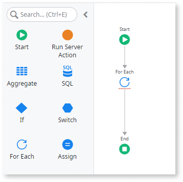
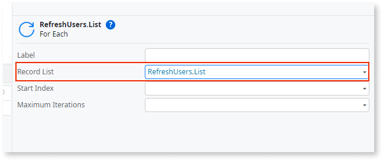
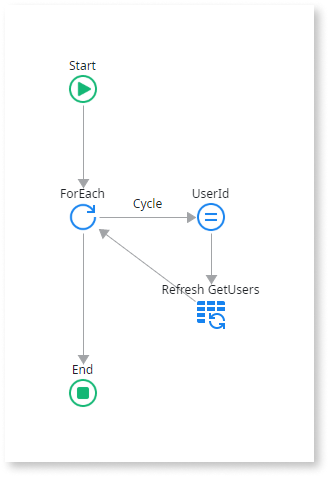

# Use a For Each to Iterate a List

In your application logic, you may want to loop over each element in a collection to perform a piece of logic recursively. You can iterate lists using a For Each logic node.

To iterate through the elements of a List:

1. Add a **For Each** flow element to the action flow.

    
   
1. Set its **Record List** property to the list you want to iterate.

    
1. Add the instructions you want to implement in the body of the loop. 
1. Create a connection from the For Each node to the first instruction in the logic you want to iterate. This first connector is called Cycle and marks the beginning of the cycle. 
1. Create a connection from the last step in your logic to the For Each Node to close the cycle. 

The Current runtime property of a List (`<List>.Current`) holds the item in the list currently being iterated. 

