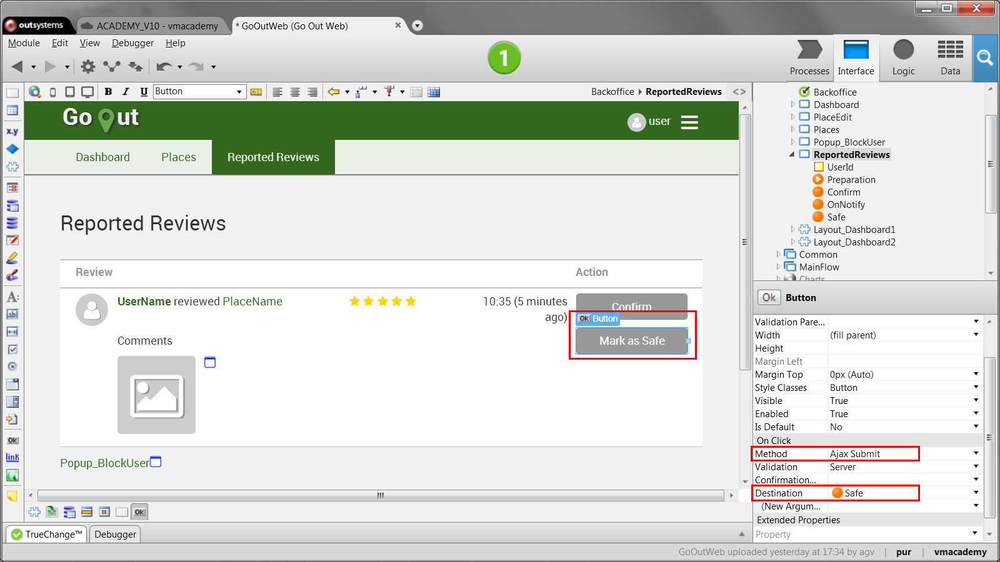

# Update List Items on a Screen

While editing items in lists it is more efficient to only refresh the affected items in the interface than the entire list. OutSystems provides system actions to manipulate lists. When the list you manipulate is being displayed on the screen, these actions can also refresh the affected elements displayed on the screen right away.

To update list items in Reactive Web and Mobile:

1. Display the list on a screen. 
1. Add a button or link that updates the list. 
1. In the action associated with the button or link, drag the *Run Client Action* from the toolbox to the action flow. 
1. Select one of the following system actions to manipulate elements in the list variable bound with the widget displayed on the screen: 
    * ListAppend
    * ListAppendAll
    * ListInsert
    * ListRemove
    * ListClear 
1. The widget automatically displays the updated list. 

To update list items in Traditional Web:

1. Display the list on a screen. 
1. Add a button or link that updates the list and set the Method property to Ajax Submit. 
1. In the action associated with the button or link, drag the Execute Action from the toolbox to the action flow. 
1. Select one of the following system actions to manipulate elements in the list variable of the widget displayed on the screen: 
    * ListAppend 
    * ListInsert 
    * ListRemove 
1. The widget automatically displays the updated list. 

## In Traditional Web

In the GoOutWeb application, used to find, review and rate places, we have a screen that lists reviews that were reported as inappropriate. We want to allow the end user to check each review in the list and either confirm the report or mark the review as safe. When the end user marks a review as safe, we want to remove the corresponding review from the list without re-rendering the whole list.

1. Open the screen ReportedReview that displays the list with the reviews reported as inappropriate.

1. Add a button with the text "Mark as Safe" to the column Action of the table. 

1. On the properties of the button Mark as Safe, set the Method property to Ajax Submit and set the Destination to a new screen action called Safe. 

    

1. Open the new screen action, drag the action Review_ClearReport from the Logic tab to the action flow, and set the input parameter of this action to `GetReportedReviews.List.Current.Review`. This action updates the review to mark it as safe in the database. 

1. Drag the Execute Action from the toolbox, place it after the action Review_ClearReport, and select the system action ListRemove. You should now see an overlay over the ListRemove system action. 

1. On the Properties editor set the field List to `ReviewTable.List` and the field Position to `ReviewTable.List.CurrentRowNumber`. This removes the review of the current row from the list displayed in the List widget.

    

1. Publish and test. 
