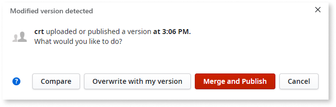
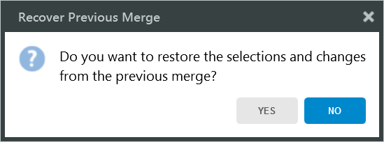

# Merge the Work

In an environment where many developers work on the same module, you often need to incorporate other people's changes to the module. If there are no conflicting changes, Service Studio first tries to automatically integrate the differences. If conflicting changes are detected, you are prompted to manually resolve them. To publish the module, you will need to update your local module, save it locally with conflicts resolved, and then publish it.

The merge capabilities are designed with OutSystems visual language in mind, which enables you to review changes for both visual and textual elements. 

What follows is an overview of the merge feature. For the step by step instructions for conflict resolution, check [Compare and merge example](<merge-example.md>). The document about [the merge feature and team collaboration](<concepts.md>) outlines the merge operations in OutSystems.

## Modified version detected

You can see the **Modified version detected** window when you try publishing your module and Service Studio detects differences between your version and the version on the server. These are the most relevant buttons and their actions.

Merge and publish
:   Enables you to attempt an automatic merge of the differences and to publish the updated version. If the automatic merge fails because of the conflicting changes, you can manually resolve the differences in the **Compare and Merge** window that opens afterward.

Compare
:   Opens the **Compare and Merge** window where you can preview the changes between both versions, and edit the local version before publishing.

Publish my version
:   Use this option to overwrite the version of the module on the server with your local version. This option is a destructive operation, and you will lose all changes in the version that is currently on the server.

## Compare and Merge window

You can open the **Compare and Merge** window by clicking **Compare** in the **Modified version detected** window. The **Compare and Merge window** shows the local and the server version side by side and enables you to select and incorporate both textual and visual elements. Elements with the conflicting changes are labeled "**(merged with conflicts)**". Double-click an element to navigate to the details screen. 

## Editing the textual elements

The textual elements you can edit during the merge are CSS, JavaScript, and the values of the properties inside elements (for example, a variable value in the Assign tool, SQL expressions, descriptions, text in widgets...). After you double-click a textual element, two tabs show the different versions and origins of the textual element.
**Merged version (# of conflicts)** tab, with the editable text and comparison:

* **Merged version** pane – the textual element that you save locally during a merge. It contains _both_ the automatically merged text and the conflicting changes you need to resolve. You can edit this text.
* **The other version** pane – the textual element in the server version of the module. You cannot edit this text.

**Your version** tab, with the comparison:

* **Your version** pane – the textual element in the local version of the module. You cannot edit this text.
* **The other version** pane – the textual element in the server version of the module. You cannot edit this text.

### Resolving conflicts in the textual elements

To select the changes that will be saved in the local version, and that can then be uploaded to the server, do the following in the **Merged version (# of conflicts)** tab:

* To accept the changes from the server version, click the arrow in **The other version** pane.
* To accept the changes from the local version, select the check box in **Merged version** pane.
* To change the resulting local version, edit the text in **Merged version** pane.

### Highlight all differences

By default, the pane for editing the changes highlights only the lines with conflicts. If you'd like to highlight all the changes, check the **Highlight all differences** check box.

### Color reference

The highlights in different colors help identify the differences between the versions. Hover the mouse over the highlights to see a tooltip description.

Here are the color descriptions.

| Color | Name | Meaning |
 --- | --- | --- | 
 | Gray | Deleted line
 | Green| Inserted line
 | Light blue | Modified line with no conflicts, no changes in this version
 | Dark blue | Modified line with no conflicts, this version was changed
 | Red | Modified in both versions, has conflicts

### "Merge and publish" vs "Merge"

Once you select which changes to accept, you may choose to **Merge and publish** or just **Merge** to finalize the integration process.

* **Merge and publish** – click to update the local version of the module and to publish the module.
* **Merge** – click to update the local module and continue with your work, and then publish it using the **1-Click Publish** button.

## Recover previous merge

The merge changes and actions are saved automatically. When the window **Recover Previous Merge** shows, click **Yes** to continue working on changes without losing the previous edits. Clicking **No** deletes the saved merge edits and you can start the edits from scratch.

