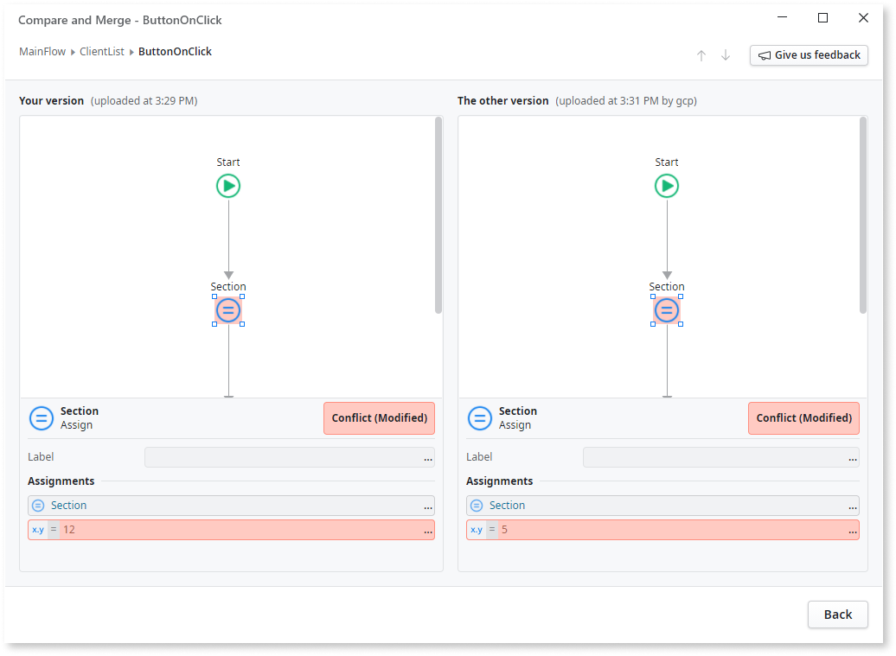
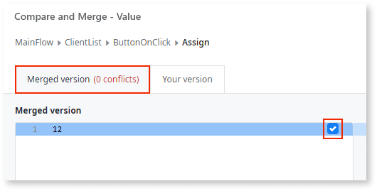

# Compare and merge example with conflicts

In this example you are trying to publish the module, but a window **Modified version detected** shows up. It seems that you and your fellow developer edited the module at the same time. You select **Merge and publish** to try the automatic merge, but there are conflicting changes in the local version of the module and the version on the server. An automatic integration of changes is not possible, and you are presented with the **Compare and Merge** window:

After analyzing the **Compare and Merge** window, you see that:

* You both edited the CSS on the "ClientList" screen. You need to resolve the conflicting changes.
* The other developer added the screen "Report". There are no conflicts to resolve there.

These could be the steps to resolve the conflicts.

1. Double-click the element **Style Sheet (merged with conflicts)**. The **Compare and Merge - Style Sheet** opens. The number in the tab **Merged version (1 conflict)** indicates the number of conflicts.

    

1. Select which part of the CSS code goes into the resulting local module that you will publish at the end of the merge. Click the arrow icon next to the text to replace `color: green;` with  `color: red;`. **Merged version (1 conflict)** changes to  **Merged version (0 conflicts)**. You can also edit the code by typing in the **Merged version** pane.

    

1. Click **Done and back** in the lower left corner to return to the **Compare and Merge** section.

1. Double-click **Preparation** to open the **Compare and Merge - Preparation** window. You can see that the `Section` assign element has conflicting values.

    

1. Click on the value viewer to open **Compare and Merge - Value** window. The value viewer button is labeled by the three dots (`...`).

    

1. Click the check box in the  **Merged version (1 conflict)** pane to select the value from your version of the module. **Merged version (1 conflict)** changes to **Merged version (0 conflicts)**.

    

1. Click **Done and back** in the lower left corner to return to the **Compare and Merge - Preparation** section.

1. Finally, click **Back** in the lower right corner to return to the main **Compare and Merge** window. If there are no conflicts (no elements highlighted red), you can continue to the next step to publish the module.

1. Click **Merge and publish** to update the local version of the module and publish it. If you want to update the local module, continue working on it and publish later — at this step you should click **Merge**.

    
