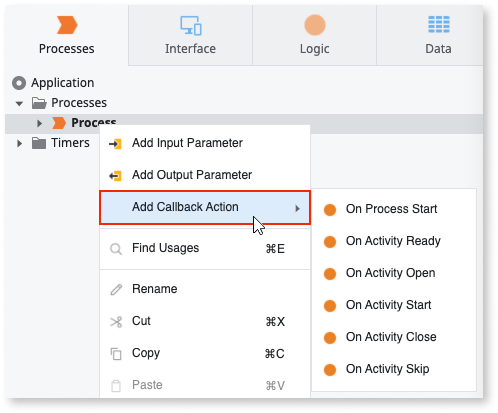

# Using Process Callback Actions

When designing the process flow of your process, you can add business rules to validate the execution of your process. This allows you to block or quit the process execution if a specified condition is not verified. This behavior is implemented through **Process Callback actions**.

## Add a Process Callback Action

1. From the **Processes** tab, right-click the process element and select **Add Callback Action**.

1. Select one of the **On Process ...** actions.

    

1. Design the behavior of the action.

    You can design the business rules for the following available process callback action:

    * **On Process Start**: this action is executed before a **Process** starts its execution.

You can also design activity callback actions at the process level. This allows you to move the common business rules in the callbacks of several process activities to a single place at the process level.
