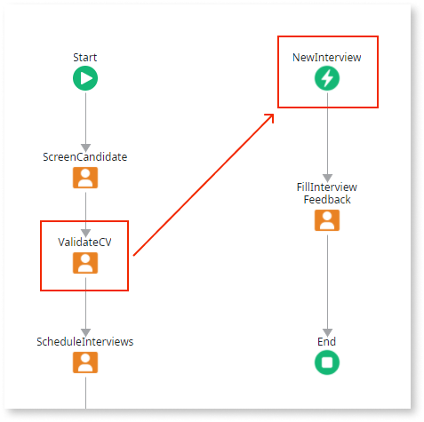
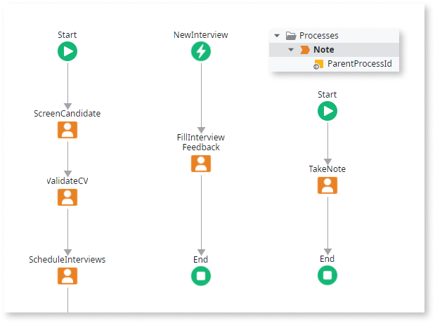

# Limit the Use of Conditional Starts

When you add [Conditional Starts](<../../../ref/lang/auto/Class.Conditional Start.final.md>) to a [Process](../intro.md) you should consider well the business case you are addressing, or else you may be **introducing unnecessary complexity to the deployment of applications**. This is essentially due to:

1. Each conditional start has its own life cycle and it keeps an activity instance permanently active and listening to events. On each event, a new execution of the flow is launched, meaning that, multiple events launch multiple executions growing the amount of information. When deploying an application, the [impact analysis](../process-upgrade/intro.md) goes over all this information;

2. During the deployment of applications, a specific validation is ran for conditional starts. It goes over all instances of active processes and checks whether each conditional start in the process has an activity instance listening to its event. Any missing activity instance is created. This operation brings an extra overhead to the deployment.

In this case, we recommend that you do one of the following:

* Analyze processes to identify conditional starts that are only necessary after a specific point in the process flow. Use the [dependency connector](<../../../ref/lang/auto/Class.Conditional Start.final.md>) to postpone the listening activity of a conditional start to only when it is really necessary. This way, the validation during deployment has less conditional starts to analyze.

## Example

Think of a process to handle candidates that apply for a job. At some point, interviews are scheduled and each scheduled interview is handled independently by a conditional start.

The conditional start is only necessary when interviews are scheduled, therefore, a dependency connector is added right before that activity.

* Analyze the process flow and identify conditional starts that are not directly related with the process. A good method is usually to look for conditional starts with their `Start On` property empty, which means that they are being manually executed.

Move the flow of the conditional start to a new process and replace all executions of the conditional start by executions of the new process.

Add an input parameter to the new process to pass the identifier of the main process. This way, the new process is automatically related with the main process, which is useful for reporting. To pass other values you need, simply add more input parameters.

## Example

From the process of the previous example, imagine it also has a conditional start to take note of ad hoc telephone calls.

The **TelephoneNote** conditional start is being explicitly started because it has no `Start On`. It is, in fact, a generic flow. It can be moved to a new process.

This way, there are less conditional starts. Furthermore, the new process for the telephone notes is so generic that will probably be **reused**.

To **reduce the upgrade impact** of deleting the flow of the conditional start, consider the recommendation explained in topic [Impact of Deleting Activities from Process Flows](../process-upgrade/impact-delete-activities.md).

Finally, validate situations in which the main process may be [Terminated](<../../../ref/lang/auto/Class.Process End.final.md>). In this case, all processes replacing conditional starts have also to be terminated to keep the same behavior of the conditional start. Consider implementing this logic using the **ProcessTerminate** Action.
