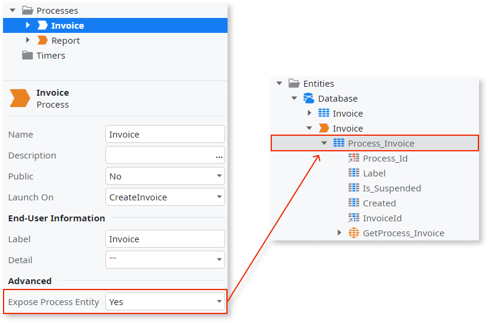
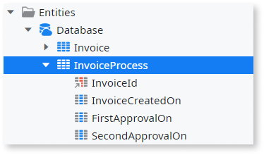
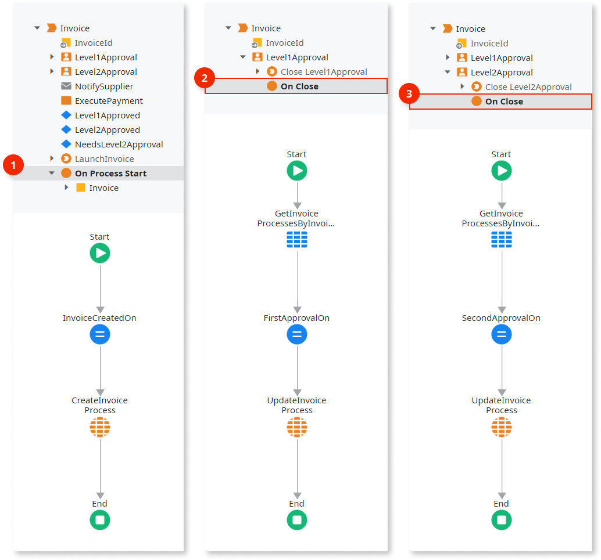

# Scale Queries over Process Entities

When designing functionality that queries runtime information of [Processes](../intro.md), it is normally done through [Process Entities](../process-entities/intro.md).

Each process entity makes available part of the whole process runtime information stored by OutSystems. As such, if the number of executing process instances grows to millions of records, queries over process entities will be slow.

In this case, we recommend that you do the following:

1. Create an **Entity** to manually store runtime information you need about the process. This entity should be called **&lt;ProcessName&gt;Process**.

1. Use a [Process Callback Action](../actions-callback/actions-callback.md) or an [Activity Callback Action](../actions-callback/actions-activities-callback.md) to add logic to manually store the needed runtime information.

By creating this entity, you may also extend the logic and **store other runtime information** you need.

## Example

As an example, imagine a process to pay invoices of suppliers: the invoice has to pass a first level of approval, then a possible second level of approval (depending on the amount to pay), and, if rejected on any approval, an e-mail is sent to notify the supplier.

There is a requirement to make a report with the time it takes to make the first approval and also the possible second approval. There are thousands of invoices to pay, therefore, we should not use the process entity.

Let's disable the process entity...

...and create an **InvoiceProcess** entity to store the date and time of: invoice creation, first approval, and second approval.

Now, use the callback actions to fill the new entity with values for their attributes:

1. Add a **On Process Start** callback action to the process to create a **InvoiceProcess** record with the invoice identifier and its creation date and time.

2. On the **Level1Approval** human activity, add a **On Close** callback action to update the **InvoiceProcess** record with the first approval date and time.

3. On the **Level2Approval** human activity, add a **On Close** callback action to update the **InvoiceProcess** record with the second approval date and time.
