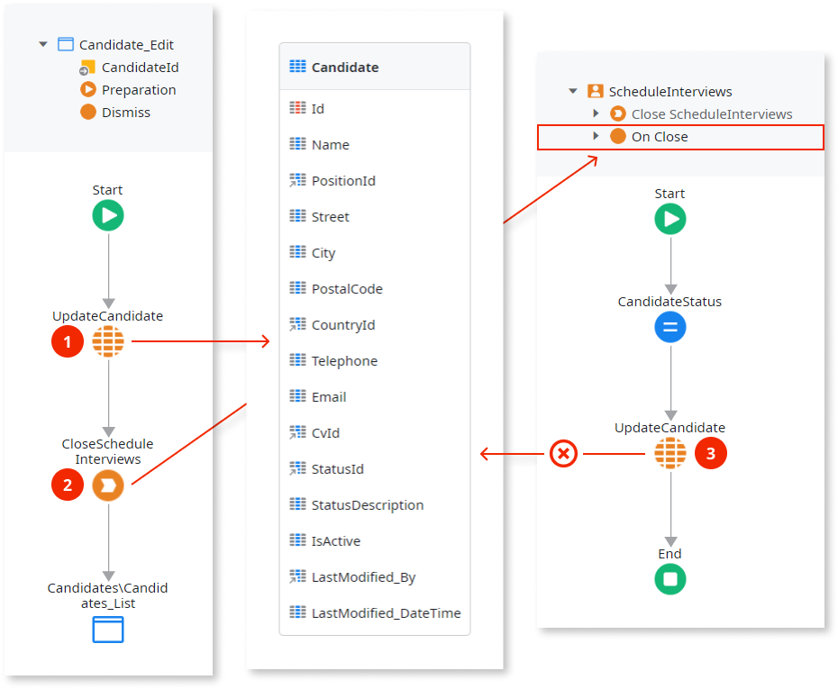
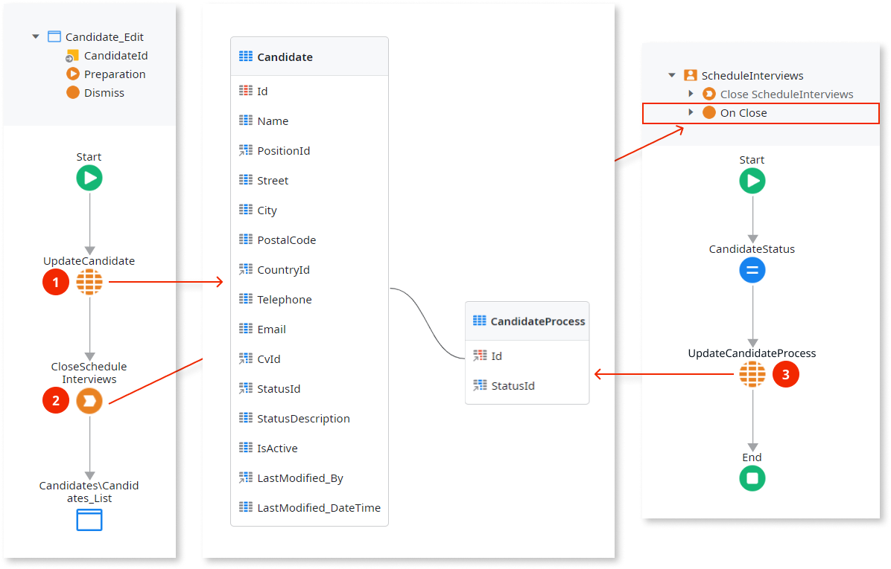
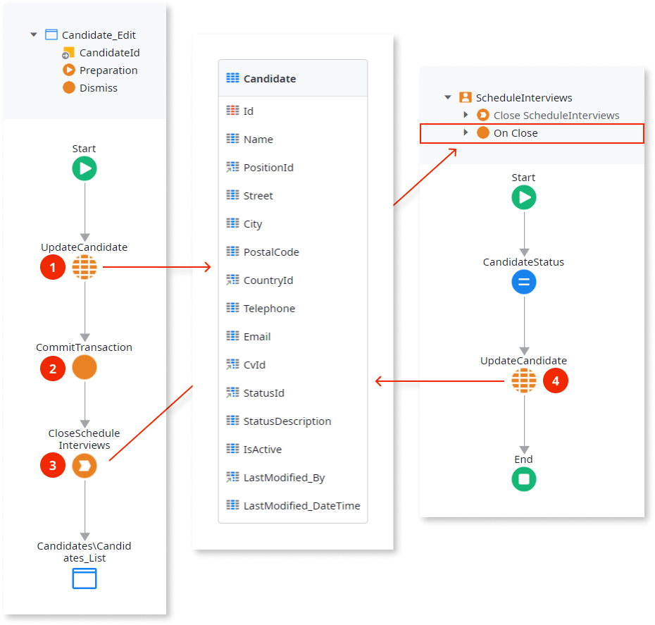

# Separate Process Logic from Application Logic

When you design a [Process](../intro.md) that is strongly integrated with your application, it may happen that both the process and the application are changing the same **Entity record** at the same time. This **leads to misbehaviors**, essentially due to:

1. Process instances and the application run in different transactions. When one transaction is changing the entity record, it locks that record to prevent other transactions from changing it. Only when the locking transaction ends, the other transaction will be able to change the record.

2. While transactions of process instances are waiting for the locking transaction to end, they may abort their execution due to a timeout. Although they resume the execution later on, this affects the runtime performance of the application and also generates unnecessary logging errors in Service Center.

In this case we recommend that you do the following:

1. Analyze the application to find situations where the process life cycle is controlled through [Process Extended Actions](../actions-extended/intro.md) or **System Actions**.

2. For the situations found in step 1, analyze the application logic and the process logic to find whether they change the same record.

3. If they both change the same record we may have a lock problem. Take one of two options:

    * **Option 1 (Recommended)**: Understand which attributes are used by the application, by the process, and by both. Normally, you have attributes that are changed either by the application or the process, and other attributes that are changed by both.  
        The solution here is to extent the entity and move the attributes that only changed by the process to a new entity in a one-to-one relationship. Call the new entity **&lt;EntityName&gt;Process**.

    * **Option 2**: In the application flow, move the action that acts on the process life cycle as much as possible to the end of the flow. Add a **CommitTransaction** before it that will end the transaction and unlock the record. Beware that you are not allowed to roll back the transaction afterwards.

## Example

As an example, imagine an application and process to handle candidates that apply for a job. At some point, on the candidate edit screen, there is a button to Dismiss the candidate.

When the Dismiss button is pressed, the following happens:

1. The **Candidate** record is updated, therefore, the **Candidate** record is locked.

2. The application closes the **ScheduleInterviews** activity in the process and the **On Close** callback action is executed.

3. The **On Close** callback action tries to update the **Candidate** record that is currently locked by the application.

### Using Option 1

Let's identify which attributes are changed either by the application or by the process. The **StatusId** is only changed by the process. So, let's create the **CandidateProcess** entity to have it isolated there.

Now, when the Dismiss button is pressed, the following happens:

1. The **Candidate** record is updated, therefore, the **Candidate** record is locked.

2. The application closes the **ScheduleInterviews** activity in the process and the **On Close** callback action is executed.

3. The **On Close** callback action updates the **CandidateProcess** record.

### Using Option 2

The **CloseScheduleInterviews** is already at the end of the flow. So, let's add the a **CommitTransaction** before it to commit the changes in the database and end the lock.

Now, when the Dismiss button is pressed, the following happens:

1. The **Candidate** record is updated, therefore, the **Candidate** record is locked.

2. The **CommitTransaction** action commits changes in the database and unlocks the record.

3. The application closes the **ScheduleInterviews** activity in the process and the **On Close** callback action is executed.

4. The **On Close** callback action updates the **Candidate** record.
