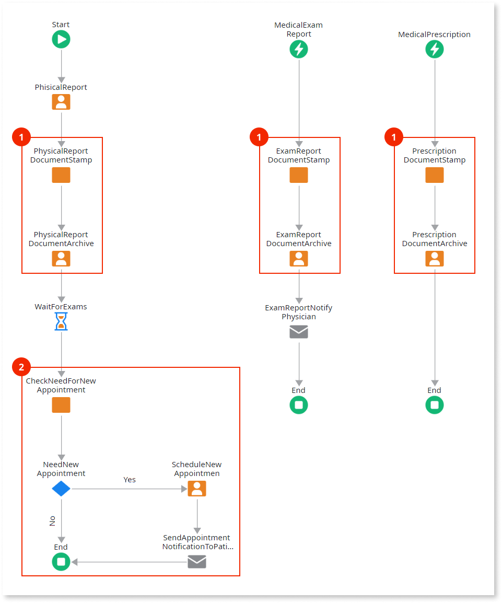
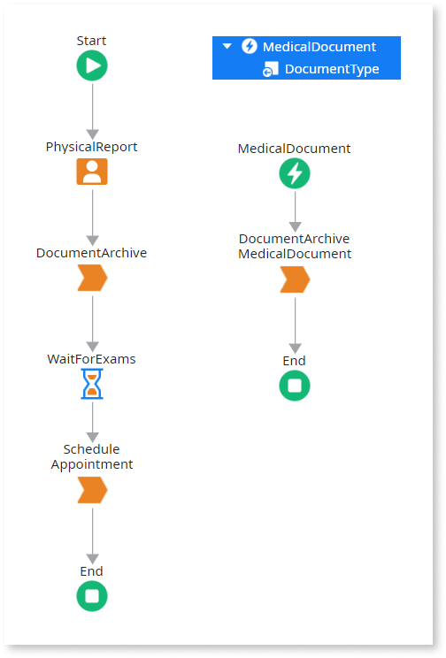

# Design Processes with Small Flows

When you design a [Process](../intro.md) with too many activities, it may **reveal hard to maintain and with impact on the deployment of applications**. This is essentially due to:

1. Active process instances with too many activities generate a lot of information.

2. During the deployment, the [impact analysis](../process-upgrade/intro.md) goes over all the information about active process instances, thus taking more time.

3. After the impact analysis, the [upgrade](../process-upgrade/intro.md) of active process instances with too many activities is more complex, thus taking more time.

In this case, we recommend that you do the following:

1. Analyze the process flow, identify subprocesses within it, and move them to new processes.

2. Use the [Execute Process](<../../../ref/lang/auto/Class.Execute Process.final.md>) tool to execute the newly created processes as subprocesses in the main process flow.

This way, the deployment runs faster because the process is executed through smaller subprocesses, which are executed one at a time. This way, the impact analysis has to go over much less information and the upgrade is easier.

## Example

As an example, imagine a process to handle medical appointments: the physician produces a report of the appointment that is stamped and archived; if further exams are requested by the physician their report is also stamped and archived; finally, if there is a prescription, it is also stamped and archived. The medical appointment ends when all exams (if any) are done and validates the need of scheduling a new appointment.

We can identify two candidates for subprocesses in the main flow:

1. The stamping and archiving of a document. Besides simplifying the main flow, this new subprocess can be **reused** in the flow of the conditional starts.

2. The validation and scheduling of the new appointment. It simplifies the main flow.

The main process flow becomes shorter and simpler and two new small processes are created.

The [NotifyPhysician](<../../../ref/lang/auto/Class.Send Email.final.md>) send email was also included in the new process as an optional branch that is executed or not depending on the type of document. This way we can further simplify the process flow by merging the two conditional starts into a single one, with the type of document as parameter.

