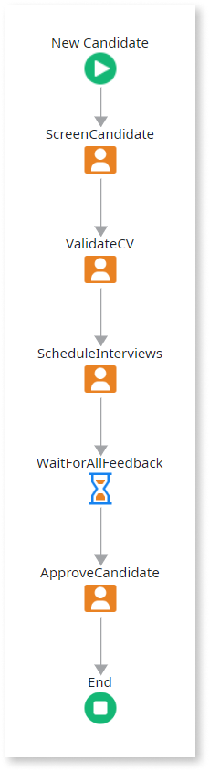

# Designing Sequential Activities

To design activities which are to be executed in sequence, simply place those activities in the flow path connected by their execution order.

When the process is executed, activities are executed, one by one, following the sequence in the flow; the process execution only advances to the next activity when the current one is finished.

## Example

As an example, think of a recruitment process for candidates who apply for a job: screen the candidate, validate the Curriculum Vitae, interview the candidate, and approve (or not) based on the gathered feedback.

