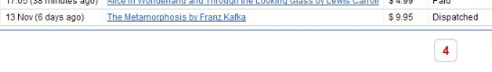

# Use Processes - BPT

OutSystems allows you to design and manage your business processes and integrate them into your applications. A business process is simply called a **Process** in OutSystems and is understood as the way that a particular task is carried out in your organization, such as handling invoices, processing orders, or handling complaints. Processes are also known as BPT (Business Process Technology).

A process is usually designed while thinking about an entity's life cycle, that is, it is designed as a flow of activities to be carried out at each stage of the entity's life cycle such as a task for the end user to execute in your application, or wait for some condition to advance to the next activity, or even execute some task without the need for end user intervention.

To implement your process flow, use the Process Flow Editor which has a set of process tools for you to design the process flow of activities that have to be executed during the entity's life cycle.

Integrate your processes in your application through Entity Actions that issue events to your processes or use [Process Extended Actions](actions-extended/intro.md) and Process System Actions in your application's action flows.

## Entity Actions Events

In your application, if you set an Entity Action to issue process events each time it creates or updates an entity record, an event is issued to all executing instances of processes and activities. So, at design time, you should set which processes or activities are to handle and react to which entity events.

Example: in an application that manages invoices, this allows you to automatically launch an invoice handling process for each new invoice that is created in your application, or to put the process execution on hold before the invoice payment task, and wait for the invoice to be updated as "cleared for payment" by the chief officer.

## Process Extended Actions and System Actions

While designing your application action flows, you may explicitly interact with your processes through process extended actions and System actions.

This allows you, for example, to explicitly launch a process execution or explicitly open a task to be executed by an end user.

While designing your process you may schedule tasks to be done in your application by end users and allow them to take actions on the task they are doing. These tasks and actions are available to the end users in the Taskbox.

### Using the Taskbox

The Taskbox is automatically available in your application once you are executing processes, and if you have the User module as the user provider. It lists new and ongoing tasks of users. It also displays the instructions and the actions for users to assign themselves the tasks.

#### In Reactive Web Apps

Use Sample Reactive Taskbox component from Forge to implement the Taskbox in Reactive Apps. Check instructions in document [Using Taskbox in Reactive Web Apps](https://success.outsystems.com/Documentation/How-to_Guides/Processes/Using_Taskbox_in_Reactive_Web_Apps).

#### In Traditional Web Apps

In Traditional Web Apps, the UI of the Taskbox is available by default.

When the end user clicks on a listed task, it is opened and the task instructions are displayed in the Taskbox. Simultaneously, the application navigates automatically to the appropriate Web Screen and displays the appropriate data needed for the end user to accomplish the task.

### Using the Processes API

To customize and extend the design of your Processes, you can use the [Processes API](<../../ref/apis/processes-api.md>) which allows extracting information from the platform data model.

## Light Process Execution

OutSystems Processes are designed to model and execute long running processes where activities can wait for minutes, hours or months until a given event occurs. For large scale batch processing scenarios, such as an event broker, use [light process execution](light-process.md).
