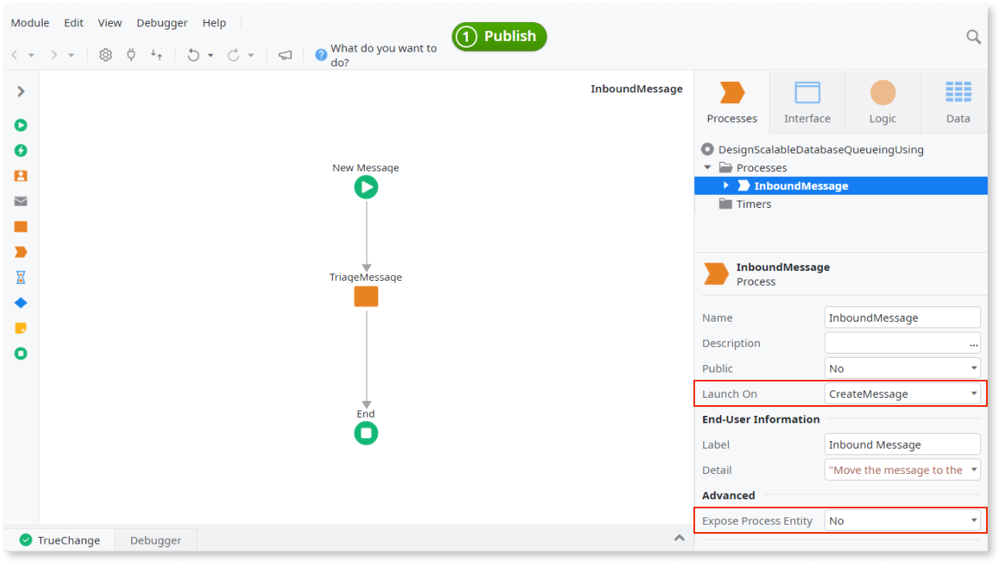

# Design Scalable Database Queueing Using Light Processes

OutSystems Processes are designed to model and execute long-running processes where a specific event can take a long time to occur. Each activity for each process instance is tracked in the database.

When enabling **light process execution** you allow simpler processes that don't need tracking to run much faster, which increases the event processing throughput. This lighter execution mode is useful for event-driven processes on a large scale that handle several thousand events per day, such as event brokers, and that require a scalable database queueing.

During light process execution, a process doesn't create any process instances or activity instances, therefore the **process history isn't available**. Defining start dates for Automatic Activities is also **not supported**.

To enable light process execution, a process must meet all the following conditions:

* The process flow includes only one **Automatic Activity**, having a simple **Start** > **Automatic Activity** > **End** flow.

* The **Launch On** property of the process is set with a database event.

* The **Expose Process Entity** property of the process is set to **No**.

    

Even if a process is enabled for light process execution, only a trigger by a database event executes the process as a light process. The manual launch of the process using the **Launch Process** action still executes the process as a regular process.

## Enable light process execution

To enable light process execution for a process, do the following:

1. Go to the Service Center management console of your OutSystems environment.

1. Go to the **Factory** section and select the app which contains the process for which you want to allow light process execution.

1. In the application details screen, select the module containing the process for which you want to allow light process execution.

1. In the module details screen, go to the **Operation** tab and check the **Light process execution** option.

1. Click the **Apply** button. Changing this setting requires republishing the module.

    

1. To republish the module, go to the **Versions** tab and publish the current version of the module. You get a compilation message for the processes that can benefit from light process execution:

      

    You see the same compilation message when you publish the module through Service Studio:  

    

After these steps and after publishing your module, the process is enabled for light process execution.  
Keep in mind that only a trigger by a database event executes the process as a light process. Launching the process using the **Launch Process** action executes the process as a regular process.
