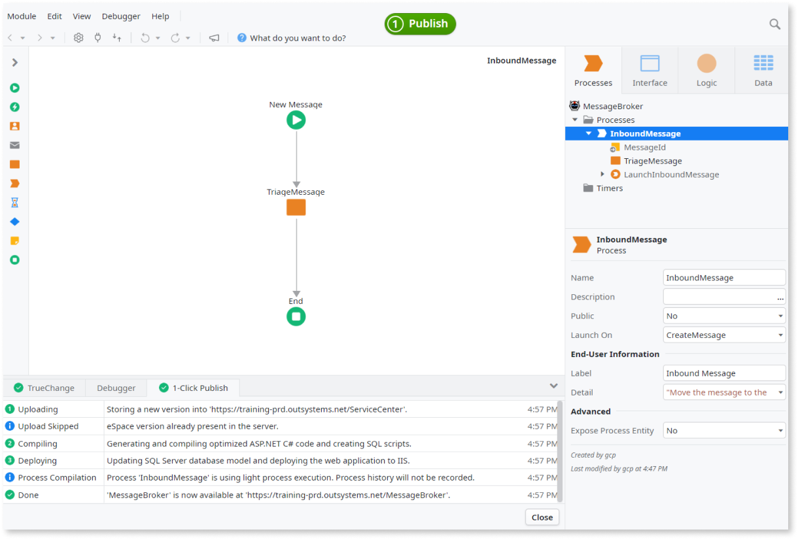

# Design Scalable Database Queueing Using Light Processes

OutSystems Processes are designed to model and execute long-running processes where a specific event can take a long time to occur. Each activity for each process instance is tracked in the database.

When enabling **light process execution** you allow simpler processes that don't need tracking to run much faster, which increases the event processing throughput. This lighter execution mode is useful for event-driven processes on a large scale that handle several thousand events per day, such as event brokers, and that require a scalable database queueing.

Processes that benefit from light process execution must meet all the following conditions:

* Has a simplified structure (Start > Automatic Activity > End).

* Is triggered by a database event.

* `Expose Process Entity` property is set to No:  

    

This kind of Process does not create any process instances or activity instances, therefore the **process history will not be available**. Defining start dates for Automatic Activities is also **not supported**.

## Enable Light Process Execution

To enable light process execution for your module, do the following:

1. Go to the Service Center management console of your OutSystems environment.

1. Go to the Factory section and select your application.

1. In the application details screen, select the module containing the Processes for which you want to allow light process execution.

1. In the module details screen, go to the Operation tab and check the "Light process execution" option.

1. Click the "Apply" button. Changing this setting requires republishing the module.    

    

1. Go to the Versions tab and publish the module. You will get a compilation message for the processes that will benefit from light process execution:

      

    You will see the same compilation message when you publish the module through Service Studio:  

    

Even though a process is enabled for light process execution, only a trigger by a database event will allow the execution as a light process. The manually launch of the process  will result in the execution as a regular process.

Light process execution is available when using SQL Server or Oracle as main OutSystems database.

