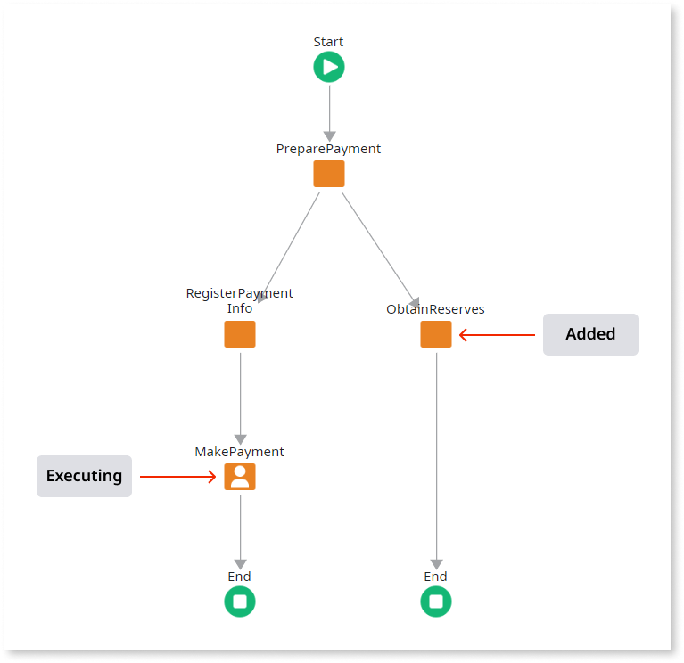

# Impact of Adding Activities to Process Flows

When you publish an eSpace containing modified [process flows](../process-flow/process-flow-editor.md), all of the executing process instances that were based on the former process flows are automatically upgraded by OutSystems. This topic lists some examples of the impact of newly added activities on executing process instances.

## Process Instance is Executing After the Added Activity

In this case the execution of the process instance has already passed the added activity and **continues executing**.

## Process Instance is Executing Before the Added Activity

In this case the execution of the process instance has not passed the added activity and **continues executing**.

## Process Instance is Executing in a New Branch

In this case the execution of the process instance has already passed the new branch and **continues executing**.

