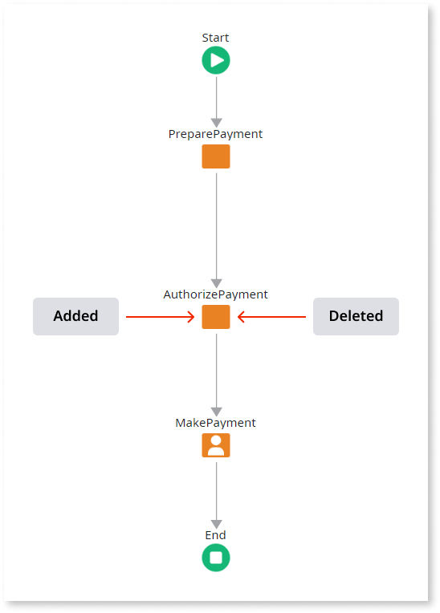
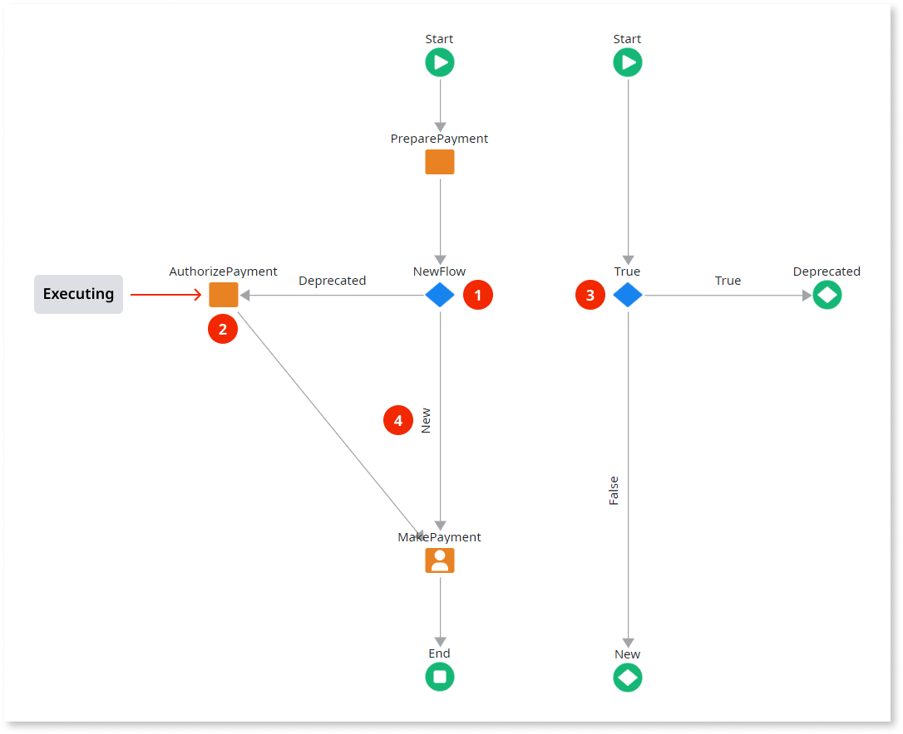
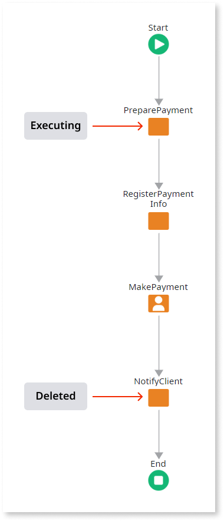
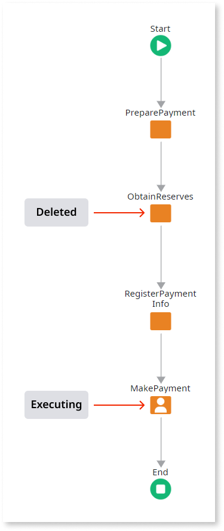

# Impact of Deleting Activities from Process Flows

When you publish a module containing modified [process flows](../process-flow/process-flow-editor.md), all of the executing process instances that were based on the former process flows are automatically upgraded by OutSystems. This topic lists some examples of the impact of removed activities on executing process instances.

## Process Instance is Executing the Removed Activity

In this case the process instance is executing the deleted activity: **the execution is suspended**.

The process instance has to be analyzed in Service Center to decide whether it can continue or should be stopped.

In this case, you **avoid having a process instance suspended** if you change the process in the following way:

1. Use the [Decision](<../../../ref/lang/auto/Class.Decision.final.md>) tool to branch the flow in two: **Deprecated** and **New**.

1. Put the activities to be deleted in the **Deprecated** branch.

1. Open the flow of the Decision element and design it to always return **New**, i.e., no more processes will follow the Deprecated branch.

1. Connect the **New** branch to the first activity that is not to be deleted.

This way, **processes are not suspended** because activities continue to exist in the process flow. All new processes will stop executing the deprecated branch. When there are not more **active instances** of activities to be deleted, those activities can effectively be deleted without suspending any process.

To check for active instances of activities, use one of the following (by order of importance):

* **Business Activity Monitoring (BAM)**: Use this reporting tool to check for active instances of activities. You can [get it from the Forge](<http://www.outsystems.com/forge/component/132/business-activity-monitoring/>).

* **Service Center**: use this component to check for active instances of activities, however, is done manually, process by process.

* **Platform Database**: query the Meta model of the platform database for active instances of activities.

## Process Instance is Executing Before the Deleted Activity

In this case the execution of the process instance has not passed the deleted activity and **executes the new flow without it**.

## Process Instance is Executing After the Deleted Activity

In this case the execution of the process instance has already passed the deleted activity and **continues executing**.

