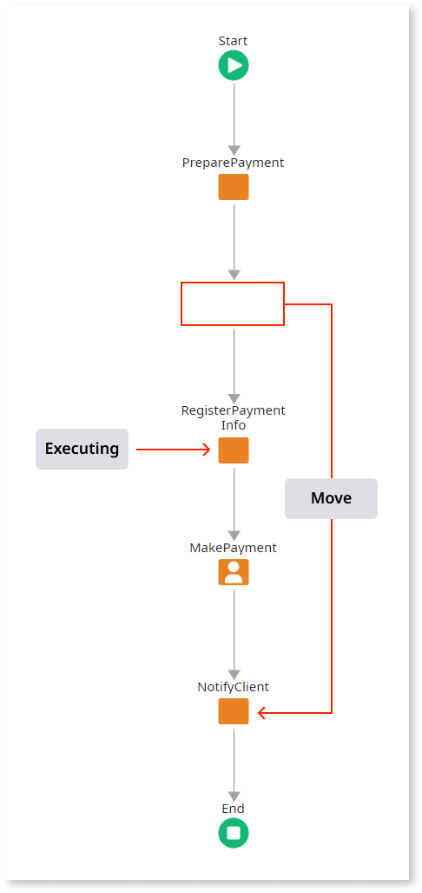

# Impact of Moving Activities in Process Flows

When you publish an eSpace containing modified [process flows](../process-flow/process-flow-editor.md), all of the executing process instances that were based on the former process flows are automatically upgraded by OutSystems. This topic lists some examples of the impact of moved activities on executing process instances.

## Process Instance is Executing Before the Moved Activity

In this case the execution of the process instance has not executed the moved activity and should have executed it: **the execution is suspended**.

In case the process instance is suspended it has to be analyzed in Service Center to decide whether it can continue or should be stopped.

## Process Instance is Executing After the Moved Activity (Case 1)

In this case the execution of the process instance has already executed the moved activity and it is going to execute it again: **the execution is suspended**.

In case the process instance is suspended it has to be analyzed in Service Center to decide whether it can continue or should be stopped.

## Process Instance is Executing After the Moved Activity (Case 2)

In this case the execution of the process instance has already executed the moved activity in a [Conditional Start](<../../../ref/lang/auto/Class.Conditional Start.final.md>) and it is going to execute it again: **the execution is suspended**.

In case the process instance is suspended it has to be analyzed in Service Center to decide whether it can continue or should be stopped.

