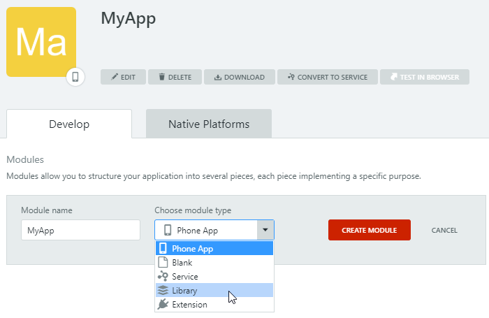

# Libraries

A Library is a module type that helps you lay the foundations of your application. Libraries have a direct fit in the **Foundation Layer** of the [Architecture Canvas](https://success.outsystems.com/Support/Enterprise_Customers/Maintenance_and_Operations/Designing_the_Architecture_of_Your_OutSystems_Applications/The_Architecture_Canvas) architecture tool and allow you to reduce the number of dependencies in a given environment.

**Best Practice**

Start building your OutSystems applications with architecture in mind. Having a sound architecture allows you to change fast according to business needs, and to have different lifecycles for distinct applications, allowing them to evolve at different paces.

Good architecture promotes the reusability of common modules, avoiding duplicated implementations, and clear ownership of modules and applications throughout your factory.

The Library module type was designed with the following principles in mind:

* **Libraries are stateless.** They do not store information in the database and they do not have direct access to Entities.
* **The elements of a library are only deployed in the context of consumer applications.** They are not deployed as standalone applications, reducing the load in the Platform Server's Application Server.
* **Libraries are agnostic to the database where applications referencing them are deployed.**

For example, you can use Libraries to build the following:

UI Elements/Style Guides
:   Used to enforce reusability and standardization throughout a factory.  
    For example, use libraries to implement components like [TinyMCE](https://www.outsystems.com/forge/component-overview/1263/inputtotinymce) or [CKEditor](https://www.outsystems.com/forge/component-overview/97/ckeditor).
    
Reusable Utilities
:   Used to group functionalities while adhering to a sound architecture.  
    For example, use Libraries to implement:
    
    * Connectors — integration with external services APIs or UI. E.g. a `MyRESTServiceUtils` Library to abstract REST services consumption.
    * Logic — encapsulate logic that can be called by several applications. E.g. a `CipherUtils` Library to help encrypt/decrypt data.

Libraries can contain most kinds of elements:

* UI Flows
* Blocks
* Images
* Themes
* Scripts
* Data Actions
* Server Actions and Client Actions
* Consumed Integrations
* Exceptions
* Structures
* Resources

The elements that you can use in Libraries are enforced both in Service Studio editors, while you are editing your module, and in the "Manage Dependencies" window, when you are referencing elements from other modules. Therefore, you will have immediate feedback on what you can create and reference in a Library.

## Restrictions

Considering the architectural philosophy behind Libraries, some concepts must be approached differently. Take the following into account when creating a Library:

* Libraries can only reference elements from other Libraries or from Extensions. However, you can still reference System actions.
* Libraries can only access Site Properties in read-only mode. The effective values of Site Properties can still be modified via Service Center, or via LifeTime when the [technical preview "Configure Site Properties during deployment"](../../managing-the-applications-lifecycle/deploy-applications/tp-configure-site-properties-during-deploy.md) is enabled.
* By design, these elements are not available in Libraries:
    * Screens
    * Service Actions
    * Entities (both Server and Client Entities)
    * Exposed integrations
    * Processes and Timers
    * Roles
* Static Entities can be created and referenced in Libraries but cannot be used in queries, as dropdown sources or as foreign keys for entities. However, you cannot reference Static Entities from (System) in Libraries.
* Though you can reference both public Server Actions and public Structures made available by Libraries in a Traditional Web App, you cannot reference the following elements from a Library in a Traditional Web App: Blocks, Client Actions, Images, Themes, Scripts and Resources.

When using Libraries, it is not possible to deploy [existing resources](../data/resources.md) to Target Directory.

## Create a Library

1. In Service Studio, create a new application (Mobile or Reactive Web) and give it a name.  
    Alternatively, if you are creating a Library in an existing application, click the icon of an existing Mobile or Reactive Web application and then click **Add Module**.

1. Enter a name for the new module and choose **Library** as the module type in the dropdown.

    

1. Click **Create Module**.

### Debugging a Library

To debug a Library module you need to set the **entry module** to a module that is consuming the library, like you already do when debugging producer modules. Check [Debugging Producer Modules](../troubleshoot/debug/debug-producer-modules.md) for more information.
