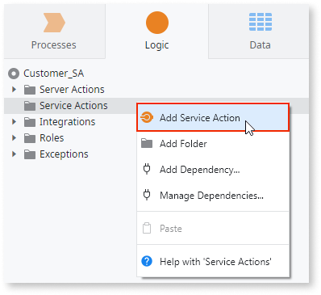
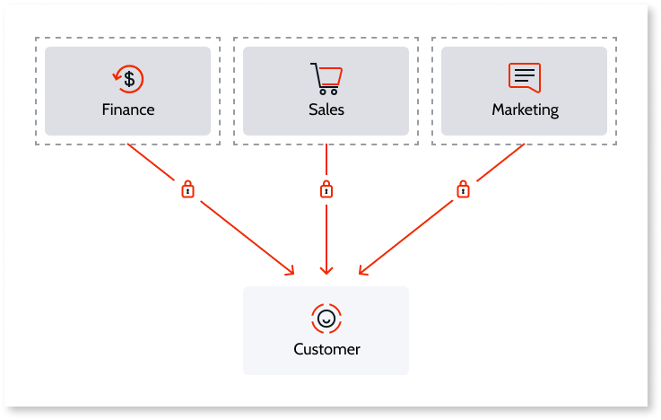

# Use Services to Expose Functionality

Designing the architecture of your application is an iterative and continuous process. As your application grows, you may need to abstract specific business concepts or business-agnostic services that extend the framework, and expose them to be reused by other applications.

In OutSystems you can refactor your application and build a service-oriented architecture using **Service Modules** and **Service Applications**.

## Service Modules and Service Applications

In OutSystems, you can use **Service modules** in your apps to enforce the separation of concerns and encapsulate the core service functionality.

Depending on the size of your services portfolio, you can also create a **Service application** to organize your Service modules.

In a Service module you define the elements that compose your core services:

* The service logic, using Server Actions and Service Actions.
* Integrations such as REST.
* Processes and Timers.
* Database Entities.

Based on the nature of a core service, it is not possible to have UI related elements in a Service module. Therefore, the following features are not available in Service modules:

* Interface tab
* Module properties for UI assets (JavaScript, Global Error Handler, ...)
* Client-side logic
* Local Storage Entities
* Session Variables

You should use Reactive Web, Mobile, or Traditional Web modules to implement UI related elements. 

## Implement the Logic of Your Service

The way you implement a service in OutSystems will be different if your service exposes functionality to external systems or inside the same OutSystems environment:

* **Expose functionality to an external system or a different OutSystems infrastructure:** You can implement the logic of your service exposing a [REST API](../../extensibility-and-integration/rest/expose-rest-apis/intro.md) or a [SOAP Web Service](../../extensibility-and-integration/soap/expose/expose-soap-web-service.md) in your Service module.

* **Expose a service to be reused by other modules or applications inside the same OutSystems environment:** You can implement the logic of your service in a tightly-coupled way exposing public **Server Actions**, or you can do it in a loosely-coupled way exposing **Service Actions**.

### Exposing Server Actions

In OutSystems, exposing a **Server Action** generates a [strong dependency](strong-weak-dependencies.md#strong-dependencies) from the consumer to the producer module, in a **tightly-coupled** way.

The Server Action logic is executed just as if it is defined in the consumer module, running in a single process with the same request and transaction.

Each time the implementation of an exposed Server Action changes, the consumer modules must be **refreshed and republished** to start using the latest version.

### Exposing Service Actions

In OutSystems, a **Service Action** is a REST based remote call to another process, but its usage is very similar to public Server Actions. 

Exposing a Service Action generates a [weak dependency](strong-weak-dependencies.md#weak-dependencies) from the consumer to the producer module, in a **loosely-coupled** way.

Each time the implementation of an exposed Service Action changes, that change **takes immediate** effect in the consumer modules.

When making a remote call to a Service Action, OutSystems passes the following information from the client session:

* **UserId** and **TenantId**, which enables the usage of built-in functions such as GetUserId() and CheckRole() within the implementation of the Service Action.

* **Locale**, which enables the usage the built-in function GetCurrentLocale() within the implementation of the Service Action. 

* **Request Key**, which enables the correlation of all logs in Service Center from the same top level request.

Service Actions mix the advantages of loosely-coupled REST API methods with the Rapid Application Delivery (RAD) capabilities of tightly-coupled Server Actions:

**Findability**
:   When publishing a module with a Service Action, the Service Action becomes immediately available to consumers in the internal catalog of reusable elements accessible through the Manage Dependencies window.

**Impact analysis**
:   OutSystems calculates the impact of changing the signature of a Service Action and shows it in the Manage Dependencies window. This helps you to decide whether you need to create a new version of your service or if the changes in your service have no impact on consumers.

**Strong typing**
:   Just like Server Actions, Service Actions are strongly typed logic elements. You can use entities and structures in Service Action signatures.

**Security**
:   Service Actions are only accessible from the same environment. OutSystems passes the authentication context from the client session when making the call to a Service Action (UserId and TenantId).

**Exception handling**
:   User Exceptions and Communication Exceptions thrown by a Service Action can be caught in the consumer modules.

**Access governance**
:   Service Actions follow the same governance model as any other reusable element defined by permissions in LifeTime.

#### Dealing with transactionality and networking

Since Service Actions don’t share the same process and transaction with the consumers, implementing fault-tolerant services using Service Actions requires additional logic on the consumer side.

If the operation executed in a Service Action fails, the consumer logic must handle the failure and evaluate the undo of that operation. Any rollback in a consumer will not rollback the logic executed in the Service Action. Also, a rollback within a Service Action does not rollback the logic executed in other Service Actions previously called by the consumer.

Using Service Actions implies executing logic through remote calls, which can have significant performance penalties when compared to running the same logic in a single process. Therefore, your logic must take into account the amount of data passed through the remote requests. 
Also, if there is a communication failure, the consumer logic must be prepared to handle the communication exceptions. 

The remote address used when calling Service Actions is determined by the [Deployment Zone Address](<../../managing-the-applications-lifecycle/deploy-applications/zones/reference.md>) of the producer. If the producer is in a different deployment zone from the consumer, then the consumer must be able to reach the producer. For more information check [Communication between applications in different Deployment Zones](<../../managing-the-applications-lifecycle/deploy-applications/zones/intro.md#communication-between-applications-in-different-deployment-zones>). 

### Choose Between Server Actions and Service Actions

Both Server Actions and Service Actions have their own characteristics and should be used depending on the use case.

The table below compares the most relevant differences between Server Actions and Service Actions: 

|   | Server Actions | Service Actions |
| - | -------------- | --------------- |
| **Release cycles** | Changes in implementation requires consumers to also be deployed. | Changes in the implementation can be deployed independently from the consumers. |
| **Service communication** | Consumer and producer modules run in a single process. | Consumer and producer modules run in different processes. |
| **DB transactions** | All transactions in a single process. |Multiple processes require multiple transactions. |
| **Development effort** | Simpler logic and faster development. | Requires additional logic to handle transactionality and networking. |

During the lifecycle of your application, you will typically start with a small tightly-coupled application. When your application begins to evolve to a large portfolio, you should decide when is the right time to start decoupling your modules, using Service Actions to expose functionality instead of Server Actions. 

OutSystems provides you with a set of features that help you [converting existing modules and logic to services](convert-to-service.md).

#### Small applications with same release cycle

You will probably start having a small service that is used by a single application. Take the example of a Customer service that encapsulates functionality to be reused by a Order Management application from the Sales department:

Using **Server Actions** to expose Customer functionality simplifies the logic of the Order Management application, since the logic runs in a single process with the same request and transaction. However, changes in the Customer service may require the deploy of the Order Management application too.

As long as these modules have the **same release cycle**, keeping these modules tightly-coupled will not have negative impacts in the deployment phase, while having positive impact in the development speed.

#### Several applications with similar release cycle

Then your system evolves and you have more applications using your service, for example a Shipping application, also from the Sales department:

Keeping the modules tightly-coupled, using **Server Actions** to expose Customer functionality, will now require that Order Management and Shipping applications are both deployed together with Customer service whenever this module changes, increasing the deployment effort. On the other hand, the logic of Order Management and Shipping applications is still simple to develop and maintain. 

Since both applications belong to Sales department and have **similar release cycles**, the deployment effort is still acceptable. This way, you can still take the advantage of a faster development.

#### Large applications supporting different lines of business

When you start having services that are reused by several applications, supporting different lines of business with **independent release cycles**, keeping all the modules tightly-coupled starts to be a burden in the deployment phase. Changes in the Customer service will now have negative impact in the release cycles of each consumer, because they may not be ready to be deployed yet.

At this point you should consider exposing the functionality of your service in a loosely-coupled way, using Service Actions:

In this case, using Service Actions to expose functionality will increase business value by enabling several consumers to have **independent release cycles**. On the other hand, you will have additional development effort, since the developer must implement additional logic to handle multiple processes and transactions. 

To decide for using Service Actions to expose functionality, you must evaluate if the additional development effort pays off the increased business value of having independent release cycles.
